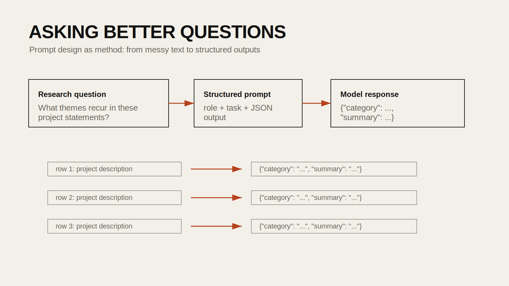

## Introduction

Prompt engineering is often reduced to the idea of "writing better prompts," but in research settings it is more precise than that. A good prompt establishes role, task, context, output format, and evaluation criteria. When the objective is classification, summarization, labeling, or comparison, the prompt becomes part of the method.

This tutorial combines the conceptual overview from `24FA-ARCH-581A-40 Week 6` with the applied text-analysis workflow from `24FA-ARCH-581A-40 Week 9`. The goal is to move from abstract prompting styles to a practical workflow that design students can use to structure research tasks.

## Historical Context

Early public use of large language models often focused on open-ended conversation. As these systems improved, users discovered that model behavior changed dramatically based on how instructions were framed. This gave rise to a range of prompting strategies such as zero-shot, one-shot, few-shot, chain-of-thought, role prompting, and structured-output prompting.

In research and design contexts, prompting is most valuable when it produces repeatable analytical outputs rather than impressive one-off responses. That means prompts should be treated as methods, documented clearly, and tested on multiple examples.

## Design Relevance

Design work increasingly depends on reading large bodies of text: survey responses, interview transcripts, reviews, policy documents, project statements, calls for proposals, and archival descriptions. Language models can help summarize or classify this material, but only if the task is framed carefully.

Prompt engineering matters because it lets you ask better research questions, such as:

- What categories recur across project descriptions?
- What emotions or attitudes appear in public feedback?
- How can a long text be reduced to one useful summary sentence?
- Can a model produce consistent labels across a dataset?

## Learning Goals

- Understand major prompting patterns and when to use them
- Design prompts for structured research tasks instead of casual chat
- Use JSON outputs for repeatable analysis
- Apply prompts across a DataFrame column in Python
- Recognize where prompt-based workflows can fail or mislead



## Step 1: Understand the Main Prompting Patterns

The Week 6 notebook introduces several useful prompting modes.

### Zero-shot prompting

You ask the model to perform a task without examples.

```text
Summarize this policy in one sentence.
```

Useful when the task is simple and the model already knows the format.

### One-shot prompting

You give one example before the task.

```text
Example:
Project text: "A public plaza with shade trees and bus priority lanes."
Output: {"category": "public space", "focus": "mobility and climate comfort"}

Now analyze this new project text:
...
```

Useful when you want to imply structure without a long prompt.

### Few-shot prompting

You give multiple examples. This is often better for nuanced classification tasks.

### Chain-of-thought prompting

You ask the model to reason step by step. This can be helpful for complex reasoning, but for public tutorials it is often better to ask for a concise final answer unless intermediate reasoning is genuinely needed.

### Role prompting

You assign a perspective or analytical frame.

```text
You are an urban climate researcher evaluating this text for evidence of heat-risk mitigation.
```

### Structured prompting

You specify the exact output format, ideally JSON. For repeatable research workflows, this is one of the most useful modes.

## Step 2: Set Up a Small Text Dataset

Start with a CSV so you can test prompts systematically rather than manually.

```python
import pandas as pd

df = pd.read_csv("imdb_top_1000.csv")
df = df[["Series_Title", "Overview"]].dropna().head(20)
df.head()
```

You can replace the movie dataset with design statements, public comments, or any other short text collection.

## Step 3: Write a System Prompt for Structured Classification

The Week 9 notebook uses a strong pattern: ask the model for a JSON object with a small number of fields. That is much easier to evaluate than free-form prose.

```python
categorize_system_prompt = """
You are helping organize a text dataset.

Given a short description, return a JSON object with:
- category: a short thematic label
- summary: a one-sentence summary

Return valid JSON only.
"""
```

This prompt is narrow on purpose. It tells the model what to do, what fields to produce, and what format to return.

## Step 4: Test the Prompt on a Few Examples First

Always test on a small sample before running across the full dataset.

```python
from openai import OpenAI
import json

client = OpenAI()

def categorize_text(text: str) -> dict:
    response = client.responses.create(
        model="gpt-4.1-mini",
        input=[
            {"role": "system", "content": categorize_system_prompt},
            {"role": "user", "content": text},
        ],
    )

    output_text = response.output_text
    return json.loads(output_text)

sample = df.loc[0, "Overview"]
result = categorize_text(sample)
print(result)
```

This is the moment to refine wording, category granularity, or summary length.

## Step 5: Apply the Prompt Across the Dataset

Once the output format is stable, apply it to the whole DataFrame.

```python
df["analysis"] = df["Overview"].apply(categorize_text)
df["category"] = df["analysis"].apply(lambda x: x.get("category"))
df["summary"] = df["analysis"].apply(lambda x: x.get("summary"))

df[["Series_Title", "category", "summary"]].head()
```

If you are processing a large dataset, add rate limiting, retries, and periodic saves.

## Step 6: Try a Different Task, Such as Emotion Detection

The Week 9 notebook also experiments with a second system prompt for emotion classification. The same pattern applies.

```python
emotion_system_prompt = """
You are analyzing short text statements.

Return valid JSON with:
- emotion: the dominant emotion
- intensity: an integer from 1 to 5

Return JSON only.
"""
```

This is useful for public comments, reviews, reflections, or interview excerpts, but it should be treated carefully. Emotional tone is culturally and contextually complex, and model outputs should be read as interpretive suggestions rather than objective truth.

## Step 7: Refine the Prompt Methodically

Prompt engineering works best when you make one change at a time and observe the effect.

Useful dimensions to refine:

- the model's role
- the number of categories allowed
- the allowed output length
- whether examples are included
- whether uncertainty is allowed
- whether JSON schema is strict or flexible

For example, this version constrains the result further:

```text
Choose exactly one category from this list:
["mobility", "housing", "public space", "governance", "environment"]
```

That makes the model more consistent, but it also reduces nuance. The right choice depends on your research goal.

## Step 8: Evaluate the Results

Do not stop at generation. Review the outputs critically.

Ask:

- Are categories consistent across similar rows?
- Are summaries too generic?
- Does the model overuse one label?
- Are ambiguous texts being forced into false certainty?

One good practice is to manually inspect 20 to 50 examples before trusting the full run.

## Common Pitfalls

1. Hardcoding API keys.
Use environment variables or Colab Secrets, not literal keys in notebooks.

2. Using open-ended prompts for analytical tasks.
If you want repeatability, use explicit fields and explicit formatting.

3. Asking for too many things at once.
A single prompt that summarizes, classifies, critiques, and scores often becomes unstable.

4. Treating model output as ground truth.
Prompt-based analysis still needs human review.

5. Ignoring failure cases.
Some rows will be vague, malformed, or resistant to clean categorization.

## Extensions

- classify studio project statements by theme
- summarize neighborhood survey comments
- tag policy excerpts by topic and urgency
- compare how multiple prompts frame the same dataset differently

## Resources

- [OpenAI Prompting Guide](https://platform.openai.com/docs/guides/text)
- [OpenAI Structured Outputs](https://platform.openai.com/docs/guides/structured-outputs)
- [Pandas Documentation](https://pandas.pydata.org/docs/)
