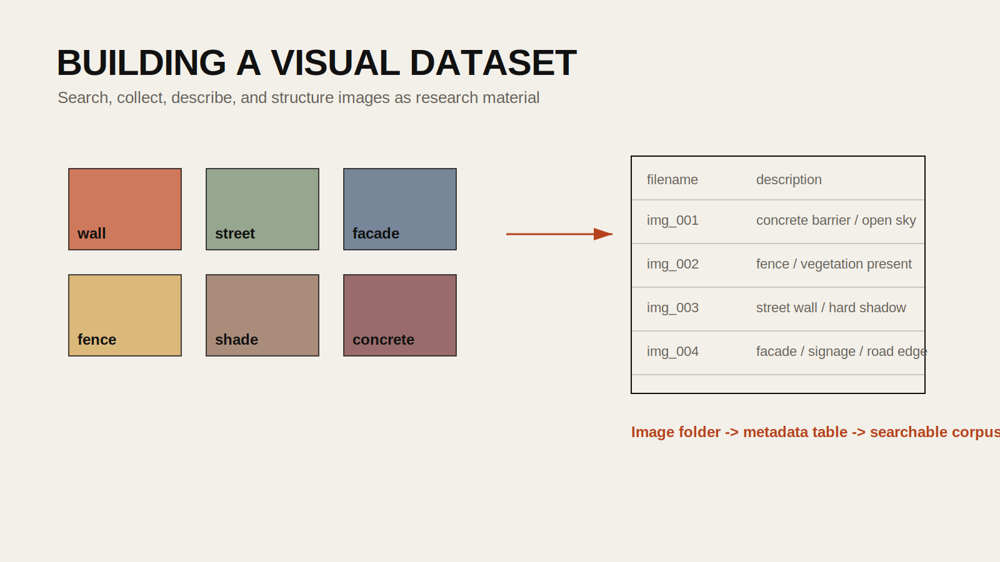

## Introduction

Visual research often begins in an ad hoc way: a designer downloads a handful of images, renames them inconsistently, and tries to remember where they came from. That can be fine for quick inspiration, but it does not scale into a serious research workflow. Once a project needs hundreds of images, metadata, searchable descriptions, or comparison across categories, the image collection has to become a dataset.

This tutorial combines the `24FA-ARCH-581A-40 - GoogleImageAPI` and `24FA-ARCH-581A-40 - Describe Image` notebooks into one public-facing workflow. The objective is to collect a thematically focused image set, save usable metadata, and generate machine-readable descriptions that can support later filtering, search, or analysis.

## Historical Context

Image archives have long depended on cataloging systems: keywords, captions, curatorial notes, and classification schemes. In digital research, image search engines made collection easier but often at the cost of transparency and consistency. More recently, multimodal AI systems made it possible to describe image content computationally, generating captions, tags, and categorical attributes at scale.

For design and visual culture research, this is powerful because it lets students move from a folder of references to a structured visual corpus.

## Design Relevance

Designers routinely work with precedent images, urban photographs, street scenes, construction documentation, material references, and scraped visual evidence from online sources. Organizing these images as data helps with questions like:

- What kinds of visual patterns recur in a topic such as border walls, storefront facades, or flood barriers?
- Can images be grouped by materials, landscape conditions, or spatial typologies?
- How can a large reference collection become searchable without hand-captioning every file?

## Learning Goals

- Collect a themed image set from a search API
- Save image metadata to a DataFrame and CSV
- Build a table of local file paths and filenames
- Generate AI descriptions for each image
- Store the results for downstream analysis



## Important Caution Before You Begin

Image collection and description workflows raise legal and ethical questions.

- Respect copyright and terms of service
- Document where images came from
- Be cautious with faces, private property, and identifiable individuals
- Understand that machine-generated descriptions may be incomplete, biased, or wrong

This tutorial is best used for research and analysis rather than for republishing copyrighted imagery.

## Step 1: Install Packages

```bash
pip install pandas pillow openai google-search-results requests
```

If you are using Google Colab, store API credentials in Secrets or a configuration file outside the notebook. Do not hardcode keys.

## Step 2: Search and Download Images

The source notebook uses SerpApi to query Google Images. The public version should keep the logic but make the file management clearer.

```python
import os
import io
import requests
import pandas as pd
from PIL import Image
from serpapi import GoogleSearch

SERPAPI_KEY = os.environ["SERPAPI_KEY"]

def download_images(search_term, num_images=20, output_dir="images"):
    os.makedirs(output_dir, exist_ok=True)

    search = GoogleSearch({
        "engine": "google_images",
        "q": search_term,
        "api_key": SERPAPI_KEY,
    })

    results = search.get_dict()
    image_results = results.get("images_results", [])[:num_images]

    rows = []
    for i, item in enumerate(image_results):
        url = item.get("original") or item.get("thumbnail")
        if not url:
            continue

        try:
            response = requests.get(url, timeout=20)
            response.raise_for_status()
            image = Image.open(io.BytesIO(response.content)).convert("RGB")

            filename = f"{search_term.replace(' ', '_')}_{i:03d}.jpg"
            filepath = os.path.join(output_dir, filename)
            image.save(filepath)

            rows.append({
                "search_term": search_term,
                "filename": filename,
                "file_path": filepath,
                "source_url": url,
                "title": item.get("title"),
                "source": item.get("source"),
            })
        except Exception:
            continue

    return pd.DataFrame(rows)
```

Run it on a focused theme rather than a generic topic.

```python
df = download_images("border wall", num_images=10, output_dir="./border_wall_images")
df.head()
```

## Step 3: Save Metadata Immediately

One of the most important parts of the notebook workflow is not the API call itself, but the fact that it creates a structured table. Save that right away.

```python
df.to_csv("image_collection.csv", index=False)
```

That CSV becomes the foundation for later description, classification, and auditing.

## Step 4: Build a Local Image Table

If you already have a folder of images, you can skip the search step and simply turn the folder into a DataFrame.

```python
import glob

image_dir = "./border_wall_images"
patterns = ["*.jpg", "*.jpeg", "*.png"]

filepaths = []
for pattern in patterns:
    filepaths.extend(glob.glob(os.path.join(image_dir, pattern)))

df = pd.DataFrame({
    "file_path": sorted(filepaths),
})
df["filename"] = df["file_path"].apply(os.path.basename)
df.head()
```

## Step 5: Describe Each Image with a Vision Model

The source notebook uses OpenAI to generate image descriptions and then stores them in a DataFrame. That pattern is useful because the descriptions can later support search, tagging, and filtering.

```python
import base64
from openai import OpenAI

client = OpenAI()

def encode_image(image_path):
    with open(image_path, "rb") as f:
        return base64.b64encode(f.read()).decode("utf-8")

def describe_image(image_path):
    b64 = encode_image(image_path)
    response = client.responses.create(
        model="gpt-4.1-mini",
        input=[
            {
                "role": "user",
                "content": [
                    {"type": "input_text", "text": "Describe this image in 3 to 5 sentences. Focus on objects, materials, spatial conditions, and environmental cues."},
                    {"type": "input_image", "image_url": f"data:image/jpeg;base64,{b64}"},
                ],
            }
        ],
    )
    return response.output_text
```

Apply it to the DataFrame:

```python
df["image_description"] = df["file_path"].apply(describe_image)
```

## Step 6: Add Structured Attribute Extraction

The source notebook goes a step further by extracting materials and environmental attributes. This is where the workflow becomes more analytical.

```python
import json

attribute_prompt = """
Your goal is to extract material and environmental attributes from an image.

Return valid JSON with these fields:
- primary_materials: list of visible materials
- spatial_setting: short phrase
- vegetation_present: true or false
- weather_or_light: short phrase

Return JSON only.
"""

def extract_attributes(image_path):
    b64 = encode_image(image_path)
    response = client.responses.create(
        model="gpt-4.1-mini",
        input=[
            {"role": "system", "content": attribute_prompt},
            {
                "role": "user",
                "content": [
                    {"type": "input_text", "text": "Analyze this image and return the requested JSON."},
                    {"type": "input_image", "image_url": f"data:image/jpeg;base64,{b64}"},
                ],
            },
        ],
    )
    return json.loads(response.output_text)
```

Then expand the JSON into columns.

```python
df["attributes"] = df["file_path"].apply(extract_attributes)
df["primary_materials"] = df["attributes"].apply(lambda x: x.get("primary_materials"))
df["spatial_setting"] = df["attributes"].apply(lambda x: x.get("spatial_setting"))
df["vegetation_present"] = df["attributes"].apply(lambda x: x.get("vegetation_present"))
df["weather_or_light"] = df["attributes"].apply(lambda x: x.get("weather_or_light"))
```

## Step 7: Save the Dataset for Later Use

At this point you have a real research artifact: a visual dataset with source information, local file paths, descriptions, and structured attributes.

```python
df.to_pickle("image_description_dataset.pkl")
df.to_csv("image_description_dataset.csv", index=False)
```

The pickle file preserves Python data types more easily, while the CSV is convenient for sharing and inspection.

## Reading the Results Critically

Machine descriptions are useful, but they are not neutral.

Possible failure modes include:

- misidentifying materials or objects
- inventing details not clearly visible
- flattening complex social or political imagery into generic descriptions
- reproducing visual bias around people, place, or class markers

Students should always sample the output manually and compare the generated metadata against the actual images.

## Extensions

- build a searchable precedent archive for facade studies
- compare visual differences across neighborhoods or infrastructure types
- cluster images by description or extracted material tags
- combine this workflow with embeddings to create a semantic image browser

## Resources

- [SerpApi Documentation](https://serpapi.com/images-results)
- [OpenAI Vision Guide](https://platform.openai.com/docs/guides/images)
- [Pillow Documentation](https://pillow.readthedocs.io/en/stable/)
