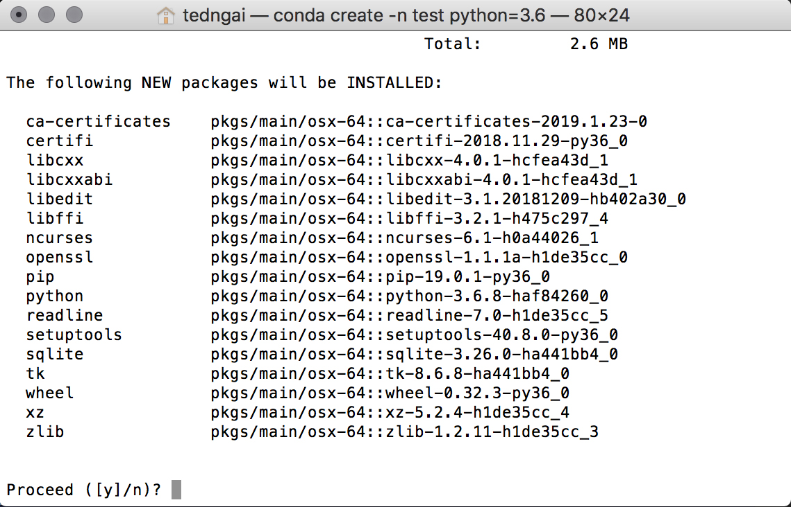
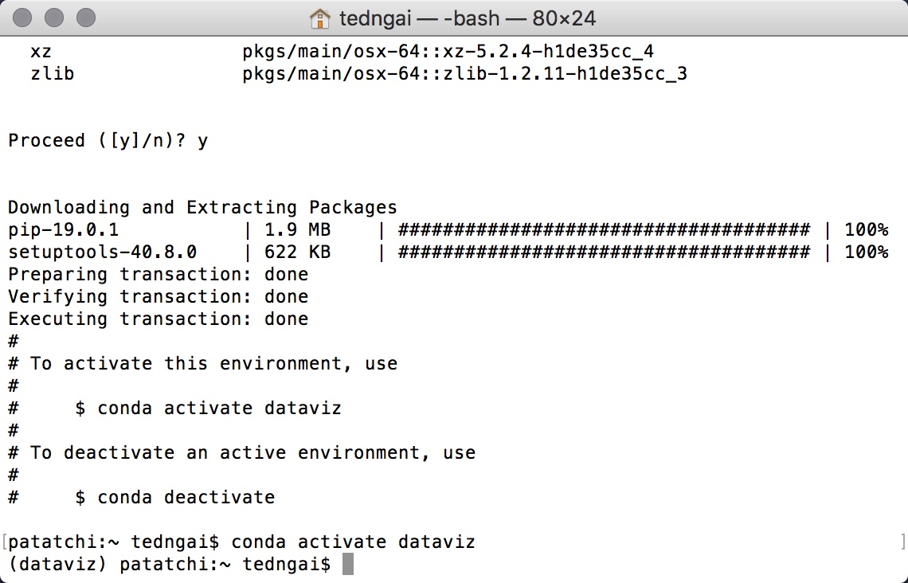
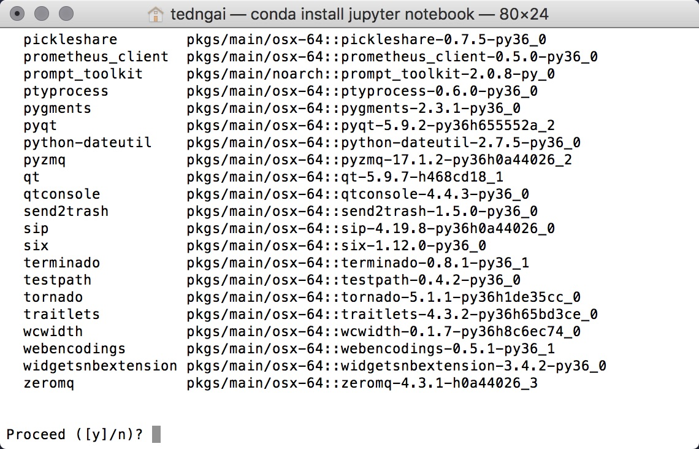
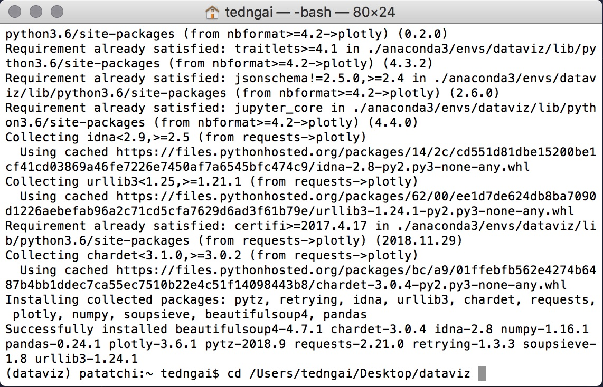
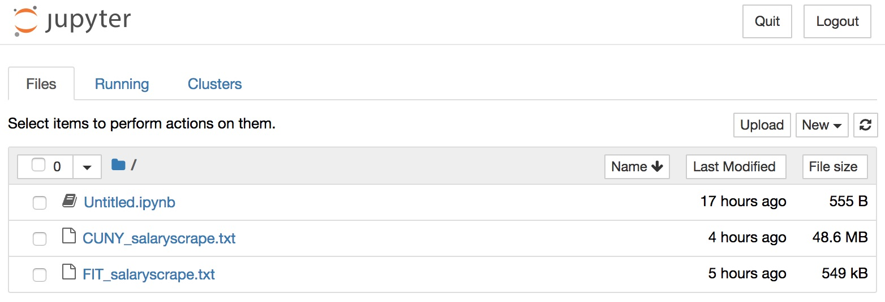
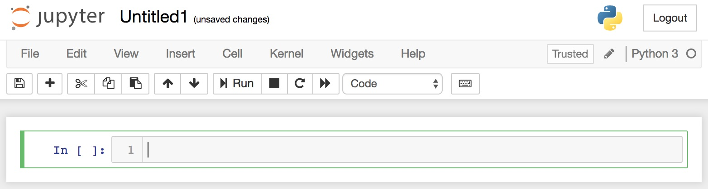

## Project Description

This module is preparation for the data visualization with Python workshop. No programming background is required. In this installation module, you will follow step-by-step instructions to install Python and some of the most powerful and popular data processing / visualization libraries in the industry. We will be using Anaconda as a Python management software that is cross platform, thus all the instructions are the same between Windows, OSX and Linux.

---

# Step 1
## Python Installation

First you want to install [Anaconda](https://www.anaconda.com/distribution/). Go to the website and download the Anaconda Installer, you want to go with Python 3 and the current version as of writing is Python 3.7.

Once you have downloaded and installed Anaconda, open a [Terminal](https://www.macworld.co.uk/how-to/mac-software/how-use-terminal-on-mac-3608274/) if you're on OSX or an [Anaconda Prompt](https://docs.anaconda.com/anaconda/user-guide/getting-started/) if you're on Windows.

You want to create a Virtual Environment for this exercise. The purpose of virtual environment is to create an isolated environment to contain all the packages you will install. What that literally means is everything you install, all the libraries and packages, including the python version, will be stored in a separate folder. There many reasons why this is a good practice. Since python is used from machine learning to webscraping to data visualization, sometimes you will encounter an application such as GIS that will require python version 2.7, whereas the machine learning framework from Google Tensorflow will only work with python version 3.5 (as of writing, the GPU optimized version only works with Python 3.5 if you use a particular GPU hardware). So virtual environment is a very convenient way to isolate and manage your python installations.

To create a virtual environment in [Anaconda](https://www.anaconda.com/distribution/), in the Terminal or Anaconda Prompt, type:

```bash
conda create --name dataviz python=3.7
```



When asked to proceed, click Y and press Enter. For a more in-depth write up on Anaconda Environments, see the [Conda Environments documentation](https://conda.io/projects/conda/en/latest/user-guide/tasks/manage-environments.html).

Now that you have Anaconda and Python running in your system, you want to activate the environment you just created and then start installing all the packages that we will use in this workshop. First activate the environment by typing this in the Terminal or Anaconda Prompt.

```bash
conda activate dataviz
```

If you're successful in activating the virtual environment, you should see the name of the environment appear in brackets. And congratulations, you are now ready to dive into the vast and exciting world of Python libraries.



---

# Step 2
## Jupyter Notebook Installation

Next we will install [Jupyter Notebook](https://jupyter.org/index.html) by typing the following command in Terminal or Anaconda Prompt, and type Y when asked to Proceed.

Jupyter Notebook is an Interactive Computing Environment that allows you to get immediate feedback when coding, and it is a full featured Python IDE that automatically formats your code properly. It makes programming much more visual and intuitive and we will use it exclusively in our workshops.

```bash
conda install jupyter
```



### Installing Other Python Packages

Next we will install [Plotly](https://plot.ly/python/getting-started/), [NumPy](https://pypi.org/project/numpy/), [BeautifulSoup](https://pypi.org/project/beautifulsoup4/), [Scikit-Learn](https://scikit-learn.org/stable/index.html), [Matplotlib](https://matplotlib.org/) and [Pandas](https://pandas.pydata.org/pandas-docs/stable/install.html) by typing the following command in Terminal or Anaconda Prompt.

```bash
conda install plotly pandas scikit-learn matplotlib basemap netcdf4 seaborn requests
```

```bash
pip install beautifulsoup4
```

- [Plotly](https://plot.ly/python/getting-started/) is a dynamic graphing web application. It lets you make beautiful interactive plots easily.
- [NumPy](https://pypi.org/project/numpy/) is a library that deals with multidimensional arrays or matrices, it's an essential library for many scientific computing and image processing applications.
- [BeautifulSoup](https://pypi.org/project/beautifulsoup4/) is a webscraping module that lets you access and collect data online easily.
- [Scikit-Learn](https://scikit-learn.org/stable/index.html) is an essential toolkit for data processing and machine learning.
- [Matplotlib](https://matplotlib.org/) is a graphing library that handles much of the non-dynamic graphics.
- [Pandas](https://pandas.pydata.org/pandas-docs/stable/install.html) is a library for data processing.

---

# Step 3
## Launch Jupyter Notebook

Next, we create a folder where all the coding files will reside. In my case, I'll create a folder on my desktop called dataviz. You can do that wherever you want. Once the folder has been created, go back to your Terminal or Anaconda Prompt, then type cd and then type in the path to your newly created folder, then press **Enter**.

```bash
cd /Users/tedngai/Desktop/dataviz
```



Once you're in your newly created folder, launch Jupyter Notebook by typing the following. It will launch your web browser and should open the web app, and you should see Jupyter and your current folder location. Again, you should see *dataviz* in parenthesis. If not, refer back to Step 1 to activate your environment again.

```
(dataviz)patatchi:Dataviz tedngai$ jupyter notebook
```



Last but not least, click the New button at the near top right and click on Python 3 to create a new notebook. And congratulations, if you are able to get to this point, you are all set to do some exciting programming. If you have trouble getting things to work thus far, please carefully review the steps and make sure you have your virtual environment activated and you are in the proper folder.



---

# Summary

### What You Have Accomplished

- How to install Anaconda and Python
- How to install any Python libraries
- How to launch and work with Jupyter Notebook
