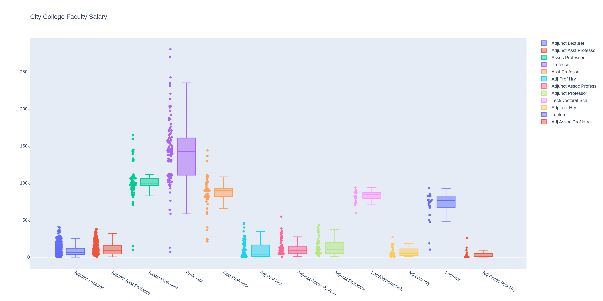
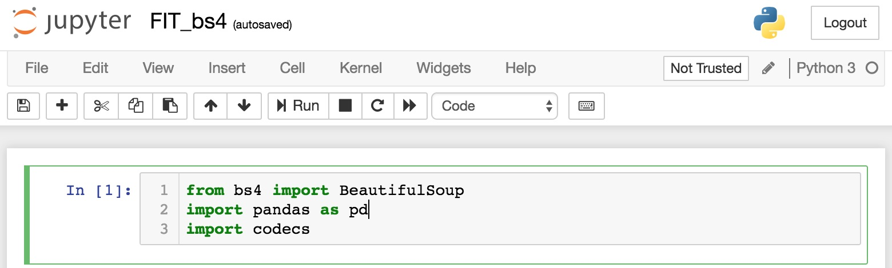
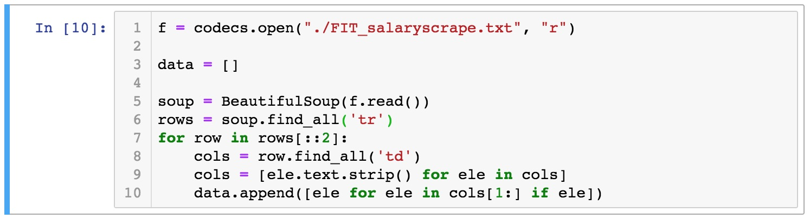
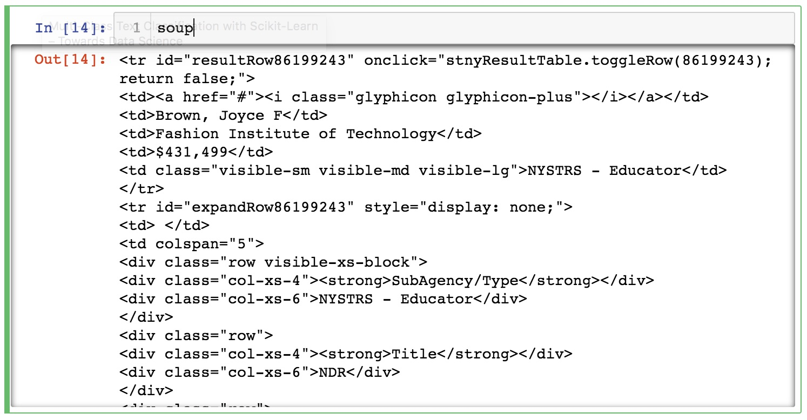
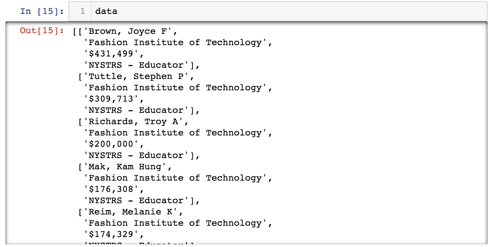
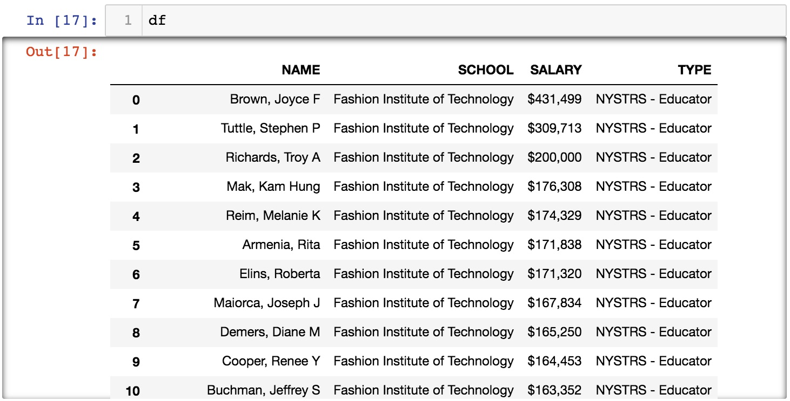
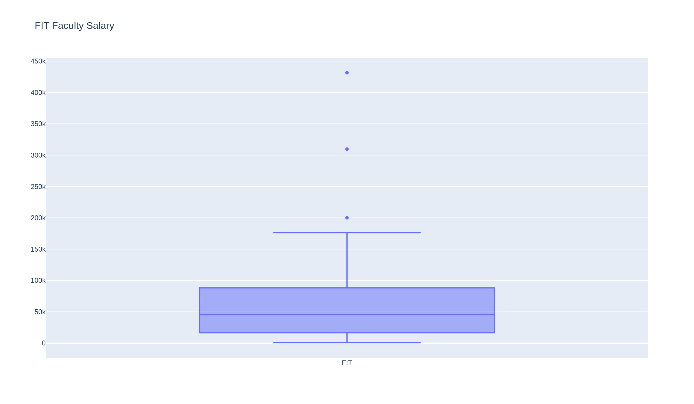
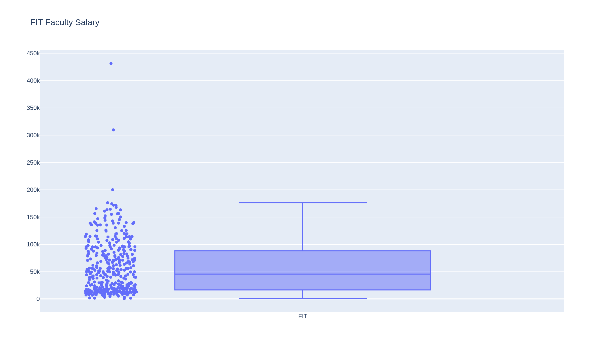
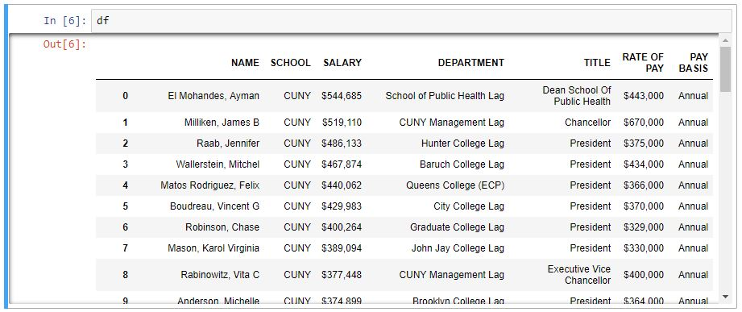
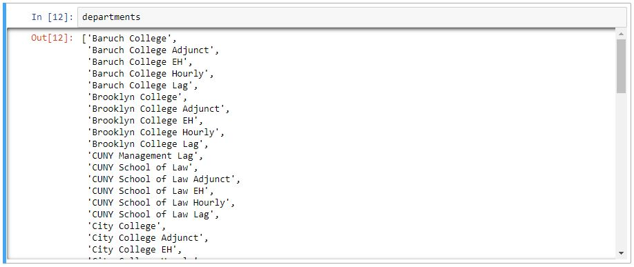

## Project Description

In this workshop session you will learn to scrape data off an HTML document, process the data by extracting all the data and eliminating all the HTML tags, and then do a fairly straightforward visualization. By the end of this session, you will learn to do something like this.



[Open interactive chart](../assets/interactive/data-viz/city-college-faculty-salary-box.html)

---

# Step 1
## Webscraping & Data Processing

Webscraping is a very powerful tool for data visualization especially if you're interested in culturo-socio-politico-economic issues. This tool allows you to tap into vast amount of data from sometimes not so data friendly sources. In this example, we will look at salary levels of people who work in the New York Public Education System. By deploying the Freedom of Information Act, some organizations have requested and released data such as salary levels of all public employees across the country. This is an invaluable tool to demand accountability for people holding public offices. However, these datasets do not always come in a format that is easy to visualize. In our case, we will dive into a typical use case scenario and use the data released by the [Empire Center](https://www.seethroughny.net/), and look at salary levels of employees working in the CUNY system.

To start, the data cannot be downloaded with the click of a button. The data is not stored in any of the contemporary data formats like XML, JSON, or even CSV. So to get the data, we'll need to do some detective work and see how we can collect the information we want. First visit this website, [seethroughny.net](https://www.seethroughny.net/). Go to Menu > Payrolls > Schools, then under **Filter > Employer / Agency**, type in **Fashion Institute of Technology**.

We will cover how to use Python to access web pages and webscrape with code at a different exercise. For now, I have already prepared and downloaded part of the HTML data for you so we can jump into data processing and visualization immediately.

If you have not done so already, download, unzip, and move the data file and place them into a new folder. Then **Launch Jupyter Notebook** by opening a [Terminal](https://www.macworld.co.uk/how-to/mac-software/how-use-terminal-on-mac-3608274/) or [Anaconda Prompt](https://docs.anaconda.com/anaconda/user-guide/getting-started/), and type **CD** for "change directory", and type in the path of the folder where your data file is stored.

```bash
cd /Users/tedngai/Desktop/dataviz
```

Then launch Jupyter Notebook by typing this, it will launch your web browser and should open the web app, and you should see Jupyter and your current folder location.

```bash
jupyter notebook
```

In Jupyter Notebook, click in the space at the first line right next to **In [1]**, and type the following, once it's done **Hold SHIFT then press ENTER** to execute the code.

```python
from pathlib import Path
from bs4 import BeautifulSoup
import pandas as pd
```



Python is a very powerful programming language due to the fact that it has a large community of developers writing libraries to handle lower level programming, allowing you to concentrate on the big ideas.

There are many libraries and packages out there that will handle different types of issues. And whenever you install libraries or packages from the opensource community, you will need to **"import"** them into the current system. And that's what these first 3 lines of code is doing.

Next we will need to load the data file. Do that by typing the following and **Hold SHIFT then press ENTER** again to execute the code.

```python
html = Path("FIT_salaryscrape.txt").read_text(encoding="utf-8")
```

This line reads the entire text file into a variable called `html`. As mentioned before, this file is basically a copy-paste of the webpage's HTML code. That means it contains both human-readable content and structural markup that we need to parse before we can analyze it as data. If you are not familiar with HTML code, see [W3Schools HTML Examples](https://www.w3schools.com/html/html_examples.asp) for a deep-dive into HTML code format and structure.

What we want to do is to separate HTML codes from data. Luckily the Python library BeautifulSoup is built to do just that. Type in the following code and **Hold SHIFT then press ENTER** to execute.

```python
data = []

soup = BeautifulSoup(html, "html.parser")
rows = soup.find_all('tr')
for row in rows[::2]:
    cols = row.find_all('td')
    cols = [ele.text.strip() for ele in cols]
    data.append([ele for ele in cols[1:] if ele])
```



The first line creates an empty list named `data`. Think of it as a container that will collect one processed row at a time. The second line asks BeautifulSoup to parse the raw HTML string and assign the parsed document to `soup`. If you type `soup` into the next cell and run it, you will see the HTML content itself. By looking at the HTML code, we can see that the useful payroll information is stored in repeating table rows, which means we can apply the same extraction logic over and over until we have a tabular dataset.



HTML is basically a mix of human-readable language and machine-readable structure, allowing both people and software to access the same information. Most of that machine-readable structure is stored in bracketed **tags** such as `tr` and `td`. `tr` represents a table row and `td` represents a table cell. In this example, we collect every `tr` row, then look inside each row for `td` cells and strip away the tags so only the text remains. For more information on lists, see [Think CS: Lists](http://openbookproject.net/thinkcs/python/english3e/lists.html).

This code loops through each HTML row and applies the same cleaning procedure repeatedly until we have a programming-friendly dataset. `for row in rows` is the basic Python pattern for stepping through every item in a list. In this first example, `[::2]` skips every other row because the source alternates between useful payroll rows and nonessential expansion rows. For a deep-dive into Python loop structures, see [Python For Loops](https://wiki.python.org/moin/ForLoop).

Now that we're inside the **for loop**, we identify all the `td` tags inside each row and convert them into a plain Python list. The `.text.strip()` step removes extra whitespace and leaves only the human-readable values.

Last but not least, the final line appends the cleaned row to `data`. If you execute `data` in the next cell, you should see a list of payroll rows ready to turn into a DataFrame.



As you can see, this data structure is a **list of lists**. It contains one cleaned record per person, with fields such as name, school, salary, and type. Now it's time to turn this list into a Pandas DataFrame to make visualization much easier. We also convert the salary column from currency-formatted text into numeric values so Plotly can treat it as quantitative data.

```python
labels = ['NAME', 'SCHOOL', 'SALARY', 'TYPE']
df = pd.DataFrame.from_records(data, columns=labels)
df['SALARY'] = (
    df['SALARY']
    .str.replace(r'[^0-9.-]', '', regex=True)
    .astype(float)
)
```



Now that you have turned an ordinary **list of lists** into a Pandas **DataFrame**, we will be able to use many of its powerful features to further process the data.

---

# Step 2
## Data Visualization

We're now ready to visualize the data. The table we have only has 4 columns of data, 2 of which repeats the same information over and over. So essentially, we only have **names** and **salary** to work with. For something like this, we can do a [Box Plot](https://plotly.com/python/box-plots/) that allows us to look at 1-Dimensional data in an interesting way. For more graph types you can do with Plotly, see [Plotly Python Graphs](https://plotly.com/python/).

For this next part we'll need to bring in another Python package. Plotly is a dynamic graphing package that lets you interact with data live. We will look at the basics of how to use it to graph what we have. So first import the packages by typing in the following.

```python
import plotly.graph_objects as go
```

This import gives you access to Plotly's low-level graph objects API. Once you have executed the code, you can go ahead and input the following code.

```python
fig = go.Figure(
    data=[
        go.Box(
            name="FIT",
            y=df['SALARY'],
        )
    ]
)
fig.update_layout(title="FIT Faculty Salary")
fig.show()
```

If everything is running correctly, you should see a graph like this one. This is a 1 dimensional graph that gives you a bit of statistical calculation. It tells you what the median value is, what the lower and upper fence is, and what numbers are falling outside of the norm.



[Open interactive chart](../assets/interactive/data-viz/fit-faculty-salary-box.html)

### Alternate Visualization

Although this visualization is very straightforward, you can improve it by showing the underlying points so the distribution is easier to read. `boxpoints='all'` tells Plotly to show every data point, `jitter` spreads those points horizontally, and `pointpos` shifts them slightly so they do not sit directly on top of the box.

```python
boxpoints='all',
jitter=0.2,
pointpos=-1.5
```

All together it would look something like this.

```python
fig = go.Figure(
    data=[
        go.Box(
            name="FIT",
            y=df['SALARY'],
            boxpoints='all',
            jitter=0.2,
            pointpos=-1.5,
        )
    ]
)
fig.update_layout(title="FIT Faculty Salary")
fig.show()
```



[Open interactive chart](../assets/interactive/data-viz/fit-faculty-salary-box-all-points.html)

---

# Step 3
## Data Visualization Challenge

Let's try to apply everything we've learned so far and apply it to a more challenging dataset. For this exercise, you will have to learn a few more Pandas commands on data processing. We will use the **CUNY_salaryscrape.txt** file that was downloaded earlier.

Now before we begin this final challenge, let's take a look at the file and try to understand what kind of strategy we need to unpack this. First, the text file itself is almost 50MB, for a text file this is pretty big, which means we have to be careful about memory management. And upon opening the file, you'll find that there are over 12 million lines of text inside. Although not all the lines are useful data, we'll need to devise a way to efficiently extract only the useful information out.

Now let's open up the file and look at the first 2 rows of data under the **tr** tag and try to see what we're dealing with. The file opens with an HTML tag `<tbody>` followed by 1 `<tr>` tag and a bunch of `<td>` tags. This part of the file is exactly the same as the previous exercise. The `<tr>` tags have 2 different `id` types: 1 is the ***resultRow*** and the other is the ***expandRow***, with ***resultRow*** showing the basic information and ***expandRow*** showing supplemental information. Unlike the previous example, we can't just simply discard the expandRow, this means we will have to accommodate that with our code.

Also, the first row of data is separated into columns with the `<td>` tags whereas the second row is separated by `<div>` tags. So the 2 rows of data will have to be parsed differently.

```html
<tbody><tr id="resultRow88275159" onclick="stnyResultTable.toggleRow(88275159); return false;">
    <td><a href="#"><i class="glyphicon glyphicon-minus"></i></a></td>
    <td>El Mohandes, Ayman</td>
    <td>CUNY</td>
    <td>$544,685</td>
    <td class="visible-sm visible-md visible-lg">School of Public Health Lag</td>
        </tr>
    <tr id="expandRow88275159" style="">
    <td>&nbsp;</td>
    <td colspan="5">
        <div class="row visible-xs-block">
            <div class="col-xs-4"><strong>SubAgency/Type</strong></div>
            <div class="col-xs-6">School of Public Health Lag</div>
        </div>
        <div class="row">
            <div class="col-xs-4"><strong>Title</strong></div>
            <div class="col-xs-6">Dean School Of Public Health</div>
        </div>
```

Ok so let's just dive right into this. First, again, import all the packages we need by executing the following code.

```python
from pathlib import Path
import re
from bs4 import BeautifulSoup
import pandas as pd
import plotly.express as px
```

Next, read the data file and use BeautifulSoup to parse the payroll HTML.

```python
html = Path("CUNY_salaryscrape.txt").read_text(encoding="utf-8")
soup = BeautifulSoup(html, "html.parser")
```

Same as before, the next block goes through each row of data and extracts the useful fields. This time the payroll export is more complex: each visible result row has a matching hidden expansion row containing additional metadata such as title and pay basis. So instead of flattening alternating rows by position, we match each `resultRow` with its corresponding `expandRow` and build a record from both.

```python
records = []

for result_row in soup.find_all('tr', id=re.compile(r'^resultRow')):
    row_id = result_row['id'].replace('resultRow', '')
    expand_row = soup.find('tr', id=f'expandRow{row_id}')

    base_cells = [td.get_text(' ', strip=True) for td in result_row.find_all('td')]
    details = {}

    if expand_row is not None:
        for detail_row in expand_row.find_all('div', class_='row'):
            columns = detail_row.find_all('div')
            if len(columns) >= 2:
                key = columns[0].get_text(' ', strip=True).replace(':', '')
                value = columns[1].get_text(' ', strip=True)
                details[key] = value

    records.append(
        {
            'NAME': base_cells[1] if len(base_cells) > 1 else None,
            'SCHOOL': base_cells[2] if len(base_cells) > 2 else None,
            'SALARY': base_cells[3] if len(base_cells) > 3 else None,
            'DEPARTMENT': details.get('SubAgency/Type'),
            'TITLE': details.get('Title'),
            'RATE OF PAY': details.get('Rate of Pay'),
            'PAY YEAR': details.get('Pay Year'),
            'PAY BASIS': details.get('Pay Basis'),
        }
    )
```

Now that we have a list of structured records, it's time to turn them into a Pandas DataFrame for further processing.

```python
df = pd.DataFrame.from_records(records)
df['SALARY'] = (
    df['SALARY']
    .str.replace(r'[^0-9.-]', '', regex=True)
    .astype(float)
)
```

If everything is going smoothly up to this point, you should see something like this when you type in `df`



Now that we have the whole dataset with 34,000 rows of data, we can see we have actually more than 1 dimension to work with. So for this exercise, let's filter the amount of data down. If you see the **DEPARTMENT** column, this dataset includes employees in the whole **CUNY** system. So let's start with singling out a specific college and concentrate on that. In our case, we'll only look at people who work at the **City College**.

```python
departments = sorted(df['DEPARTMENT'].dropna().unique())
```



As you can see, **City College** is named in different ways like **City College**, **City College Adjunct**, **City College EH**, and **City College Hourly**. The filter therefore needs to catch several related labels rather than a single exact match.

```python
df_cc = df[df['DEPARTMENT'].str.contains('City College', case=False, na=False)].copy()
```

Now that we have singled out only employees working at City College, we want to look at the different academic job titles and compare their salary levels.

```python
df_cc_prof = df_cc[df_cc['TITLE'].str.contains(r'Prof|Lect', case=False, na=False)].copy()
titles = sorted(df_cc_prof['TITLE'].dropna().unique())
```

Lastly, we use Plotly Express to visualize the filtered data. Instead of writing one trace per title manually, we can pass the whole tidy DataFrame into `px.box(...)` and let Plotly group the salaries by title automatically.

```python
top_titles = df_cc_prof['TITLE'].value_counts().head(12).index.tolist()
plot_df = df_cc_prof[df_cc_prof['TITLE'].isin(top_titles)].copy()

fig = px.box(
    plot_df,
    x='TITLE',
    y='SALARY',
    points='all',
    title='City College Faculty Salary',
)
fig.update_layout(
    xaxis_title='Title',
    yaxis_title='Salary ($)',
)
fig.show()
```


[Open interactive chart](../assets/interactive/data-viz/city-college-faculty-salary-box.html)

---

# Summary

### What You Have Learned

- How to create and assign value to a variable
- How to create and assign values to a list
- How to create and assign values to a list of lists
- How to bring data into Python as text or CSV files
- How to create and use a counter
- How to write and call a basic function
- Basic loop structure - how to use for-loops
- How to import packages in Python
- How to use basic functions of packages like Pandas, Plotly, BeautifulSoup
- How to create interactive plots with Plotly
