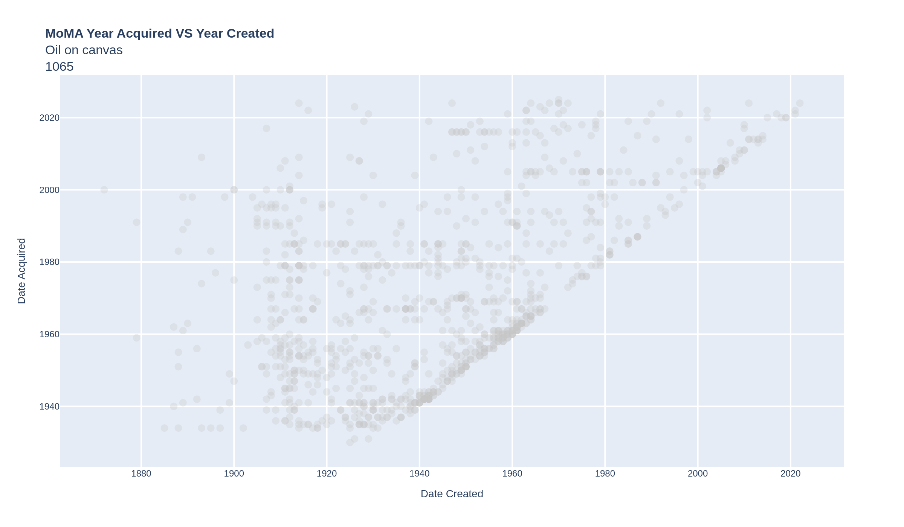
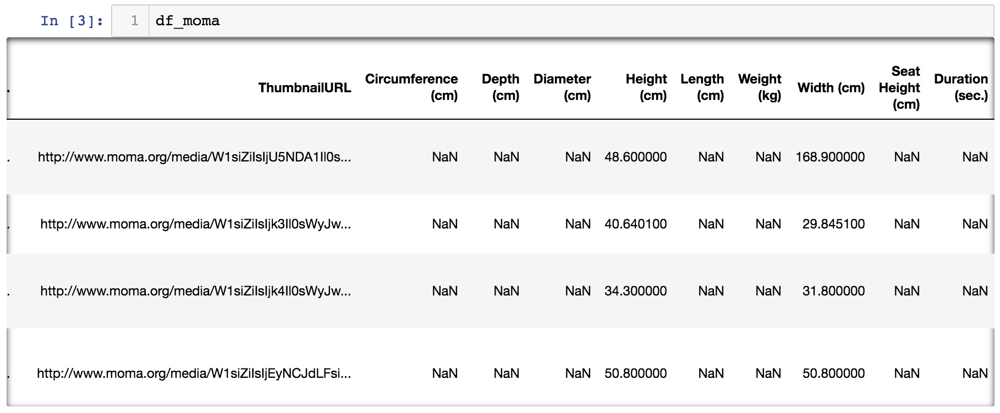
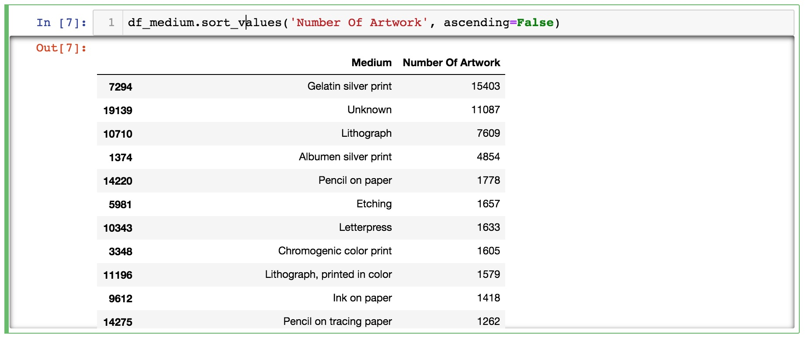
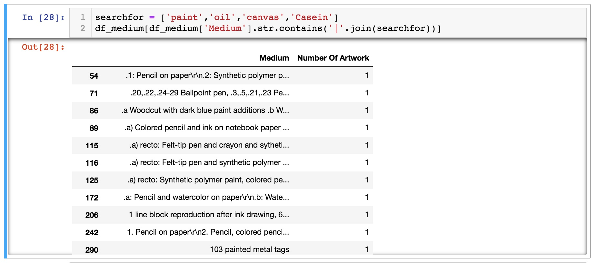
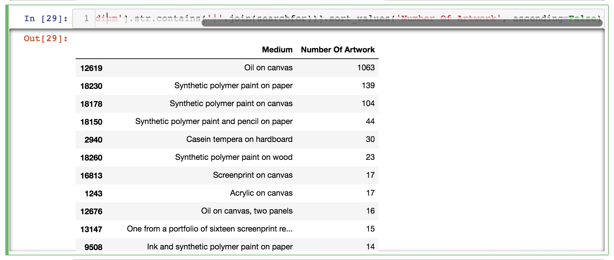
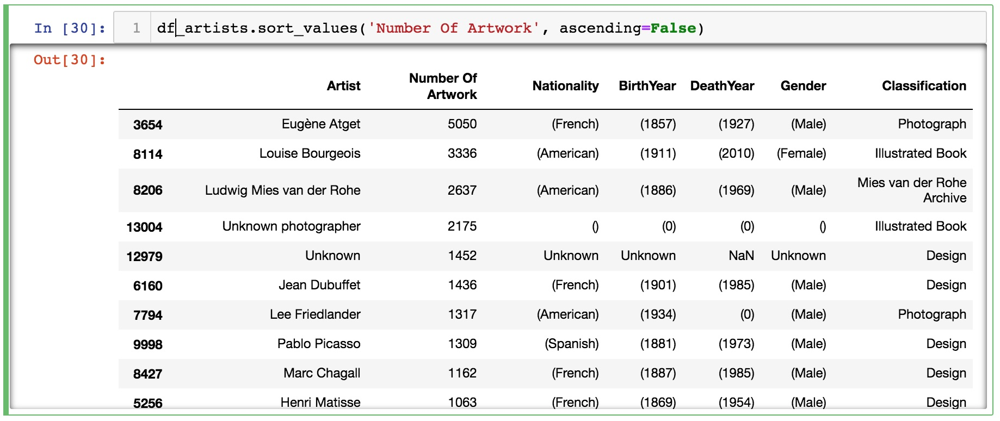
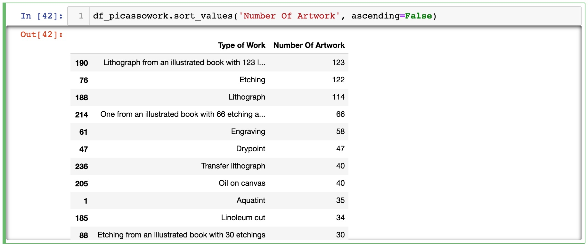
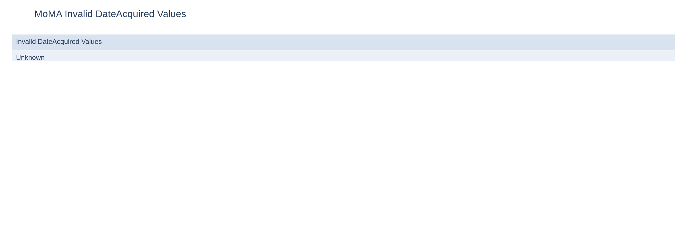
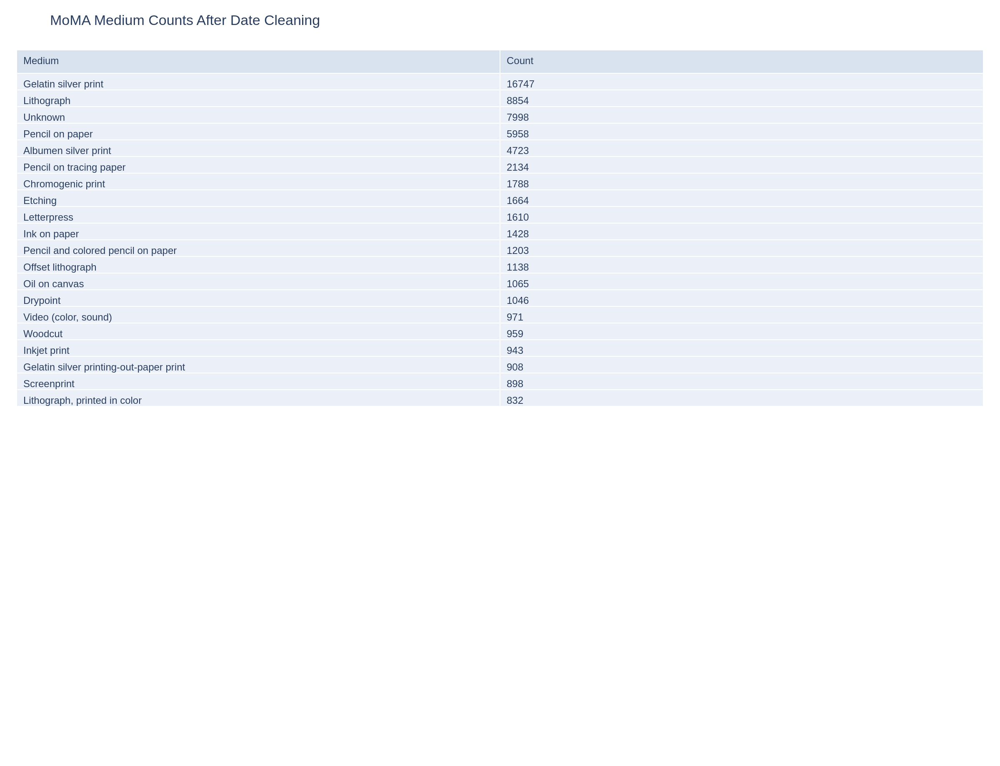

## Project Description

This data visualization module is inspired by MoMA's [data dump](https://github.com/MuseumofModernArt/collection) in 2015. MoMA released the database of their collection which contains over 130,000 pieces of artwork over the timespan of 150 years. In this session, we will learn to visualize MoMA collection similar to what [Oliver Roeder](https://fivethirtyeight.com/features/a-nerds-guide-to-the-2229-paintings-at-moma/) had done at [FiveThirtyEight](https://fivethirtyeight.com/), perhaps we will even take it further. This session will allow us to dive into Pandas, Plotly, and Python regular expression a lot more and get into some of the more intermediate level of data processing. In the course of this workshop, we will try to re-create some of Oliver's visualizations.


[Open interactive chart](../assets/interactive/moma/moma-architecture-rectangles.html)



[Open interactive chart](../assets/interactive/moma/moma-created-vs-acquired-oil-on-canvas.html)

---

# Step 1
## Import Libraries and Data

This workshop module assumes you have already installed all the necessary Python libraries, if you have not done so, please go back to the previous module. What we will need for this session is Plotly and Pandas, and we will run the entire session on Jupyter.

First import all the libraries by executing the following code.

```python
import plotly.express as px
import pandas as pd
```

Import the CSV file by executing the following code.

```python
csv_url = 'https://media.githubusercontent.com/media/MuseumofModernArt/collection/main/Artworks.csv'
df_moma = pd.read_csv(csv_url, low_memory=False)
```

If you want to speed things up a little, download the CSV file to your local drive and place it in the same folder as where you're running Jupyter Notebook, then execute this code.

```python
df_moma = pd.read_csv('./Artworks.csv', low_memory=False)
```

Execute **df_moma** to see what's inside this variable.



Upon inspecting the data, you should see that there are a large number of records that has the value of **NaN**, which in computer science lingo means **"not a number"**, which also means there is an invalid record in the dataset. So before we begin to do anything beyond this, we need to fill those records up with something else other than a **NaN** because it will cause issues with Pandas and Python down the line. We use a function called **fillna** to replace any **NaN** value with something we designate.

```python
df_moma[['Artist', 'Nationality', 'BeginDate', 'Gender', 'Medium']] = (
    df_moma[['Artist', 'Nationality', 'BeginDate', 'Gender', 'Medium']]
    .fillna('Unknown')
)
```

This line of code lets us look into each of these columns and find any **NaN** values and replace them with the word **"Unknown"**. We're now ready to move forward with more advanced data processing techniques.

---

# Step 2
## Data Processing

Now that we have imported the whole 130,000 records of MoMA's collection, say we want to see which is their largest collection, we can do something like - look at every record and see what "Medium" it uses and count them all. And finally give me a sorted result which tells me what is their biggest collection based on the Medium.

Pandas already has a built-in way to count repeated values, so we can skip the custom duplicate-counting function and go straight to a grouped summary.

```python
df_medium = (
    df_moma['Medium']
    .fillna('Unknown')
    .value_counts()
    .rename_axis('Medium')
    .reset_index(name='Number Of Artwork')
)
```

This gives you a clean two-column DataFrame that can be sorted, filtered, and graphed directly.

At this point the summary table is already a DataFrame, so the next step is simply to sort it and inspect the results.

```python
df_medium.sort_values('Number Of Artwork', ascending=False)
```



So now we know the largest collection MoMA has is photography and a large number of artwork have unknown media type.

Now let's say you want to look for specific **keywords** in the collection that you would associate with paintings, you can do something like this.

```python
searchfor = ['paint','oil','canvas','Casein']
df_medium[df_medium['Medium'].str.contains('|'.join(searchfor), case=False, na=False)]
```

For more details see [Pandas Str Contains](https://pandas.pydata.org/pandas-docs/stable/reference/api/pandas.Series.str.contains.html).



Now combine the sort function with the search function and write it all at once.

```python
df_medium[
    df_medium['Medium'].str.contains('|'.join(searchfor), case=False, na=False)
].sort_values('Number Of Artwork', ascending=False)
```



Now let's try to use the same method of finding duplicates to see which artist has the largest number of work at MoMA.

```python
df_artists = (
    df_moma
    .fillna({'Artist': 'Unknown'})
    .groupby('Artist', as_index=False)
    .agg(
        Number_Of_Artwork=('Title', 'size'),
        Nationality=('Nationality', 'first'),
        BirthYear=('BeginDate', 'first'),
        DeathYear=('EndDate', 'first'),
        Gender=('Gender', 'first'),
        Classification=('Classification', 'first'),
    )
    .sort_values('Number_Of_Artwork', ascending=False)
)
```



We can also single out individual artist and look at the variety of work based on medium.

```python
df_picasso_work = (
    df_moma[df_moma['Artist'].eq('Pablo Picasso')]
    .groupby('Medium', as_index=False)
    .size()
    .rename(columns={'Medium': 'Type of Work', 'size': 'Number Of Artwork'})
    .sort_values('Number Of Artwork', ascending=False)
)
```



So it turns out, MoMA has over one thousand pieces of artwork by Picasso and almost 25% of that are lithographic work!

---

# Step 3
## Date Created VS Date Acquired

This next exercise will dive right into one of the graphs [Oliver Roeder](https://fivethirtyeight.com/features/a-nerds-guide-to-the-2229-paintings-at-moma/) had done at [FiveThirtyEight](https://fivethirtyeight.com/) in which he graphed the year in which a painting had been painted versus the year in which the painting had been acquired by MoMA.

Let's open up a new notebook start fresh, and import the following packages.

```python
import plotly.express as px
import pandas as pd
import re
```

Import the CSV file as we did before, again, your choice if you want to load it remotely or locally.

```python
csv_url = 'https://media.githubusercontent.com/media/MuseumofModernArt/collection/main/Artworks.csv'
df_moma = pd.read_csv(csv_url, low_memory=False)
```

```python
df_moma = pd.read_csv('./Artworks.csv', low_memory=False)
```

And again, let's clean up all the missing values which is represented by **NaN** and fill that with the text **Unknown**. For more on how to work with **Missing Data** in Pandas, see [Pandas Missing Data](https://pandas.pydata.org/pandas-docs/stable/user_guide/missing_data.html).

```python
df_moma[['Artist', 'Nationality', 'Date', 'BeginDate', 'Gender', 'DateAcquired', 'Medium', 'Title']] = (
    df_moma[['Artist', 'Nationality', 'Date', 'BeginDate', 'Gender', 'DateAcquired', 'Medium', 'Title']]
    .fillna('Unknown')
)
```

Now let's look at the 2 columns of data we're interested in working with, DateAcquired and Date.

```python
df_moma[['DateAcquired','Date']]
```


[Open interactive table](../assets/interactive/moma/moma-date-preview.html)

Immediately we notice that the date format is different between the 2 columns, and even within each column, there are a lot of inconsistencies in the format. This is one of the quintessential chores in data science to search through and clear data for inconsistencies.

To do that let's talk through what the approach is, and simplify the problem by only looking at one of the columns first. The Date Acquired seems to be a bit more consistent at first glance, it seems most of the rows have this xxxx-xx-xx format. So let's take a deeper look into this.

```python
invalid_date_acquired = df_moma.loc[
    ~df_moma['DateAcquired'].str.contains(r'^(?:\d{4}).*', regex=True, na=False),
    'DateAcquired'
].drop_duplicates()

invalid_date_acquired.tolist()[:10]
```



[Open interactive table](../assets/interactive/moma/moma-dateacquired-invalid-values.html)

`df_moma['DateAcquired']` isolates one column of the DataFrame. We then use a regular expression inside `str.contains(...)` to test whether each row begins with a four-digit year. Regular Expression is a powerful way to look for patterns in messy text data. For a deeper understanding, see [Regex Cheatsheet](https://www.dataquest.io/blog/regex-cheatsheet/).

But let's try to break it down so we have a basic understanding.

The pattern `^(?:\d{4}).*` means "start at the beginning of the string and look for a four-digit year." In plain language, we are asking whether the value starts like a usable calendar date.

Instead of printing every row, this pattern gives you the distinct unexpected values directly, which is usually more useful when cleaning a dataset.

Now the **Date** column seems like it's a lot more complex. Just by scrolling through the data we can already see there is **xxxx, xxxx-xx, c. xxxx, c. xxxx-xx, xxxx-xxxx**... so we will have to come up with another **regular expression pattern** to sift through that data.

```python
invalid_date = df_moma.loc[
    ~df_moma['Date'].str.contains(r'^.*(?:\d{4}).*', regex=True, na=False),
    'Date'
].drop_duplicates()

invalid_date.tolist()[:10]
```

The second pattern is looser. It asks whether a four-digit year appears anywhere in the `Date` field, which is useful because the production date column contains prefixes like `c.` or ranges like `xxxx-xxxx`.

Now that we know the data has these many inconsistencies, let's get rid of them. But as a general practice, we don't necessarily want to delete records. Instead, we can create a copy of the data with a filter so we get a clean dataset.

```python
df_moma_clean = df_moma.loc[
    df_moma['DateAcquired'].str.contains(r'^(?:\d{4}).*', regex=True, na=False)
    & df_moma['Date'].str.contains(r'^.*(?:\d{4}).*', regex=True, na=False)
].copy()
```

Now although we have filtered the obviously unusable rows, we still need to convert the surviving text strings into actual numeric year columns. Since the year is the only consistently recoverable part of both fields, we extract just that piece.

```python
df_moma_clean['DateCreated'] = pd.to_numeric(
    df_moma_clean['Date'].str.extract(r'^.*(\d{4}).*')[0],
    errors='coerce',
)
df_moma_clean['DateAcquiredFormatted'] = pd.to_numeric(
    df_moma_clean['DateAcquired'].str.extract(r'^(\d{4}).*')[0],
    errors='coerce',
)

df_moma_clean = df_moma_clean.dropna(subset=['DateCreated', 'DateAcquiredFormatted'])
df_moma_clean = df_moma_clean[df_moma_clean['DateAcquiredFormatted'] >= 1700].copy()
```

For this part, we're using a native Pandas function **str.extract** in combination with regular expression to create numeric year columns that can be plotted directly.

Since there are still over 120,000 records, the next step is to narrow the dataset to a few representative media types before plotting.

```python
df_medium = (
    df_moma_clean['Medium']
    .value_counts()
    .rename_axis('Medium')
    .reset_index(name='Number Of Artwork')
)

df_medium.head(20)
```



[Open interactive table](../assets/interactive/moma/moma-medium-counts-cleaned.html)

You can choose to filter the records in different ways but let's say for now we will do it by medium.

```python
df_gelatin = df_moma_clean[df_moma_clean['Medium'].eq('Gelatin silver print')].copy()
df_lithograph = df_moma_clean[df_moma_clean['Medium'].eq('Lithograph')].copy()
df_oil = df_moma_clean[df_moma_clean['Medium'].eq('Oil on canvas')].copy()
df_albumen = df_moma_clean[df_moma_clean['Medium'].eq('Albumen silver print')].copy()
```

Now to create the actual graph, we'll use a placeholder variable so if you want to change to a different medium, you just need to change the first variable.

```python
df_placeholder = df_oil

fig = px.scatter(
    df_placeholder,
    x='DateCreated',
    y='DateAcquiredFormatted',
    hover_data=['Artist', 'Title'],
    title=f"MoMA Year Acquired VS Year Created<br>{df_placeholder.iloc[0]['Medium']}<br>{len(df_placeholder)}",
    template='seaborn',
)
fig.update_traces(marker=dict(size=8, color='rgba(200, 200, 200, 0.35)'))
fig.update_layout(showlegend=False)
fig.show()
```


[Open interactive chart](../assets/interactive/moma/moma-created-vs-acquired-oil-on-canvas.html)

Congratulations for completing this step. Now you're ready to move on to the next step.

---

# Step 4
## MoMA Collection by Size

For this exercise we will go back to what [Oliver Roeder](https://fivethirtyeight.com/features/a-nerds-guide-to-the-2229-paintings-at-moma/) had done at [FiveThirtyEight](https://fivethirtyeight.com/) and look at the visualization that compare the size of the artwork in the collection.

Again we'll start fresh with a new notebook and import all the libraries.

```python
import plotly.graph_objects as go
import pandas as pd
import re
```

And we bring in the CSV file.

```python
csv_url = 'https://media.githubusercontent.com/media/MuseumofModernArt/collection/main/Artworks.csv'
df_moma = pd.read_csv(csv_url, low_memory=False)
```

```python
df_moma = pd.read_csv('./Artworks.csv', low_memory=False)
```

And again, let's clean up all the missing values.

```python
df_moma[['Artist', 'Nationality', 'Date', 'BeginDate', 'Gender', 'DateAcquired', 'Classification', 'Title']] = (
    df_moma[['Artist', 'Nationality', 'Date', 'BeginDate', 'Gender', 'DateAcquired', 'Classification', 'Title']]
    .fillna('Unknown')
)
```

Remember that there are over 130,000 records and it's simply not feasible to visualize every single item in the collection, we will make an arbitrary decision and say the visualization will be based on their classification, and in this case, the architecture collection.

First look at how many classifications there are that are related to architecture.

```python
df_classification = (
    df_moma['Classification']
    .value_counts()
    .rename_axis('Classification')
    .reset_index(name='Number Of Artwork')
)

df_classification.head(10)
```


[Open interactive table](../assets/interactive/moma/moma-classification-top10.html)

From this list you can see there is a Mies van der Rohe Archive, an architecture collection, and a Frank Lloyd Wright Archive, all related to architecture. So we'll create a new dataframe that would use those terms as filter words.

```python
searchfor = ['Mies van der Rohe Archive','Architecture','Frank Lloyd Wright Archive']
df_moma_archi = df_moma[
    df_moma['Classification'].str.contains('|'.join(map(re.escape, searchfor)), case=False, na=False)
].copy()
```

Since we know we will base our visualization on the Height and Width columns, we need to ensure we don't have any missing data.

```python
df_moma_archi_hasSize = df_moma_archi.dropna(subset=['Height (cm)', 'Width (cm)']).copy()
df_moma_archi_hasSize['Height (cm)'] = pd.to_numeric(df_moma_archi_hasSize['Height (cm)'], errors='coerce')
df_moma_archi_hasSize['Width (cm)'] = pd.to_numeric(df_moma_archi_hasSize['Width (cm)'], errors='coerce')
df_moma_archi_hasSize = df_moma_archi_hasSize.dropna(subset=['Height (cm)', 'Width (cm)'])
```

Now the data is ready to pass to Plotly. In this first version we build a simple scatter chart directly with `go.Scatter` so you can see the relationship between width and height before adding rectangles.

```python
hovertext = [
    f"{row['Artist']}<br>{row['DateAcquired']}<br>{row['Title']}"
    for _, row in df_moma_archi_hasSize.iterrows()
]

fig = go.Figure(
    data=[
        go.Scatter(
            x=df_moma_archi_hasSize['Width (cm)'],
            y=df_moma_archi_hasSize['Height (cm)'],
            mode='markers',
            text=hovertext,
        )
    ]
)
fig.update_layout(
    title=f"MoMA Drawing Size<br><br>{len(df_moma_archi_hasSize)}",
    hovermode='closest',
    xaxis={'title': 'Width (cm)'},
    yaxis={'title': 'Height (cm)'},
    showlegend=False,
)
fig.show()
```


[Open interactive chart](../assets/interactive/moma/moma-architecture-scatter.html)

Now let's not stop here because we only got a scatter plot, but we want to actually see the rectangles. To have Plotly draw shapes, we'll need to learn about the syntax. See [Plotly Shapes](https://plotly.com/python/shapes/) for a deep dive.

In Plotly, shapes are defined in the layout rather than in the data traces. Each rectangle is stored as a Python dictionary describing its type, coordinates, and appearance. For a deep dive on dictionaries, see [Python Dictionaries](https://www.w3schools.com/python/python_dictionaries.asp).

```python
keys = ['type','xref','yref','x0','y0','x1','y1','line','fillcolor']
values = ['rect','x','y',0,0,2,2,{'color': 'rgb(55,55,55)','width':1,},'rgba(55,55,55,0.5)']
temp = dict(zip(keys,values))
```

So all we need to do is build one rectangle dictionary per artwork and collect them into a list called `rects`.

```python
rects = []
for i,row in df_placeholder.iterrows():
    keys = ['type','xref','yref','x0','y0','x1','y1','line','fillcolor']
    values = ['rect','x','y',0,0,
              row['Width (cm)'],
              row['Height (cm)'],
              {'color': 'rgb(200,200,200)','width':1,},
              'rgba(55,55,55,0.1)']
    rects.append(dict(zip(keys,values)))
```

Once that's done, you can create the graph again with this new variable.

```python
df_placeholder = df_moma_archi_hasSize.copy()

hovertext = [
    f"{row['Artist']}<br>{row['DateAcquired']}<br>{row['Title']}"
    for _, row in df_placeholder.iterrows()
]

rects = []
for _, row in df_placeholder.iterrows():
    rects.append(
        dict(
            type='rect',
            xref='x',
            yref='y',
            x0=0,
            y0=0,
            x1=row['Width (cm)'],
            y1=row['Height (cm)'],
            line={'color': 'rgb(200,200,200)', 'width': 1},
            fillcolor='rgba(55,55,55,0.1)',
        )
    )

fig = go.Figure(
    data=[
        go.Scatter(
            x=df_placeholder['Width (cm)'],
            y=df_placeholder['Height (cm)'],
            mode='markers',
            text=hovertext,
            marker={'size': 2, 'color': 'rgba(255, 0, 0, 0.3)'},
        )
    ]
)
fig.update_layout(
    title=f"MoMA Drawing Size<br><br>{len(df_placeholder)}",
    hovermode='closest',
    xaxis={'title': 'Width (cm)'},
    yaxis={'title': 'Height (cm)'},
    shapes=rects,
    showlegend=False,
)
fig.show()
```


[Open interactive chart](../assets/interactive/moma/moma-architecture-rectangles.html)

---

# Summary

### What You Have Learned

- How to create and assign value to a variable
- How to create and assign values to a list
- How to create and assign values to a list of lists
- How to bring data into Python as text or CSV files
- How to create and use a counter
- How to write and call a basic function
- Basic loop structure - how to use for-loops
- How to import packages in Python
- How to use basic functions of packages like Pandas, Plotly, BeautifulSoup
- How to create interactive plots with Plotly
