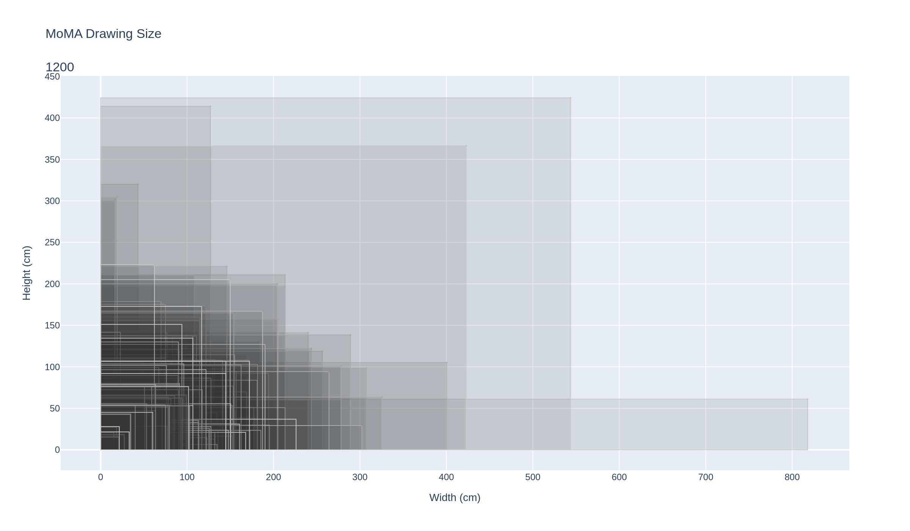
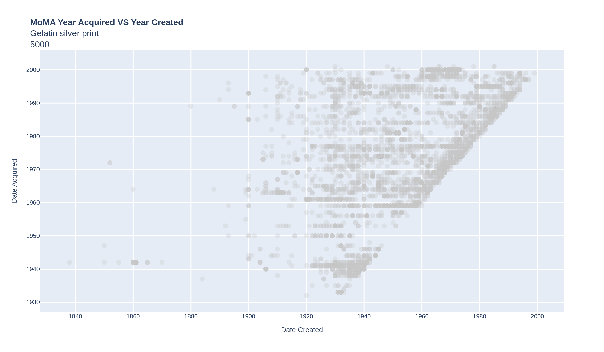
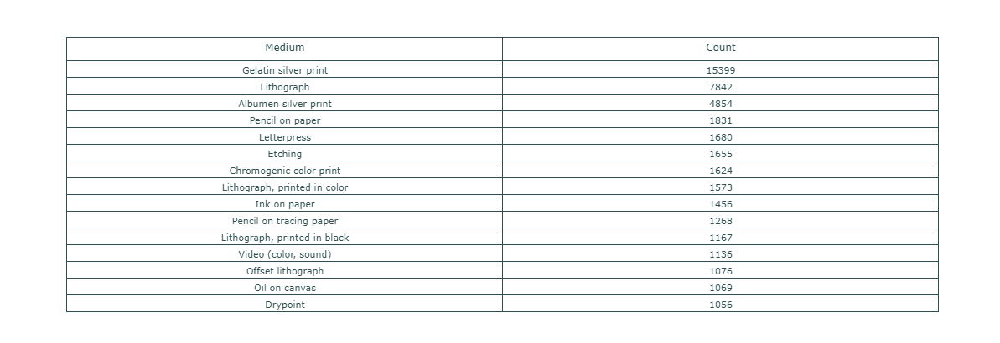
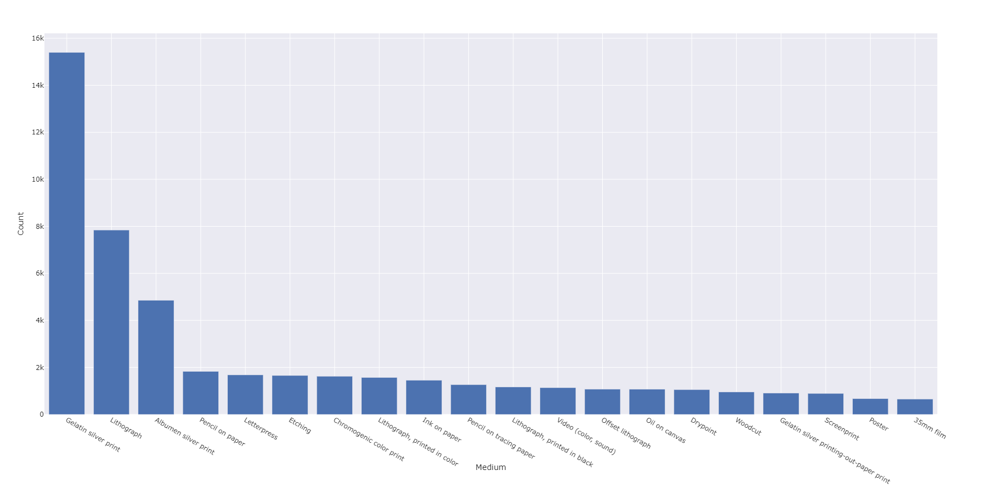
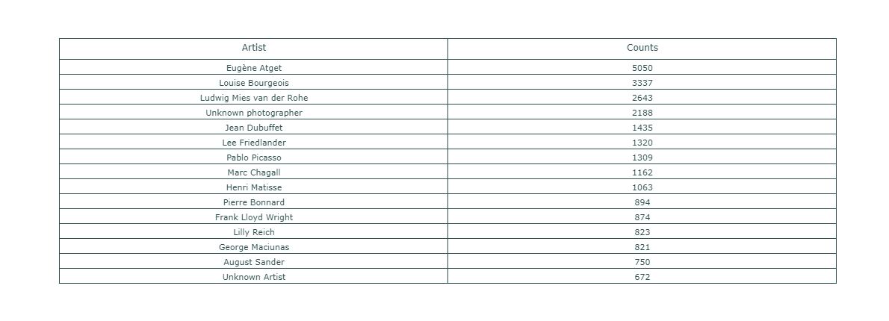
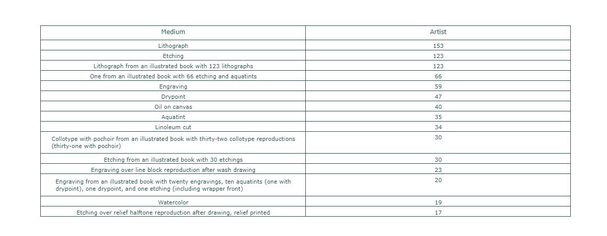
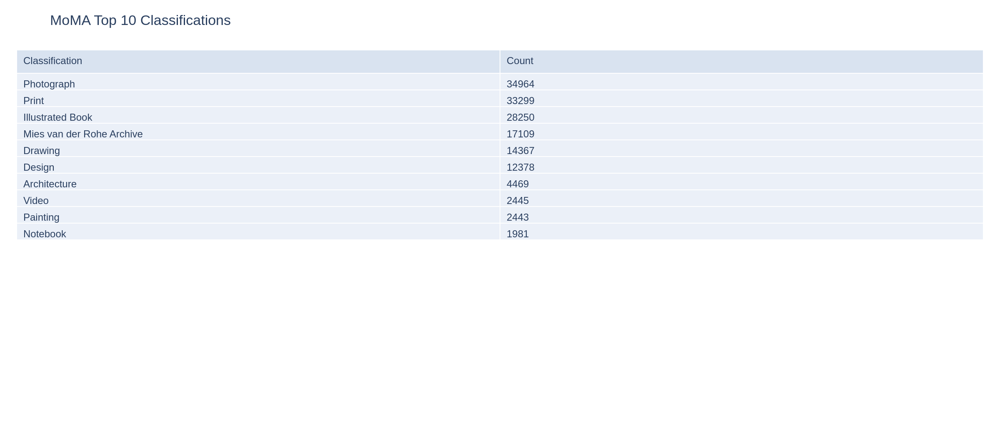
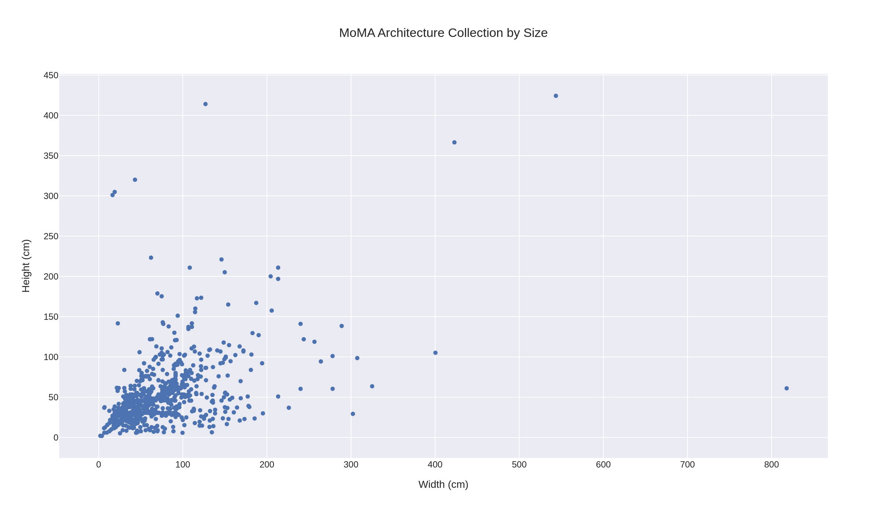
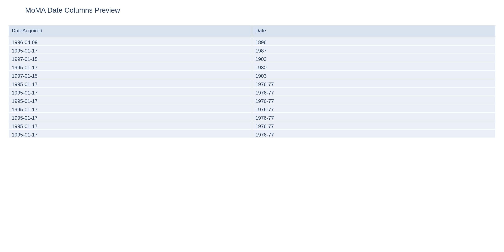
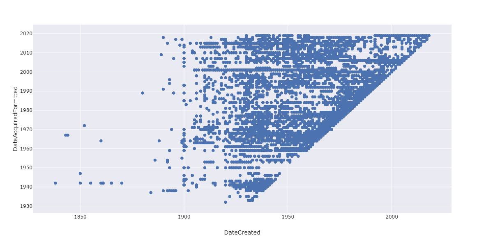

## Project Description

This data visualization module is inspired by MoMA's [data dump](https://github.com/MuseumofModernArt/collection) in 2015. MoMA released the database of their collection which contains over 130,000 pieces of artwork over the timespan of 150 years. In this session, we will learn to visualize MoMA collection similar to what [Oliver Roeder](https://fivethirtyeight.com/features/a-nerds-guide-to-the-2229-paintings-at-moma/) had done at [FiveThirtyEight](https://fivethirtyeight.com/), perhaps we will even take it further. This session will allow us to dive into Pandas, Plotly, and Python regular expression a lot more and get into some of the more intermediate level of data processing. In the course of this workshop, we will try to re-create some of Oliver's visualizations.



[Open interactive chart](../assets/interactive/moma/moma-architecture-rectangles.html)



[Open interactive chart](../assets/interactive/moma/moma-created-vs-acquired-gelatin-silver-print.html)

---

# Step 1
## Import Libraries and Data

This workshop module assumes you have already installed all the necessary Python libraries, if you have not done so, please go back to the previous module. What we will need for this session is Plotly and Pandas, and we will run the entire session on Jupyter.

First import all the libraries by executing the following code.

```python
import plotly.graph_objects as go
import plotly.express as px
import pandas as pd
```

Import the CSV file by executing the following code.

```python
csv_url = 'https://media.githubusercontent.com/media/MuseumofModernArt/collection/main/Artworks.csv'
df_moma = pd.read_csv(csv_url, low_memory=False)
```

If you want to speed things up a little, download the CSV file to your local drive and place it in the same folder as where you're running Jupyter Notebook, then execute this code.

```python
df_moma = pd.read_csv('./Artworks.csv', low_memory=False)
```

Execute **df_moma.info()** to see what's inside this variable.

```
<class 'pandas.core.frame.DataFrame'>
RangeIndex: 138118 entries, 0 to 138117
Data columns (total 29 columns):
Title                 138079 non-null object
Artist                136662 non-null object
ConstituentID         136662 non-null object
ArtistBio             132559 non-null object
Nationality           136662 non-null object
BeginDate             136662 non-null object
EndDate               136662 non-null object
Gender                136662 non-null object
Date                  135743 non-null object
Medium                127156 non-null object
Dimensions            127253 non-null object
CreditLine            135354 non-null object
AccessionNumber       138118 non-null object
Classification        138118 non-null object
Department            138118 non-null object
```

The RangeIndex shows there is a total of 138,118 entries in the dataset. It also lists the number of non-null items in each column. Non-null objects has a value of **NaN**. In computer science lingo, it means **"not a number"**, which also means there is an invalid record in the dataset. So before we begin to do anything beyond this, we need to fill those records up with something else other than a **NaN** because it will cause issues with Pandas and Python down the line. We use a function called **fillna** to replace any **NaN** value with something we designate.

```python
df_moma[['Artist', 'Nationality', 'BeginDate', 'Gender', 'Medium']] = (
    df_moma[['Artist', 'Nationality', 'BeginDate', 'Gender', 'Medium']]
    .fillna('Unknown')
)
```

This line of code lets us look into each of these columns and find any **NaN** values and replace them with the word **"Unknown"**. We're now ready to move forward with more advanced data processing techniques.

---

# Step 2
## Data Processing

Now that we have imported the whole 130,000 records of MoMA's collection, say we want to see which is their largest collection, we can do something like - look at every record and see what "Medium" it uses and count them all. And finally give me a sorted result which tells me what is their biggest collection based on the Medium.

You can explore this easily with a **pandas** function

```python
df_moma['Medium'].value_counts()
```

And you should see something like this

```
Gelatin silver print    15399
Lithograph              7842
Albumen silver print    4854
Pencil on paper         1831
Letterpress             1680
...  
```

The square bracket defines the column name, you can try using different column names to explore the dataset. Now, because the list of medium types is long and the screen does not show everything, we will need to find a way to access all the other items.

Since Pandas restricts how many rows of data it shows, we will need to do a little work-around.

```python
df_medium = (
    df_moma['Medium']
    .fillna('Unknown')
    .value_counts()
    .rename_axis('Medium')
    .reset_index(name='Count')
)
df_medium.to_csv('MoMA_MediumCounts.csv', index=False)
```

What we have done is create a new Pandas DataFrame that contains only the medium label and its count, then export it as a CSV so it can be inspected in Excel or another spreadsheet tool.

We can also plot this as a graph with the following code. Bear in mind that we have over 20k medium types so it would be quite unlikely we can fit everything within the screen and potentially get some sort of error. Therefore we limit the amount of medium type to show to 20 with the code **.head(n=20)**.

```python
fig = px.bar(df_medium.head(n=20), x='Medium', y='Count')
fig.show()
```



You can also graph this with the following code.

```python
fig = px.bar(df_medium.head(n=20), template='seaborn', x='Medium', y='Count')
fig.write_image("./fig01.png", width=1800, height=900)
fig.show()
```



So now we know the largest collection MoMA has is photography. But let's say you want to look for specific **keywords** in the collection that you would associate with paintings like paint, oil, canvas...etc, you can do something like this.

```python
searchfor = ['paint','oil','canvas','Casein']
df_medium[df_medium['Medium'].str.contains('|'.join(searchfor), case=False, na=False)]
```

Now let's try to use the same method of finding duplicates to see which artist has the largest number of work at MoMA.

```python
df_artist = (
    df_moma['Artist']
    .fillna('Unknown')
    .value_counts()
    .rename_axis('Artist')
    .reset_index(name='Counts')
)
df_artist
```



We can also single out individual artist and look at the variety of work based on medium. For example, we can specifically look at the Picasso collection and see which medium the museum has the most.

```python
searchfor = ['Picasso']
df_picasso = df_moma[df_moma['Artist'].str.contains('|'.join(searchfor), case=False, na=False)]

grouped = (
    df_picasso.groupby('Medium', as_index=False)
    .size()
    .rename(columns={'size': 'Artist'})
    .sort_values('Artist', ascending=False)
)
```



So it turns out, MoMA has over one thousand pieces of artwork by Picasso and almost 25% of that are lithographic work!

---

# Step 3
## MoMA Collection by Size

For this exercise we will go back to what [Oliver Roeder](https://fivethirtyeight.com/features/a-nerds-guide-to-the-2229-paintings-at-moma/) had done at [FiveThirtyEight](https://fivethirtyeight.com/) and look at the visualization that compare the size of the artwork in the collection.

Again we'll start fresh with a new notebook and import all the libraries.

```python
import plotly.graph_objects as go
import pandas as pd
import re
```

And we bring in the CSV file.

```python
csv_url = 'https://media.githubusercontent.com/media/MuseumofModernArt/collection/main/Artworks.csv'
df_moma = pd.read_csv(csv_url, low_memory=False)
```

```python
df_moma = pd.read_csv('./Artworks.csv', low_memory=False)
```

And again, let's clean up all the missing values.

```python
df_moma[['Artist', 'Nationality', 'Date', 'BeginDate', 'Gender', 'DateAcquired', 'Classification', 'Title']] = (
    df_moma[['Artist', 'Nationality', 'Date', 'BeginDate', 'Gender', 'DateAcquired', 'Classification', 'Title']]
    .fillna('Unknown')
)
```

Remember that there are over 130,000 records and it's simply not feasible to visualize every single item in the collection, we will make an arbitrary decision and say the visualization will be based on their classification, and in this case, the architecture collection.

First look at how many classifications there are that are related to architecture. To do that we use the same value_counts() function as before.

```python
df_classification = (
    df_moma['Classification']
    .value_counts()
    .rename_axis('Classification')
    .reset_index(name='Count')
)

df_classification.head(10)
```



[Open interactive table](../assets/interactive/moma/moma-classification-top10.html)

From this list you can see there is a Mies van der Rohe Archive, an architecture collection, and a Frank Lloyd Wright Archive, all related to architecture. So we'll create a new dataframe that would use those terms as filter words.

```python
searchfor = ['Mies van der Rohe Archive','Architecture','Frank Lloyd Wright Archive']
df_moma_archi = df_moma[
    df_moma['Classification'].str.contains('|'.join(map(re.escape, searchfor)), case=False, na=False)
].copy()
```

Since we know we will base our visualization on the Height and Width columns, we need to ensure we don't have any missing data.

```python
df_moma_archi_hasSize = df_moma_archi.dropna(subset=['Height (cm)', 'Width (cm)']).copy()
df_moma_archi_hasSize['Height (cm)'] = pd.to_numeric(df_moma_archi_hasSize['Height (cm)'], errors='coerce')
df_moma_archi_hasSize['Width (cm)'] = pd.to_numeric(df_moma_archi_hasSize['Width (cm)'], errors='coerce')
df_moma_archi_hasSize = df_moma_archi_hasSize.dropna(subset=['Height (cm)', 'Width (cm)'])
```

Now the data should be ready to pass to Plotly.

```python
fig = px.scatter(df_moma_archi_hasSize, template='seaborn', x='Width (cm)', y='Height (cm)',
                hover_data=['Artist','Title','DateAcquired'], width=800, height=400)
fig.show()
```



[Open interactive chart](../assets/interactive/moma/moma-architecture-scatter.html)

Now let's not stop here because we only got a scatter plot, but we want to actually see the rectangles. To have Plotly draw shapes, we need to define them in the layout rather than as regular data marks. See [Plotly Shapes](https://plotly.com/python/shapes/) for a deep dive.

Each rectangle is stored as a dictionary that describes its geometry and style. For a deep dive on dictionaries, see [Python Dictionaries](https://www.w3schools.com/python/python_dictionaries.asp).

```python
df_placeholder = df_moma_archi_hasSize

hovertext = []
rects = []
for i,row in df_placeholder.iterrows():
    hovertext.append(row['Artist'] + '<br>' + row['DateAcquired']+ '<br>' + row['Title'] )
    keys = ['type','xref','yref','x0','y0','x1','y1','line','fillcolor']
    values = ['rect','x','y',0,0,
              row['Width (cm)'],
              row['Height (cm)'],
              {'color': 'rgb(200,200,200)','width':1,},
              'rgba(55,55,55,0.1)']
    rects.append(dict(zip(keys,values)))

trace = go.Scatter(
        y = df_placeholder['Height (cm)'].tolist(),
        x = df_placeholder['Width (cm)'].tolist(),
        mode = 'markers',
        text = hovertext,
        marker = dict(
            size = 2,
            color = 'rgba(255, 0, 0, .3)',
            ) 
        )

layout = go.Layout(
    title = 'MoMA Drawing Size<br>'+ '<br>' + str(len(df_placeholder)),
    hovermode = 'closest',
    yaxis = dict(
            title = 'Height (cm)',
            ticklen = 5,
            zeroline = True,
            gridwidth = 1,
            ),
    xaxis = dict(
            title = 'Width (cm)',
            ticklen = 5,
            gridwidth = 1,
            ),
    shapes = rects,
    showlegend = False,
    )

fig = go.Figure(data = [trace], layout=layout)

fig.show()
```


[Open interactive chart](../assets/interactive/moma/moma-architecture-rectangles.html)

---

# Step 4
## Date Created VS Date Acquired

We are diving deeper and deeper into data processing with Pandas as we continue to work with the same data set. This next exercise will dive right into one of the graphs [Oliver Roeder](https://fivethirtyeight.com/features/a-nerds-guide-to-the-2229-paintings-at-moma/) had done at [FiveThirtyEight](https://fivethirtyeight.com/) in which he graphed the year in which a painting had been painted versus the year in which the painting had been acquired by MoMA.

Let's open up a new notebook start fresh, and import the following packages.

```python
import plotly.graph_objects as go
import plotly.express as px
import pandas as pd
import re
```

Import the CSV file as we did before, again, your choice if you want to load it remotely or locally.

```python
csv_url = 'https://media.githubusercontent.com/media/MuseumofModernArt/collection/main/Artworks.csv'
df_moma = pd.read_csv(csv_url, low_memory=False)
```

```python
df_moma = pd.read_csv('./Artworks.csv', low_memory=False)
```

And again, let's clean up all the missing values which is represented by **NaN** and fill that with the text **Unknown**. But before we do that, we want to get the info again and get a sense of how many non-null data we have, and this time we only focus on the Date and DateAcquired column.

```python
df_moma.info()

<class 'pandas.core.frame.DataFrame'>
RangeIndex: 138118 entries, 0 to 138117
Data columns (total 29 columns):
Date                  135743 non-null object
DateAcquired          131389 non-null object
```

For more on how to work with **Missing Data** in Pandas, see [Pandas Missing Data](https://pandas.pydata.org/pandas-docs/stable/user_guide/missing_data.html).

```python
df_moma[['Artist', 'Nationality', 'Date', 'BeginDate', 'Gender', 'DateAcquired', 'Medium', 'Title']] = (
    df_moma[['Artist', 'Nationality', 'Date', 'BeginDate', 'Gender', 'DateAcquired', 'Medium', 'Title']]
    .fillna('Unknown')
)
```

Now let's take a close look at the 2 columns of data we're interested in working with, DateAcquired and Date (assuming it is the date the work was produced). We want to see if the dataset is consistent.

```python
df_moma[['DateAcquired','Date']]
```



[Open interactive table](../assets/interactive/moma/moma-date-preview.html)

Immediately we notice that the date format is different between the 2 columns. And even within each column, there are a lot of inconsistencies in the format. This is one of the quintessential tasks in data science - understanding how data needs to be structured so computer language can make sense of it.

Now it's time to use **regular expression** for cleaning this up. Regular expression is a powerful way to handle text processing, but it can feel abstract at first. The idea here is simple: use a four-digit year as the pattern we want to keep, then extract that year from both date columns.

```
^ - begins with
() - extract within the parenthesis
\d{4} - find 4 digit pattern
.* - whatever character at whatever length
```

For a deeper look at regex, see [Regex Cheatsheet](https://www.dataquest.io/blog/regex-cheatsheet/).

As a test, we can list everything that does not match the pattern with the following code. And the DateAcquired column should show only the value 'Unknown' to not match the pattern.

```python
df_moma.loc[
    ~df_moma['DateAcquired'].str.contains(r'^(?:\d{4}).*', regex=True, na=False),
    'DateAcquired'
].drop_duplicates().tolist()

['Unknown']
```

However, with the Date column, we see a lot more variations. But fortunately, this pattern seem to have captured most of the date values without all the other junk.

```python
df_moma.loc[
    ~df_moma['Date'].str.contains(r'^.*(?:\d{4}).*', regex=True, na=False),
    'Date'
].drop_duplicates().tolist()

['n.d.',
 'Unknown',
 '4th-6th century C.E.',
 '3rd century C.E.',
 '6th-8th century C.E.',
 '16th century C.E.',
 'late 19th century',
 'Various',
 'Unkown',
 'unknown',
 ...
```

Now that we know the **regex pattern** works, let's create a new pandas DataFrame with only rows that contain usable year values.

```python
df_moma_knowndate = df_moma.loc[
    df_moma['DateAcquired'].str.contains(r'^(?:\d{4}).*', regex=True, na=False)
    & df_moma['Date'].str.contains(r'^.*(?:\d{4}).*', regex=True, na=False)
].copy()
```

Even though we now have valid date strings, they are still stored as text. The next step extracts the four-digit year and converts it into numeric columns that can be plotted.

```python
datePatternToExtract = r'^.*(\d{4}).*'
dateAcquiredPatternToExtract = r'^(\d{4}).*'
df_moma_knowndate['DateCreated'] = pd.to_numeric(
    df_moma_knowndate['Date'].str.extract(datePatternToExtract)[0],
    errors='coerce',
)
df_moma_knowndate['DateAcquiredFormatted'] = pd.to_numeric(
    df_moma_knowndate['DateAcquired'].str.extract(dateAcquiredPatternToExtract)[0],
    errors='coerce',
)
df_moma_knowndate = df_moma_knowndate.dropna(subset=['DateCreated', 'DateAcquiredFormatted'])
df_moma_knowndate = df_moma_knowndate[df_moma_knowndate['DateAcquiredFormatted'] >= 1700].copy()
```

This avoids hard-coding row numbers and keeps only records with usable parsed years.

Now let's create the graph by looking at a specific collection. First, do another value count so you can focus on a medium with enough records to make the scatter plot readable.

```python
df_medium = (
    df_moma_knowndate['Medium']
    .value_counts()
    .rename_axis('Medium')
    .reset_index(name='Counts')
)
df_medium
```

We should see once again Gelatin Silver Print has 14767 items and Lithograph has 7616. To make the following steps a little easier, we can separate out the 2 collections into its own dataframe.

```python
df_Gelatin = df_moma_knowndate[df_moma_knowndate['Medium']=='Gelatin silver print']
df_Lithograph = df_moma_knowndate[df_moma_knowndate['Medium']=='Lithograph']
```

Now we can use the Plotly Express method to quickly see that the result of this graph might be.

```python
fig = px.scatter(df_Gelatin, template='seaborn', x='DateCreated', y='DateAcquiredFormatted',
                hover_data=['Artist','Title'], width=800, height=400)
fig.show()
```



With the express graph, we have very little control over graphic format. If we want to change colors, add titles or labels, we'll need to use the following method.

```python
df_placeholder = df_Gelatin
fig = px.scatter(
    df_placeholder,
    x='DateCreated',
    y='DateAcquiredFormatted',
    hover_data=['Artist', 'Title'],
    title=f"MoMA Year Acquired VS Year Created<br>{df_placeholder.iloc[0]['Medium']}<br>{len(df_placeholder)}",
    template='seaborn',
)
fig.update_traces(marker=dict(size=8, color='rgba(200, 200, 200, 0.35)'))
fig.update_layout(showlegend=False)
fig.show()
```


[Open interactive chart](../assets/interactive/moma/moma-created-vs-acquired-gelatin-silver-print.html)

Congratulations for completing this step. Now you're ready to move on to the next step.

---

# Summary

### What You Have Learned

- How to create and assign value to a variable
- How to create and assign values to a list
- How to create and assign values to a list of lists
- How to bring data into Python as text or CSV files
- How to create and use a counter
- How to write and call a basic function
- Basic loop structure - how to use for-loops
- How to import packages in Python
- How to use basic functions of packages like Pandas, Plotly, BeautifulSoup
- How to create interactive plots with Plotly
