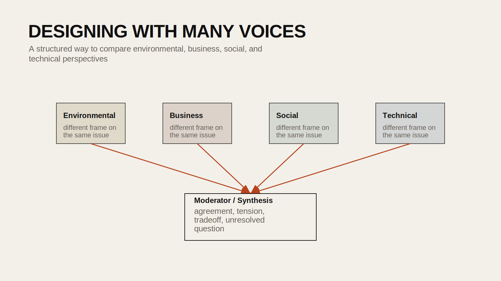

## Introduction

One of the most compelling uses of AI in design research is not just generating a single answer, but staging a structured disagreement. A planning question rarely has one valid perspective. The same project can be interpreted through environmental performance, business viability, community impact, political feasibility, technical constraints, or cultural meaning. Multi-agent workflows make those perspectives explicit.

This tutorial builds from `OpenAI Agents - Personas.ipynb`. The source notebook creates several specialized agents and uses them to debate a topic before handing the discussion to a moderator. The public version below reframes that workflow as a method for comparative analysis rather than a novelty demo.

## Historical Context

Long before AI agents became a product category, designers used structured role-play, stakeholder mapping, and scenario planning to surface competing interests. Community boards, consultants, planners, developers, and environmental advocates often describe the same project in fundamentally different terms. Agent-based workflows extend that tradition by using language models as explicitly instructed analytical stand-ins.

In contemporary AI systems, an "agent" is often just a language model wrapped with persistent instructions, tools, and rules for how it should behave. The important design question is not whether the agent is autonomous, but whether the role definition helps clarify a problem.

## Design Relevance

Design problems are rarely neutral. They involve conflict between values, constituencies, and measurement systems. Role-based AI analysis can help students and researchers:

- compare how different stakeholders frame the same issue
- test whether a design argument is robust across multiple perspectives
- identify blind spots in a proposal
- produce a first-pass stakeholder map before deeper human consultation

This is especially useful in urban policy, infrastructure, housing, climate adaptation, and public-space projects.

## Learning Goals

- Understand the difference between a general model call and a role-specific agent
- Define agents with clear scope and analytical point of view
- Run multiple agents on the same prompt
- Use a moderator or synthesis step to compare their outputs
- Recognize where agent workflows can oversimplify real stakeholder conflict



## Step 1: Define the Research Topic

The source notebook uses a topic such as congestion pricing in New York City. The exact subject is less important than the structure of the question.

Good prompts for this workflow tend to involve public controversy, tradeoffs, or competing forms of value.

Examples:

- Should a city adopt congestion pricing?
- How should a waterfront district respond to sea level rise?
- What are the tradeoffs of converting parking lanes into bus lanes and shade infrastructure?

## Step 2: Install the Required Package

```bash
pip install openai-agents nest-asyncio
```

If you are using a notebook environment, you may need `nest-asyncio` to run asynchronous agent calls inside Jupyter.

## Step 3: Create Specialized Agents

The source notebook defines several agents with distinct roles. A cleaned public version might look like this:

```python
from agents import Agent

env_agent = Agent(
    name="Environmental Agent",
    instructions="Analyze the topic from an environmental and climate perspective. Focus on emissions, ecological effects, and long-term resilience.",
)

biz_agent = Agent(
    name="Business Agent",
    instructions="Analyze the topic from an economic and commercial perspective. Focus on costs, revenue, business operations, and financial incentives.",
)

social_agent = Agent(
    name="Social Agent",
    instructions="Analyze the topic from a social and community perspective. Focus on equity, access, public experience, and who benefits or is burdened.",
)

science_agent = Agent(
    name="Technical Agent",
    instructions="Analyze the topic using technical reasoning, evidence, and implementation concerns.",
)
```

The important thing is that each agent has a clear scope. If the role is vague, the outputs will blur together.

## Step 4: Run the Same Topic Through Each Agent

```python
from agents import Runner
import nest_asyncio

nest_asyncio.apply()

topic = "What do you think about NYC congestion pricing?"

async def run_agent(agent, topic):
    result = await Runner.run(agent, topic)
    return result.final_output
```

Then call each agent and collect the responses.

```python
env_output = await run_agent(env_agent, topic)
biz_output = await run_agent(biz_agent, topic)
social_output = await run_agent(social_agent, topic)
science_output = await run_agent(science_agent, topic)
```

At this stage, students should already compare how the framing differs across outputs.

## Step 5: Add a Moderator or Synthesis Agent

The source notebook includes a moderator that summarizes tensions and areas of overlap. This is one of the most useful parts of the workflow.

```python
moderator_agent = Agent(
    name="Moderator Agent",
    instructions="Summarize the key agreements, disagreements, tensions, and unresolved questions across the provided agent responses.",
)
```

Then construct a combined input:

```python
moderator_input = f"""
Topic: {topic}

Environmental perspective:
{env_output}

Business perspective:
{biz_output}

Social perspective:
{social_output}

Technical perspective:
{science_output}
"""

moderated = await Runner.run(moderator_agent, moderator_input)
print(moderated.final_output)
```

This turns four separate answers into a structured comparison.

## Step 6: Turn the Outputs into a Design Tool

The value of this workflow is not just text generation. It is the way it helps students externalize conflict.

You can use the results to build:

- a stakeholder matrix
- a pros/cons map by role
- a list of unresolved design tradeoffs
- a set of follow-up questions for actual human stakeholders

For example, if the environmental and social agents align on reducing car dependence but the business agent emphasizes delivery logistics and customer access, that tension can become a concrete design or policy problem to resolve.

## When This Works Well

Agent-based workflows work well when:

- the topic already has multiple legitimate viewpoints
- each role has a clear domain of concern
- the output is used comparatively rather than treated as authority
- the results feed into human analysis rather than replace it

## Common Pitfalls

1. Making the agents too similar.
If the instructions overlap too much, the outputs will sound the same.

2. Treating personas as real stakeholders.
An AI "community agent" is not a substitute for actual community input.

3. Turning the debate into entertainment.
The goal is analytical contrast, not theatrical banter.

4. Using agents without a synthesis step.
Without comparison, the outputs remain disconnected.

5. Ignoring bias introduced by the role prompt itself.
The framing of each agent shapes what it can see and what it will neglect.

## Extensions

- add a policy agent, historian, or climate-risk assessor
- run the same workflow on a project proposal instead of a policy topic
- compare two moderator prompts to see how synthesis changes
- export the outputs to a CSV for comparison across many topics

## Resources

- [OpenAI Agents Documentation](https://openai.github.io/openai-agents-python/)
- [Stakeholder Mapping Methods](https://www.designkit.org/methods)
