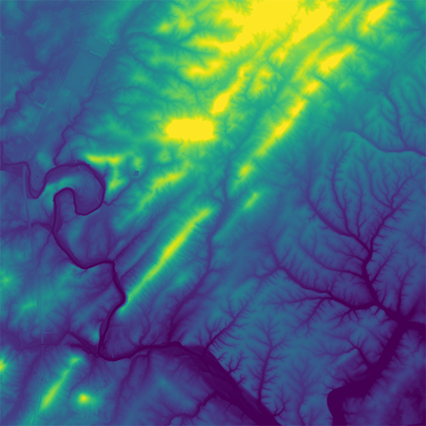
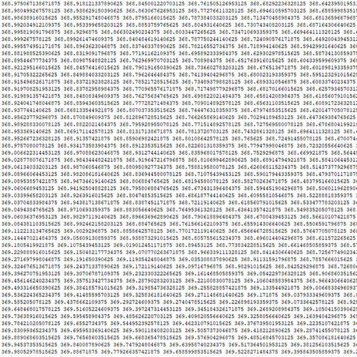
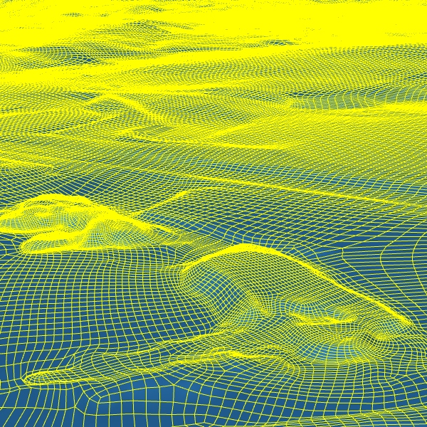
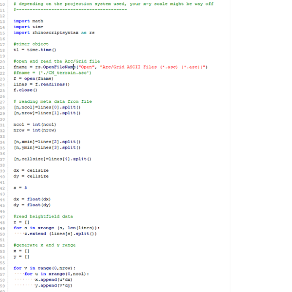
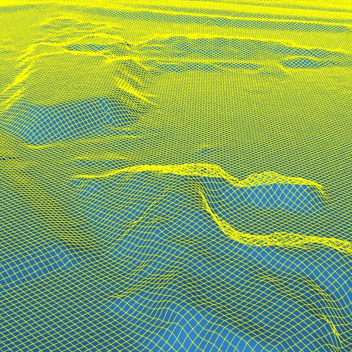
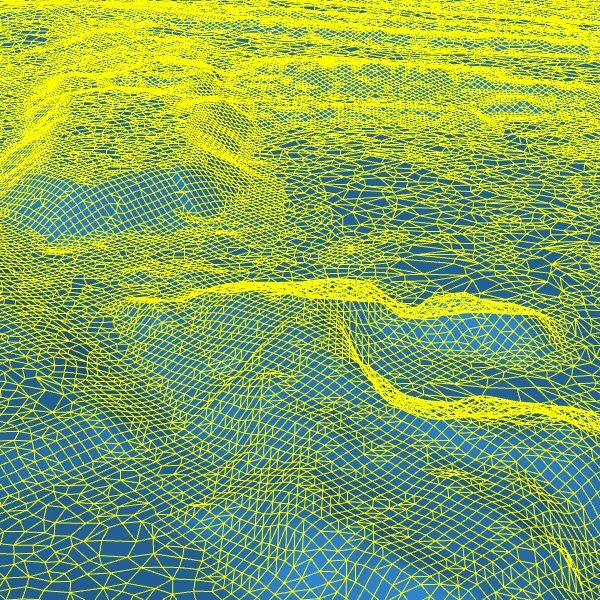
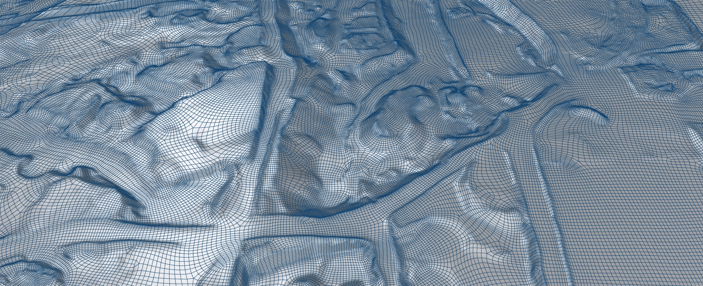

## Introduction

Digital topography is the study of Earth's surface shape and elevation—mountains, valleys, rivers, ridges—expressed as data that computers can read and designers can manipulate. Where a traditional site plan shows contours as thin lines on paper, digital elevation models (DEMs) treat elevation as a continuous data field: every point on a site has an exact height value. This allows you to query slopes, calculate viewsheds, generate 3D meshes, and integrate real terrain into your design software. For architects, landscape architects, and urban designers, digital topography transforms site analysis from intuition into evidence.

Elevation rasters come in two main flavors. Digital Elevation Models (DEMs) represent bare ground terrain, while Digital Surface Models (DSMs) include everything on top of the terrain—buildings, trees, bridges. Open-access sources such as USGS 3DEP often derive their products from airborne LiDAR, but the published raster may be a bare-earth DEM, a surface model, or another derived elevation product. Understanding this distinction matters: if you're analyzing solar access, you'll want a DSM that includes building heights; if you're modeling water flow, you want a DEM with structures removed so water moves across actual ground.

The practical power of digital topography lies in scale. You can now download high-resolution elevation data for any location in the US for free—data that previously required expensive aerial surveys. This democratization means student designers can incorporate real site conditions into early concept sketches, test grading schemes in 3D, or visualize how a building sits in relation to surrounding terrain without conducting expensive site visits.

## Learning Goals

- Understand the difference between DEMs, DSMs, and other elevation data used in design workflows.
- Interpret terrain as a dataset that can inform grading, drainage, visibility, and siting decisions.
- Build a basic workflow for downloading, processing, and converting elevation data into 3D geometry.
- Evaluate how resolution, projection, and mesh density affect analytical accuracy and design usability.
- Connect topographic analysis to environmental justice, infrastructure planning, and climate adaptation.

## Key Terms

- **Digital Elevation Model (DEM)**: A raster dataset representing bare-earth ground elevation without buildings or vegetation.
- **Digital Surface Model (DSM)**: An elevation model that includes surface features such as trees, roofs, and bridges.
- **LiDAR**: A remote sensing method that uses laser pulses to measure distance and generate detailed elevation data.
- **Raster**: A gridded data structure in which each cell stores a value, such as elevation.
- **Reprojection**: The process of converting spatial data from one coordinate reference system into another.
- **Retopology**: The simplification and reorganization of a dense mesh into cleaner geometry that is easier to edit or visualize.

## Historical Context

The measurement and representation of terrain has ancient roots—contour lines appeared on maps by the 1700s, and by the 19th century, military cartographers had developed systematic surveying methods. The real transformation came with remote sensing: radar and LiDAR (Light Detection and Ranging) from aircraft, and later satellites, allowed systematic measurement of elevation across vast areas without physical survey crews.

The USGS began systematic elevation mapping in the 1930s using photogrammetry (measuring from overlapping aerial photographs), but coverage was incomplete and resolution limited. The 2000s saw a major leap with shuttle-based radar missions like SRTM (Shuttle Radar Topography Mission), which captured near-global elevation at 30-meter resolution. Today, the USGS 3DEP program, launched in 2015, aims for nationwide LiDAR coverage at 1-meter resolution—delivering data that was unthinkable at mass scale just two decades ago.

Software evolved alongside data. Early GIS tools like GRASS (developed by the US Army Corps of Engineers in the 1980s) could process elevation grids, but workflows were arcane. Modern tools like QGIS have democratized these capabilities, putting professional-grade terrain analysis within reach of anyone with a laptop and internet connection.

## Social and Environmental Context

Topography is never only a formal surface; it structures exposure to risk, access to infrastructure, and the politics of land itself. Elevation data helps designers see where flooding is likely to concentrate, where drainage systems may fail, and how roads, public housing, parks, and shorelines are shaped by uneven investment over time. In coastal and riverine cities especially, digital topography becomes a tool for reading climate vulnerability and public infrastructure together.

For design students, the point is not simply to model terrain more accurately, but to understand how landform, flood risk, and planning decisions are bound up with social inequality and long histories of territorial control. This is where topographic analysis becomes culturally relevant: it helps reveal how apparently natural land conditions are interpreted, engineered, and governed.

## Design Relevance

Digital topography fundamentally changes how designers interact with site. Traditional site analysis happens in stages: site visit, paper drawings, mental modeling, then eventually a 3D representation. Digital elevation data collapses this pipeline—you can sketch on top of real terrain from day one, testing massing positions against actual slopes, views, and drainage patterns.

For landscape architecture and urban design, terrain is destiny. Slope determines what can be built, where water flows, how people move through space. A site that appears flat in a site visit might reveal subtle grade changes that dramatically affect drainage or accessibility. Digital topography surfaces these conditions before you're on site, enabling smarter preliminary design decisions.

The ability to generate 3D meshes from elevation data means terrain becomes a design medium itself. Rhino and 3DS Max workflows allow you to sculpt digital terrain, test cut-and-fill scenarios, or visualize proposed grading in context with existing conditions. This is especially valuable for stormwater management designs—understanding how water moves across terrain helps create sustainable drainage systems that work with natural patterns rather than against them.

## Resources & Further Reading

- [USGS 3DEP Elevation Data](https://www.usgs.gov/3d-elevation-program) - Free access to LiDAR-derived elevation data across the US at varying resolutions
- [USGS National Map Download](https://apps.nationalmap.gov/downloader/#/) - Direct portal for downloading elevation, imagery, and other geospatial data
- [NOAA Coastal Elevation Models](https://www.ngdc.noaa.gov/mgg/coastal/coastal.html) - Bathymetric and coastal elevation data for sea level rise and flood analysis
- [QGIS Documentation: DEM Terrain Analysis](https://docs.qgis.org/latest/en/docs/user_manual/working_with_raster/raster_analysis.html) - Official guide to terrain analysis tools in QGIS
- [USGS LiDAR 101](https://www.usgs.gov/faqs/what-lidar) - Plain-language introduction to LiDAR technology and data formats

## Technical Walkthrough

The following workflow moves from data collection to mesh optimization. The aim is not only to visualize terrain, but to understand how each processing step changes the design usefulness of the final model.

### Tools

## QGIS (Open Source / Free)

A very capable GIS software that can handle many data types and will cover most of our tutorials. Pratt's [Launchpad](https://one.pratt.edu/s/launchpad?tabset-e8f43=18357) can provide free access if you don't have a license.

## Rhino

Rhino 7 or newer is recommended because the newer mesh-reduction and remeshing tools are substantially better than older releases. Pratt's [Launchpad](https://one.pratt.edu/s/launchpad?tabset-e8f43=18357) can provide free access if you don't have a license.

## 3DS Max

This workflow will utilize 3DS Max's advanced retopology algorithm, new to version 2021. Pratt's [Launchpad](https://one.pratt.edu/s/launchpad?tabset-e8f43=18357) can provide free access if you don't have a license.

### Overview

There are 4 fundamental steps in this workflow. Each step is critical to ensuring high quality outcome.

Data Collection / Gathering

- We will use USGS's [National Map](https://apps.nationalmap.gov/downloader/#/) for this exercise.

- Bathymetric data can also be found via NOAA's [Coastal Elevation Model](https://www.ngdc.noaa.gov/mgg/coastal/coastal.html)

- National Centers for Environmental Information's [Hurricane Sandy Digital Elevation Models](https://www.ngdc.noaa.gov/mgg/inundation/sandy/sandy_geoc.html)

Data Processing

- If necessary, merging multiple data tiles together.

- Mapping coordinates re-projection.

- Cropping.

- Exporting data into ASCII format.

3D Mesh Generation and Decimation

- Generating high resolution mesh with Python Scripting

- Mesh polygons reduction and decimation

- Export data

Mesh Optimization and Retopology

- Further reduce mesh count with more advanced algorithm

- Retopologize the model and create quad flows that conforms to the topography

### Step 1: Data Collection / Gathering

*DEM and LiDAR data are available through The National Map and related USGS download tools. The interface and delivery methods change over time, so if the exact buttons in the video look different, focus on locating the same elevation products rather than matching the older screen recording exactly.

[DEM Download](https://www.youtube.com/watch?v=ZNroi2uqMig)

- In The National Map, search the available elevation products for your site and compare options such as `1 meter DEM` and `1/9 arc-second DEM` where both are available.
- Use `Show` to confirm where each dataset is available; the current map extent becomes the search boundary, so zoom to your site before searching.
- Run the product search, then inspect each result with its footprint or thumbnail to verify the tile covers the area you need.
- If the site crosses tile edges, download every overlapping tile now so they can be merged in QGIS.

### Step 2: Data Processing

We will cover the following procedures in this video

- Merge Tiles

- Map Reprojection

- Clip Extent

[DEM Data Processing](https://www.youtube.com/watch?v=YFvLcPr2iGM)

- Unzip the download and drag the GeoTIFF tiles into QGIS; these are elevation rasters, not standard image files.
- Merge adjacent tiles with `Raster > Miscellaneous > Merge`, keeping the output data type as `Float32`.
- If you need alignment with online basemaps or other web-derived layers, reproject a copy of the merged layer to `Web Mercator (EPSG:3857)`. If your goal is only terrain meshing, you can usually stay in the DEM's native projected CRS as long as the units are meters.
- Crop your working raster, whether native or reprojected, with `Raster > Extraction > Clip Raster by Extent` to a manageable study area before meshing.
- Export the clipped raster with `Raster > Conversion > Translate`, saving it as an `.asc` file for Rhino.

### Step 3: 3D Mesh Generation and Decimation

Download Python Script [here](https://drive.google.com/file/d/1pfTe94Q-pZPz5RpKouh5Rv3s_l2o2NZP/view?usp=drive_link)

## Run Python Script

The `.asc` file generated from QGIS is used with a Python script to generate a mesh in Rhino 3D. The DEM data file used here has 2786 x 2282 pixels, which is the main factor determining the polygon count of the terrain mesh.

## Generate Mesh

The resulting polygon count of this example is around 12.7 million - 2786x2282x2. Even the most powerful computer will not let you do much with a mesh of this size, therefore, we will need to further process this.

## Decimate Mesh

With the reduce mesh function, we can reduce the polygon count by roughly 60% to around 5 million without significantly changing the overall landform. However, the mesh is now unstructured - a mix of triangles and quads - so a retopology step in 3DS Max becomes useful.

A note about the `.asc` file: if you open it with a [text editor](https://notepad-plus-plus.org/downloads/), you can see the file structure directly. The first five or six lines are metadata, and the remaining rows contain the terrain grid. Lines 1 and 2 indicate the number of columns and rows. Lines 3 and 4 record the lower-left coordinates of the dataset, which are usually ignored by the Rhino mesh script. `cellsize` gives the physical width of each raster cell, and some exports also include a `NODATA_value` line. In this example, each pixel is roughly 1.278 meters wide, and the height values are also stored in meters, so the resulting mesh should be a reasonably accurate representation of the DEM.

- ncols 2786

- nrows 2282

- xllcorner -8783396.494329396635

- yllcorner 4632728.376925750636

- cellsize 1.278283502422

[DEM Mesh Generation and Processing with Rhino 3D](https://www.youtube.com/watch?v=Azplg3su6Oo)

- In Rhino 7 or 8, open `Tools > PythonScript > Edit`, load the provided terrain script, and run it against the `.asc` file exported from QGIS.
- Expect the first mesh to be extremely dense; in the example, the imported terrain generates roughly 12.7 million polygons.
- Use `Mesh Edit Tools > Reduce Mesh` to decimate the model before export, aiming for a substantial reduction while preserving the overall landform.
- Export the reduced mesh as `.obj`, and leave the `Z to Y` option unchecked so the axes stay consistent for the next step.

### Step 4: Retopology

We will cover the following procedures in this video

- Import meshing into 3DS Max as Editable Poly

- Pro-Optimizer for mesh optimization

- Retopology

**Rhino 7 has a new Reduce Mesh and Quad Remesh tool that performs a similar function. However, the algorithm is generally more robust in 3DS Max for large files and heavy memory use. If your initial mesh is small enough (for example under 100,000 polygons), Rhino may be sufficient. If the mesh is much larger, 3DS Max will usually be the more stable option. For reference, retopologizing a model above 100,000 polygons can take a long time even on strong hardware.

[DEM 3DSMax Retopo](https://www.youtube.com/watch?v=VJnSO0Sh7ns)

- Import the reduced `.obj` into 3DS Max as `Editable Poly`, then turn on `Wireframe Override` and viewport statistics so you can monitor polygon count while simplifying.
- Apply `ProOptimizer`, click `Calculate`, and reduce the model aggressively while monitoring RAM usage and face count.
- Collapse the modifier stack before retopology so the optimized mesh is baked and uses less memory.
- In `Retopology`, match the target face count to the current mesh, set `Regularize` to `1`, and turn off `Auto Edge` to speed up processing on terrain.
- Export the final retopologized mesh as `.obj` for reuse in Rhino or other modeling software.

### Final Result

