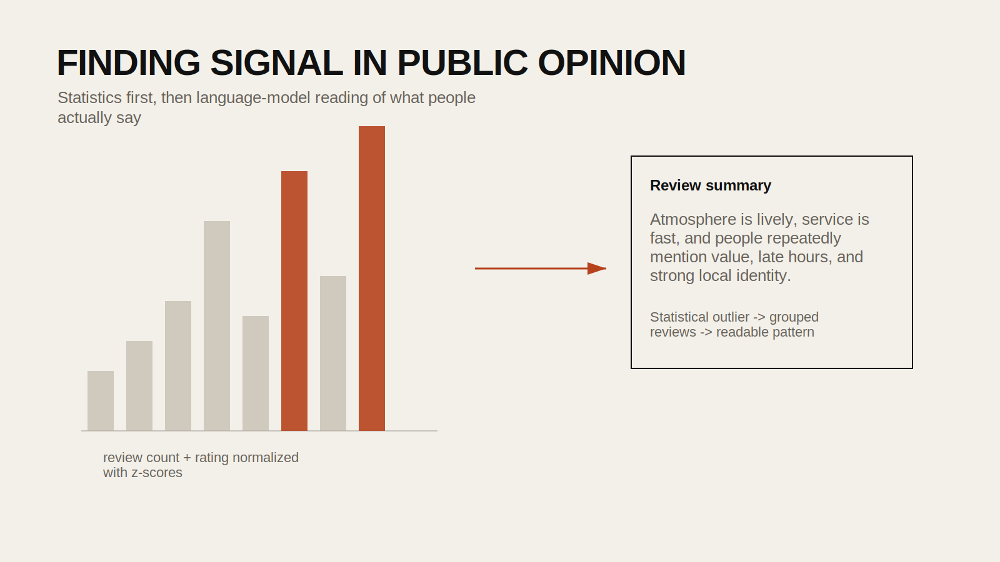

## Introduction

Large review datasets are full of noise. A business with a perfect five-star score may only have three reviews, while another with hundreds of strong reviews may be a much more meaningful case study. Before applying AI tools to public opinion or recommendation data, it helps to filter the dataset statistically.

This tutorial builds from the `24FA-ARCH-581A-40 Yelp Review Notebook`. It combines z-score filtering with language-model-based summarization so that students can move from raw review dumps to a cleaner, more defensible set of cases.

The core idea is simple: use classical statistics to identify businesses that are unusually strong in both review count and review score, then use language models to summarize what people are actually saying about them.

## Historical Context

Recommendation systems have long depended on balancing quality and quantity. A single enthusiastic review is not equivalent to consistent high ratings across a large number of customers. Statistical normalization methods such as z-scores help researchers understand how far a value departs from the mean relative to the variation of the dataset.

More recently, language models have made it easier to read, summarize, and classify very large volumes of text. Together, these methods allow a workflow that is both quantitative and interpretive: first identify strong candidates statistically, then analyze the narrative content of the reviews.

## Design Relevance

Design students often work with public commentary, ratings, and urban platform data. This could include restaurant reviews, transit comments, survey responses, or neighborhood feedback. The workflow in this tutorial is useful when you want to:

- identify standout cases from a large public dataset
- compare places that are both popular and consistently well regarded
- summarize patterns in public opinion without manually reading every review
- combine statistics with interpretive text analysis

## Learning Goals

- Load line-delimited JSON data into Pandas
- Filter a dataset by category and geography
- Use z-scores to identify high-performing outliers
- Group reviews by business or case-study unit
- Apply an LLM to summarize large blocks of review text



## Step 1: Load the Business Dataset

The source notebook loads Yelp business data from JSON. A common pattern is one JSON object per line.

```python
import json
import pandas as pd

rows = []
with open("yelp_academic_dataset_business.json", "r") as f:
    for line in f:
        rows.append(json.loads(line))

business_df = pd.DataFrame(rows)
business_df.head()
```

If your dataset is large, you may want to sample or restrict the columns early.

## Step 2: Filter to the Domain You Care About

The notebook focuses on restaurants and food-related businesses.

```python
def is_restaurant_or_food(categories):
    if pd.isnull(categories):
        return False
    return ("Restaurants" in categories) or ("Food" in categories)

business_df_filtered = business_df[
    business_df["categories"].apply(is_restaurant_or_food)
].reset_index(drop=True)
```

From there, you can focus on a single city or region.

```python
tampa_restaurants = business_df_filtered[
    business_df_filtered["city"] == "Tampa"
].reset_index(drop=True)
```

## Step 3: Understand the Distribution First

Before filtering, it helps to inspect the distribution of businesses across cities or categories.

```python
import matplotlib.pyplot as plt

top_cities = business_df_filtered["city"].value_counts().head(20)

plt.figure(figsize=(12, 6))
top_cities.plot(kind="bar", color="skyblue")
plt.title("Top Cities by Restaurant Count")
plt.xlabel("City")
plt.ylabel("Number of Businesses")
plt.show()
```

This gives students a better sense of scale before they begin filtering.

## Step 4: Use Z-Scores to Find Strong Candidates

The notebook uses z-scores to identify businesses that are above average in both review count and star rating.

```python
from scipy import stats

tampa_restaurants["review_count_z"] = stats.zscore(tampa_restaurants["review_count"])
tampa_restaurants["stars_z"] = stats.zscore(tampa_restaurants["stars"])

z_threshold = 1.0

df_high_reviews_high_ratings = tampa_restaurants[
    (tampa_restaurants["review_count_z"] >= z_threshold) &
    (tampa_restaurants["stars_z"] >= z_threshold)
].reset_index(drop=True)

df_high_reviews_high_ratings[["name", "stars", "review_count", "review_count_z", "stars_z"]].head()
```

This does not mean these are the "best" businesses in any universal sense. It means they are unusually strong relative to the rest of the filtered set.

## Step 5: Pull the Matching Reviews

Once you know which businesses you care about, use their IDs to pull the relevant reviews.

```python
high_rating_business_ids = df_high_reviews_high_ratings["business_id"].unique()
```

If you have a larger review table already loaded:

```python
filtered_review_df = review_df[
    review_df["business_id"].isin(high_rating_business_ids)
].reset_index(drop=True)
```

The notebook uses a pre-saved pickle for performance, which is a good strategy if the review file is very large.

## Step 6: Group Reviews by Business

You usually want one text bundle per business before sending the data to a model.

```python
good_reviews_grouped = filtered_review_df.groupby("business_id")["text"].apply("\n\n".join).reset_index()
good_reviews_grouped.head()
```

This creates a single review corpus for each business.

## Step 7: Summarize the Review Corpus with an LLM

The public version of this workflow should use secure credentials and a narrow, structured prompt.

```python
from openai import OpenAI

client = OpenAI()

summary_system_prompt = """
You are analyzing customer reviews for a business.

Summarize the main strengths and recurring themes in 3 to 5 sentences.
Focus on atmosphere, service, food quality, pricing, and any notable patterns.
Do not invent details.
"""

def summarize_reviews(review_text):
    response = client.responses.create(
        model="gpt-4.1-mini",
        input=[
            {"role": "system", "content": summary_system_prompt},
            {"role": "user", "content": review_text},
        ],
    )
    return response.output_text
```

Apply it to the grouped review DataFrame.

```python
good_reviews_grouped["review_summary"] = good_reviews_grouped["text"].apply(summarize_reviews)
```

Then merge those summaries back onto your business table.

```python
final_df = df_high_reviews_high_ratings.merge(
    good_reviews_grouped[["business_id", "review_summary"]],
    on="business_id",
    how="left",
)
```

## Step 8: Compare the Statistical and Narrative Results

This is where the workflow becomes most useful. The z-score filter gives you a compact set of notable cases. The language model gives you a first-pass reading of what those cases are known for.

Students should compare:

- businesses that score well statistically but have generic summaries
- businesses whose summaries reveal a strong identity or pattern
- whether price, ambiance, or service dominates the discussion

The goal is not just recommendation. It is to understand how public perception clusters around place-based experience.

## Common Pitfalls

1. Treating a high star rating with few reviews as equivalent to a strong statistical outlier.

2. Forgetting that z-scores are relative to the chosen subset.
Changing the city or category changes the meaning of the score.

3. Sending huge review bundles to the model without truncation or chunking.
Long corpora may exceed context limits or become slow and expensive.

4. Using model summaries without checking the underlying reviews.
The summary is only a compression of the source text, not a substitute for it.

## Extensions

- compare review language across different cities
- classify businesses by atmosphere or social use
- identify which review themes correlate with unusually high engagement
- compare quantitative ranking to qualitative distinctiveness

## Resources

- [SciPy Stats Documentation](https://docs.scipy.org/doc/scipy/reference/stats.html)
- [Pandas GroupBy Guide](https://pandas.pydata.org/docs/user_guide/groupby.html)
- [OpenAI Text Generation Guide](https://platform.openai.com/docs/guides/text)
