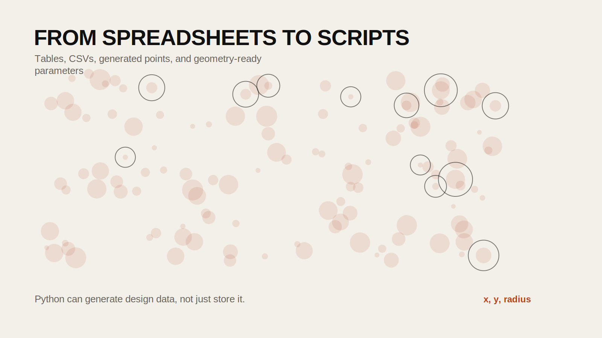

## Introduction

Before students can work with embeddings, prompt pipelines, or image analysis, they need a basic way to handle data. That means knowing how to load a CSV, inspect a table, filter rows, add columns, group values, and export results. These operations are not advanced, but they are foundational.

This tutorial combines `24FA-ARCH-581A-40 Week 2` and `24FA-ARCH-581A-40 Week 3` into a single public-facing introduction to Python data workflows. It avoids unnecessary abstraction and focuses on operations that students will keep using throughout the rest of the AI tutorial sequence.

## Historical Context

Spreadsheet logic has long shaped the way designers and planners organize information, but spreadsheets become limiting when data sources grow, transformations become repetitive, or workflows need to be reproduced. Python and Pandas provide a way to treat data operations as scripts rather than one-off manual edits.

That shift matters because repeatability is part of research rigor. A scripted workflow can be rerun, checked, shared, and adapted.

## Design Relevance

Design research is full of tables whether or not it looks like coding at first. Material inventories, room schedules, survey responses, energy data, transit ridership, coordinates, and image metadata are all tabular structures. Learning to work with those structures in Python helps students move from manual cleanup to reproducible analysis.

## Learning Goals

- create and inspect a DataFrame
- import and export CSV files
- handle common loading errors
- select and filter rows and columns
- group and aggregate data
- generate simple synthetic datasets for experiments or modeling workflows



## Step 1: Create a Simple DataFrame

Start with a small in-memory dataset so the structure is easy to see.

```python
import pandas as pd

data = {
    "Name": ["Alice", "Bob", "Charlie"],
    "Age": [25, 30, 35],
    "City": ["New York", "Los Angeles", "Chicago"],
}

df = pd.DataFrame(data)
print(df)
```

A DataFrame is a table with labeled columns. It is the core structure used throughout the later tutorials.

## Step 2: Load a CSV File

The Week 2 notebook introduces CSV import with a direct URL.

```python
url = "https://data.cityofnewyork.us/resource/592z-n7dk.csv"
df = pd.read_csv(url)
df.head(3)
```

This is often the first step in a research workflow: bring external data into a DataFrame so it can be inspected and transformed.

## Step 3: Handle Errors Explicitly

Loading data often fails because of a bad path, a broken URL, or an unsupported file. The Week 2 notebook introduces simple error handling, which is worth keeping.

```python
bad_url = "https://data.cityofnewyork.us/resource/592z-n7dk.csv3"

try:
    df = pd.read_csv(bad_url)
except Exception as e:
    print("Could not load the file:", e)
```

This is a small habit, but it prevents confusion and makes debugging easier.

## Step 4: Export a CSV

Once you have transformed a DataFrame, export it.

```python
df.to_csv("output.csv", index=False)
```

That allows you to pass the result to another tool, share it, or reuse it later.

## Step 5: Select and Filter Data

Most beginner workflows involve selecting a subset of the table.

```python
adults = df[df["Age"] >= 30]
adults
```

You can also select specific columns.

```python
df[["Name", "City"]]
```

These simple operations become the basis for far more advanced filtering later on.

## Step 6: Add and Remove Columns

You often need to derive a new value from existing fields.

```python
df["AgeNextYear"] = df["Age"] + 1
df
```

And if a column is no longer needed:

```python
df = df.drop(columns=["AgeNextYear"])
```

## Step 7: Group and Aggregate Data

Grouping lets you summarize a dataset by category.

```python
salary_data = {
    "Name": ["Alice", "Bob", "Charlie", "David"],
    "Department": ["HR", "Finance", "HR", "Finance"],
    "Salary": [70000, 80000, 75000, 85000],
}

salary_df = pd.DataFrame(salary_data)

salary_df.groupby("Department")["Salary"].mean()
```

This pattern appears everywhere in design and planning work: average by neighborhood, total by category, count by building type, and so on.

## Step 8: Use Functions with a DataFrame

The Week 2 notebook also shows how to apply a custom function. That is the beginning of using Python as more than a spreadsheet.

```python
def calculate_bmi(df):
    df["BMI"] = df["Weight"] / (df["Height"] ** 2)
    return df

data = {
    "Name": ["Alice", "Bob", "Charlie"],
    "Weight": [68, 85, 95],
    "Height": [1.65, 1.80, 1.75],
}

df = pd.DataFrame(data)
df = calculate_bmi(df)
df
```

This matters because later tutorials will rely on custom functions for prompts, embeddings, image description, and batch processing.

## Step 9: Use Lambda Functions for Quick Transformations

```python
df["NameLength"] = df["Name"].apply(lambda x: len(x))
df
```

Lambda functions are useful for short, inline transformations, though for more complex logic it is usually better to define a named function.

## Step 10: Generate a Synthetic Dataset

The Week 3 notebook adds a useful pattern: create a dataset from scratch using Python rather than loading one from elsewhere.

```python
import csv
import random

def generate_random_points(n, filename):
    points = [
        (random.uniform(-10, 10), random.uniform(-10, 10), random.uniform(-10, 10))
        for _ in range(n)
    ]

    with open(filename, "w", newline="") as csvfile:
        writer = csv.writer(csvfile)
        writer.writerow(["x", "y", "z"])
        writer.writerows(points)

generate_random_points(100, "points.csv")
```

This is useful when you want to simulate geometry parameters, random test cases, or experimental design inputs.

## Step 11: Generate Circle Parameters for Geometry Workflows

The Week 3 notebook then connects this data generation to geometry software by saving circle parameters to CSV.

```python
def generate_circle_parameters(n, filename):
    circles = [
        (
            random.uniform(-10, 10),
            random.uniform(-10, 10),
            random.uniform(0.5, 5),
        )
        for _ in range(n)
    ]

    with open(filename, "w", newline="") as csvfile:
        writer = csv.writer(csvfile)
        writer.writerow(["x", "y", "radius"])
        writer.writerows(circles)

generate_circle_parameters(50, "circles.csv")
```

That CSV can then be imported into Rhino, Grasshopper, or another geometry environment.

## Why This Matters for Later Tutorials

Even when later lessons appear to be about AI, they still rely on these same basic skills:

- load data into a table
- apply a function row by row
- save the result
- inspect the output

Without these basics, later workflows feel mysterious. With them, students can see that more advanced tutorials are still just structured data operations.

## Common Pitfalls

1. Treating a DataFrame like a static spreadsheet rather than a programmable structure.

2. Ignoring data types.
Strings, integers, and floats behave differently.

3. Overwriting files without checking the output path.

4. Trying to do too much in one cell.
Small, testable steps are easier to debug.

## Extensions

- load open city datasets and compare neighborhoods
- generate geometric parameters for Rhino or Grasshopper workflows
- join two CSVs by a shared column
- create the first reusable utility functions for later AI notebooks

## Resources

- [Pandas Getting Started](https://pandas.pydata.org/docs/getting_started/index.html)
- [Python CSV Module](https://docs.python.org/3/library/csv.html)
- [NYC Open Data](https://opendata.cityofnewyork.us/)
