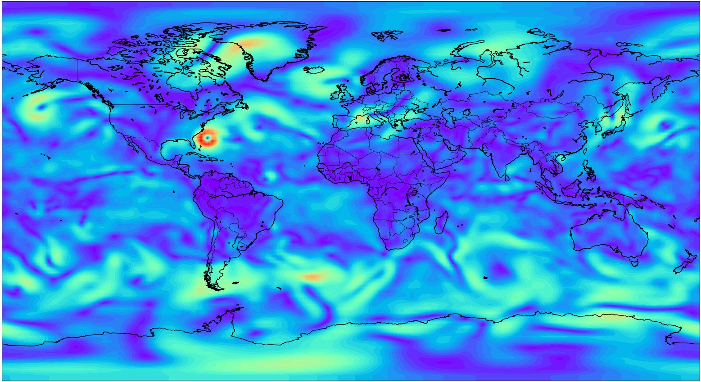
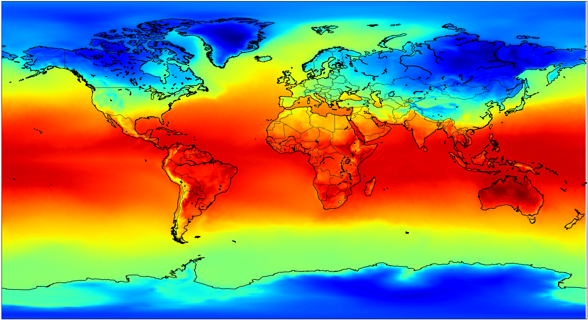

**Global wind speed when Storm Sandy made landfall in New York**



---

## Project Description

This workshop will go through some basic workflow for accessing and visualizing climate data using Python. You can find many datasets from NASA's [Goddard Earth Science Data and Information Services Center's Earth Data portal](https://disc.gsfc.nasa.gov/). It is an invaluable resource and we have access to climate data at the global level all the way back to 1980. This workshop will focus mainly on the techniques to handle NetCDF file format and to display global maps within iPython. The material presented should allow you to understand, access, and visualize many datasets. For this session we will use dataset from the **Modern-Era Retrospective analysis for Research and Applications version 2 (MERRA-2)** to look at global air temperature, and from the **Gravity Recovery and Climate Experiment Data Assimilation Product Version 2.0 (GRACE-DA-DM v2.0)** to look at groundwater and soil moisture conditions.

---

# Step 1
## Python Installation

Please follow the steps detailed in the [Data Science Intro](data-science-intro.md) for instructions to install Anaconda and create virtual environments.

You will want to create a new virtual environment for this workshop, and you will need the following packages: netCDF4, numpy, matplotlib, and basemap. First create a new virtual environment.

```bash
conda create -n climateViz python=3.7
```

Once it's done, activate the environment

```bash
conda activate climateViz
```

Now install the following packages

```bash
conda install numpy netCDF4 matplotlib basemap basemap-data-hires
```

---

# Step 2
## Download Climate Data

To access NASA's climate data, you need to register with Earthdata and agree to a few End User License Agreements.

1. Follow the steps [here](https://disc.gsfc.nasa.gov/data-access) to register with Earthdata.
2. After registration, go to [Earth Data Portal](https://disc.gsfc.nasa.gov/) and search for **M2TMNXSLV**. Then Click on the link.
3. You can access the data in multiple ways, but for our purpose, click **Online Archive**. This is a monthly dataset that dates back to 1980. You can choose any dataset you desire. For this exercise, we are using the data from Dec 2012.

You should now have the file in your local drive. Move the file to a new folder, open a **Terminal** or **Anaconda Prompt** and go to the directory that contains the downloaded file, then type **Jupyter Notebook** and create a new notebook.

---

# Step 3
## Visualize Data

The following workflow is built on the [How to read and plot NetCDF MERRA-2 data in Python](https://disc.gsfc.nasa.gov/information/howto?title=How%20to%20read%20and%20plot%20NetCDF%20MERRA-2%20data%20in%20Python) provided by GES DISC.

First you need to import all the relevant libraries Python will use.

```python
from netCDF4 import Dataset
import numpy as np
import matplotlib.pyplot as plt
import matplotlib.cm as cm
from mpl_toolkits.basemap import Basemap
```

Now import the dataset into a variable.

```python
data = Dataset('MERRA2_400.tavgM_2d_slv_Nx.201212.nc4', mode='r')
```

What we need to know is what kind of data is contained in the NetCDF file. NetCDF (Network Common Data Form) is a "self-describing" file format that contains all the metadata and is used primarily for sharing scientific data. Thus, once we loaded the file, we can access what is inside the dataset by printing the metadata.

```python
print(data)
```

```
root group (NETCDF4 data model, file format HDF5):
    History: Original file generated: Mon Jul  6 14:42:10 2015 GMT
    Filename: MERRA2_400.tavgM_2d_slv_Nx.201212.nc4
    Conventions: CF-1
    Institution: NASA Global Modeling and Assimilation Office
    SpatialCoverage: global
    TemporalRange: 1980-01-01 -> 2016-12-31
    ...
    dimensions(sizes): lon(576), lat(361), time(1)
    variables(dimensions): float64 lon(lon), float64 lat(lat), int32 time(time)...
```

What we are interested in is in the variables section. We want to see how many variables there are and how the data is structured. Type `len(data.variables)` and you can see there are 97 variables, but the variable names are coded and it's hard to understand what they are.

You can access more information by typing:

```python
print(data.variables)
```

You will find that there are many interesting variables in this file such as **TQV** (Total Precipitable Water Vapor), **TQL** (Total Precipitable Liquid Water), **TOX** (Total Column Odd Oxygen), **TO3** (Total Column Ozone)…etc. What we will look at for this exercise is the **T2M** (2-meter Air Temperature).

```
('T2M', <class 'netCDF4._netCDF4.Variable'>
float32 T2M(time, lat, lon)
    long_name: 2-meter_air_temperature
    units: K
    ...
current shape = (1, 361, 576))
```

Create the following new variables. Notice the `[]` after the variables, they specify the dimension of the data you want to create. Both **longitude** and **latitude** are 1 dimension whereas **T2M** has 3 dimensions as is described - **float32 T2M(time, lat, lon)** and **current shape = (1, 361, 576)**. Since this file is a monthly dataset and we only downloaded for a specific month, the time dimension has only 1 layer of data, therefore `[0,:,:]` is used.

```python
lons = data.variables['lon'][:]
lats = data.variables['lat'][:]
T2M = data.variables['T2M'][0,:,:]
```

Now we setup a map with all the relevant parameters such as projection, resolution, meshgrid...etc. For more information on basemap parameters, see the [Basemap API](https://matplotlib.org/basemap/api/basemap_api.html) and [Map Projections](https://matplotlib.org/basemap/users/mapsetup.html).

```python
map = Basemap(resolution='l', projection='gall', lat_0=0, lon_0=0)
lon, lat = np.meshgrid(lons, lats)
xi, yi = map(lon, lat)
```

NumPy's meshgrid creates a 2-dimensional array from latitude and longitude. `map(lon, lat)` takes the world coordinates and projects them to the map's coordinate. If you check the shape of the variables, you should see they all have the same dimensionality.

```python
print(xi.shape, yi.shape, T2M.shape)
(361, 576) (361, 576) (361, 576)
```

Now it's time to plot.

```python
plt.figure(figsize = (20,12), dpi=100, frameon=False)

cs = map.pcolor(xi,yi,np.squeeze(T2M), vmin=np.min(T2M), vmax=np.max(T2M), cmap=cm.jet)
cs.set_edgecolor('face')

map.drawcoastlines()
map.drawcountries()

plt.savefig('MERRA2-2m_airTemp_Test.png', bbox_inches='tight', pad_inches=0)
```

`plt.figure` sets the dimension of the plot. `figsize` is in inches and multiply that with `dpi` you get a pixel count. `map.pcolor` we set the values for x, y, temperature. `vmin` is the lowest temperature value and `vmax` is the highest temperature value. `cmap` sets the colormap option and in this case we are using **jet**.

**Global Air Temperature**



---

# Step 4
## Visualize Multiple Sets of Data

Now let's try to step it up and develop a more practical workflow. Since these types of data are much more informative when you look at longer duration and as a time series. Earthdata provide you with a way to download multiple files via **wget** or **curl**, you will need to setup your credentials and save it in a cookie. Follow the instructions here: [Earthdata cookie setup](https://disc.gsfc.nasa.gov/data-access)

Once you have setup the **cookie** and **credentials**, follow this page for instructions to setup mass download: [Download Multiple Files](https://disc.gsfc.nasa.gov/information/howto?title=How%20to%20Download%20Data%20Files%20from%20HTTPS%20Service%20with%20wget).

If everything is setup correctly, you should be able to download all the .nc4 files with this command:

```bash
wget --load-cookies ~/.urs_cookies --save-cookies ~/.urs_cookies --keep-session-cookies -r -c -nH -nd -np -A nc4 --content-disposition "https://hydro1.gesdisc.eosdis.nasa.gov/data/GRACEDA/GRACEDADM_CLSM0125US_7D.2.0/2014/"
```

Back in Jupyter, we will create a new notebook and start from the beginning. It will be very similar to the previous example except this time we will be visualizing all 52 sets of data at once.

```python
from netCDF4 import Dataset
import numpy as np
import matplotlib.pyplot as plt
import matplotlib.cm as cm
from mpl_toolkits.basemap import Basemap
import os

def addNC(file):
    data = Dataset(file,mode='r')
    print(file)
    return(data)

def findMinMax(a):
    minVal=[]
    maxVal=[]
    for data in a:
        minVal.append(np.min(data.variables['gws_inst'][0,:,:]))
        maxVal.append(np.max(data.variables['gws_inst'][0,:,:]))
    return(min(minVal),max(maxVal))
    
path = './files/GRACEDADM2014/'

nc4s = []
for r, d, f in os.walk(path):
    for file in f:
        if '.nc4' in file:
            nc4s.append(os.path.join(r, file))

nc4s.sort()
alldata = [addNC(u) for u in nc4s]
```

We are writing 2 functions, 1 to read the dataset which will be appended to the **alldata** variable, and the other is to find the maximum and minimum value across all 52 files for colormapping.

```python
i=0

(Vmin,Vmax) = findMinMax(alldata)

for data in alldata:
    lons = data.variables['lon'][:]
    lats = data.variables['lat'][:]
    gws_inst = data.variables['gws_inst'][0,:,:]
    map = Basemap(resolution='l', projection='gall', lat_0=(lats.max()/2), lon_0=(lons.max()/2),
             llcrnrlat=lats.min(),urcrnrlat=lats.max(),
             llcrnrlon=lons.min(),urcrnrlon=lons.max(),)
    lon, lat = np.meshgrid(lons, lats)
    xi, yi = map(lon, lat)
    plt.figure(figsize = (20,12), dpi=100, frameon=False)
    cs = map.pcolor(xi,yi,np.squeeze(gws_inst), vmin=Vmin, vmax=Vmax, cmap=cm.rainbow)
    cs.set_edgecolor('face')
    map.drawcoastlines()
    map.drawstates()
    map.drawcountries()
    plt.title(nc4s[i][47:-8], x=0.96, y=0.02)
    plt.savefig(nc4s[i][47:-8]+'.png', bbox_inches='tight', pad_inches=0)
    plt.clf()
    i += 1
```

The only difference with this code is all the map generation happens within a loop and all the files are saved with the same name as the original file. `plt.clf()` is used to clear the memory buffer. All the images can then be used to create an animated GIF like the following.

**Ground Water Storage Percentile**


