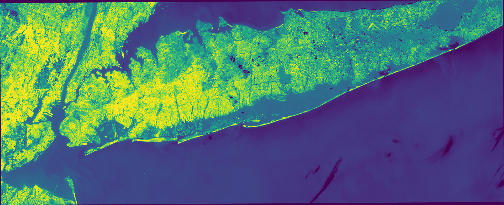
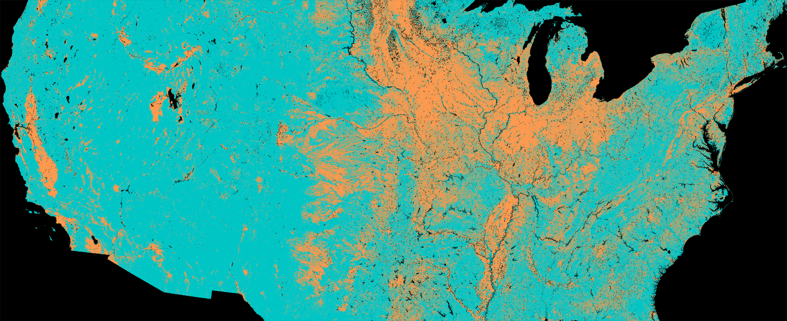
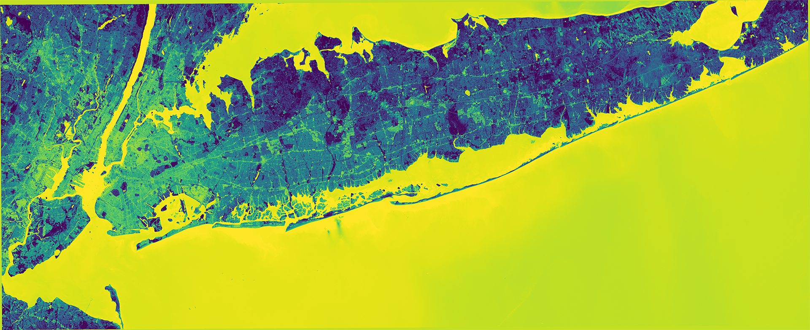
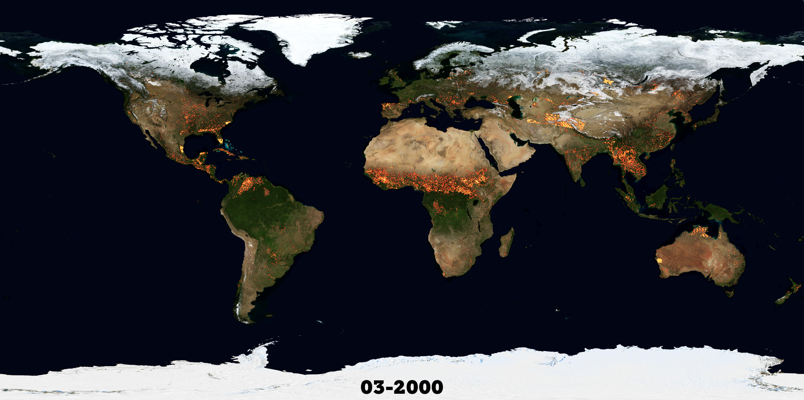
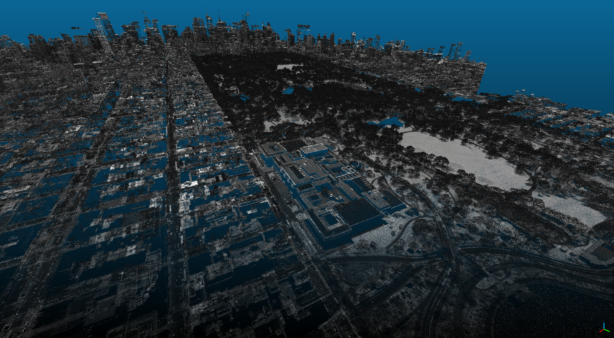
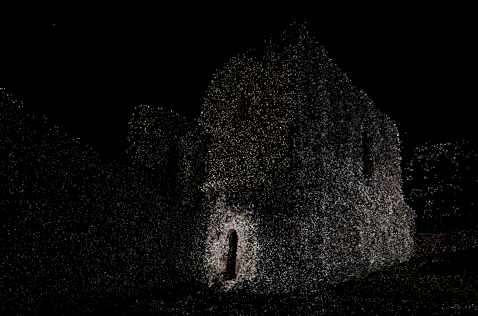
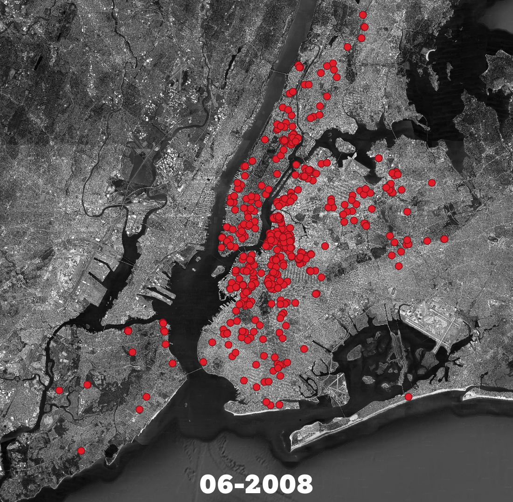
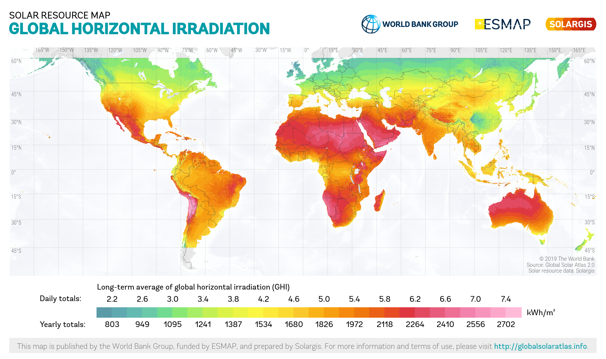

## Introduction

This site is your starting point for a hands-on journey into geographic information systems (GIS) and remote sensing—powerful tools that transform the way designers understand, analyze, and propose changes to the built and natural environment. Whether you're interested in urban heat islands, solar potential, flood risk, or ecological corridors, these tutorials will teach you to work with the same satellite data and spatial analysis techniques that planners, scientists, and policymakers use every day. Designed specifically for design students with no prior GIS experience, we'll focus on practical skills you can apply to studio projects, thesis research, and future professional work.

This tutorial series covers the full spectrum of geospatial analysis relevant to design. You'll learn foundational skills like finding and organizing data, understanding map projections, and creating clear, compelling maps. We'll explore satellite imagery analysis for urban heat studies, vegetation mapping, and land cover classification. You'll work with 3D data from LiDAR and photogrammetry to understand terrain and building form. We'll analyze temporal patterns using NASA's free satellite archives and climate datasets. And you'll learn to combine these tools to tell stories about cities, ecosystems, and climate resilience with evidence that clients and communities can understand.

## Historical Context

GIS technology emerged from cartography and geography in the 1960s, when early computer systems allowed governments and universities to digitize maps for analysis. The Canada Geographic Information System (CGIS), developed in the 1960s, is often cited as the first true GIS—it was built to analyze agricultural land use and soil capacity across the vast Canadian landscape. The 1990s brought desktop GIS software like ArcGIS and later QGIS (originally Quantum GIS), making the technology accessible beyond government agencies and large corporations. The satellite era ran parallel: Landsat launched in 1972, creating the longest continuous Earth observation record, while GPS technology transformed how we capture location data. Today, open data initiatives, free satellite archives, and open-source software have democratized geospatial analysis, putting tools once reserved for specialists into the hands of designers, journalists, and community organizers.

## Design Relevance

Design is fundamentally spatial—we shape places at specific locations, for specific communities, within specific environmental contexts. GIS lets you ask and answer questions about those spatial relationships: How far is the nearest park? Which neighborhoods have the most impervious surface? How has tree canopy changed over the past decade? Where will sea level rise flood first? These aren't abstract academic questions—they're the practical realities that determine whether designs succeed or fail, whether communities thrive or suffer, whether investments are equitable or reinforce existing disparities. Learning GIS doesn't just add a technical skill—it transforms how you see the world and positions you to make arguments that go beyond intuition and aesthetics.

## Learning Goals

- Understand the basic purpose of GIS and remote sensing in design research.
- Distinguish between vector and raster data and choose appropriate uses for each.
- Recognize how spatial analysis supports climate resilience, public interest design, and policy argumentation.
- Develop a critical approach to scale, uncertainty, and data limitations in mapping.
- Use geospatial evidence to strengthen studio, thesis, and community-based projects.

## Key Terms

- **GIS (Geographic Information System)**: A system for organizing, analyzing, and visualizing data that is tied to location.
- **Remote sensing**: The collection of information about the Earth from sensors on satellites, aircraft, or drones.
- **Vector data**: Spatial data represented as points, lines, and polygons with attached attributes.
- **Raster data**: Spatial data represented as a grid of pixels, each storing a measured or classified value.
- **Projection**: A method for translating the curved surface of the Earth onto a flat map.
- **Spatial analysis**: A set of methods for examining relationships, patterns, and change across geographic space.

## GIS, Power, and Representation

Maps are not neutral. They reflect choices about what to count, what to omit, what scale to use, and whose experiences become visible in data. In a design curriculum, GIS should therefore be understood not only as a technical toolkit but also as a method of representation with political consequences. Used carefully, spatial analysis can help surface inequity, support community claims, and make environmental burdens legible; used carelessly, it can flatten lived experience or overstate certainty. That tension is part of the discipline students need to learn.

## Resources & Further Reading
- [QGIS Download](https://qgis.org/en/site/forusers/download.html) - Free, open-source GIS software for Windows, Mac, and Linux
- [USGS EarthExplorer](https://earthexplorer.usgs.gov/) - Access Landsat, Sentinel, and aerial imagery archives
- [OpenStreetMap](https://www.openstreetmap.org/) - Free, editable world map database
- [NASA ARSET](https://arset.gsfc.nasa.gov/) - Applied Remote Sensing Education and Training tutorials
- [QGIS Documentation](https://docs.qgis.org/) - Official tutorials and guide
- [Maptime NYC](https://www.meetup.com/maptimenyc/) - Local GIS learning community

## Course Overview

Design decisions are spatial. Where we plant a tree, choose a roof material, add shade, or change a bus stop can be mapped—and measured for impact on comfort, equity, and climate resilience. This site is your on‑ramp to doing design research with geospatial data (GIS and remote sensing) so you can turn questions about cities into evidence‑based proposals.

What is GIS, in plain language?

Think of GIS as a way of asking better “where” questions—and backing them up with data. A GIS lets you bring together location (where something is) with attributes (what it is, how much, when it changed) to reveal patterns you can’t see from the ground.

Two building blocks you’ll use

- Vector data: clean lines and shapes—points (bus stops), lines (streets), and polygons (parcels, parks, census tracts). Each feature carries attributes like height, material, or population.

- Raster data: continuous grids—like photographs made of tiny squares (pixels). Satellites, elevation models, temperature maps, and land cover are rasters. If vector is a drawing, raster is a photo.

Why this matters for design and justice

Geospatial analysis helps connect design ideas to lived experience. You can:

- Locate “hot” blocks and test how tree canopy, pavement, and building form affect comfort.

- Compare resources across neighborhoods to surface inequities and target investments.

- Track change over time to see whether policies are working and for whom.

How we’ll work

- Accessible tools: we use free, open tools (QGIS and open datasets like Landsat, Sentinel, OpenStreetMap, and local open data portals). No coding required to start.

- Evidence you can explain: you’ll learn to make clear, readable maps and simple charts that communicate to clients, community partners, and policymakers.

- Thoughtful practice: we discuss scale, uncertainty, and ethics—what your data can and can’t say, how resolution affects claims, and how to avoid misrepresenting communities. Field checks and community input matter.

What you’ll do here

- Build foundational skills: find, download, and organize data; understand projections; style maps that tell a story.

- Analyze patterns: measure distances and buffers, summarize data within regions (zonal stats), and join neighborhood attributes (e.g., census data) to maps.

- Work with imagery: use satellite data to map vegetation, water, impervious surfaces, and land surface temperature for urban heat island studies.

- Compare scenarios: create fair comparisons across zones (e.g., similar building types with different tree cover) and across time (season, cloud cover, revisit).

- Communicate results: export maps, create simple dashboards/plots, and craft evidence‑based narratives for design proposals.

What to keep in mind

- Scale and resolution: satellite pixels often “see” at the block scale; great for neighborhood patterns, not individual facades.

- Time matters: season, time of day, and recent weather can change what you measure—match conditions when you compare.

- Data gaps and bias exist: not all areas are equally well mapped; always note limitations and invite community feedback.

Getting started

- Install QGIS (free) and set up a project folder.

- Explore an open dataset (for example, a Landsat 8 scene of your city).

- Follow a tutorial to make your first map—then pose a question you care about and use the tools to investigate it.

The goal: help you move from intuition to evidence—so your design ideas for cooler streets, healthier buildings, and more just cities are grounded in transparent, reproducible spatial analysis.

## Multispectral Imaging

Multispectral imaging blends several “colors” of light—some invisible to our eyes—into a single picture that reveals hidden patterns. Instead of just red, green, and blue, satellites capture 5–36 bands across visible, near-infrared (NIR), and short-wave infrared (SWIR). These bands let you map vegetation health (NDVI), detect water and moisture, distinguish roofs from pavement, and spot bare soil or burn scars. In design research, multispectral data from missions like Landsat and Sentinel-2 help compare neighborhoods, target tree planting, and monitor material choices over time. It’s a practical, block-scale tool for turning urban questions into evidence you can see.

## Urban Heat Island Effect

Urban Heat Island (UHI) maps show where cities store and release heat. Using Landsat’s thermal infrared bands, we estimate Land Surface Temperature (LST)—how hot roofs, roads, and soil get. LST isn’t air temperature, but it reveals hot spots (dark roofs, wide asphalt, low tree canopy) and cooler areas (parks, water, shade). With free Landsat imagery from USGS EarthExplorer—available back to the early 1980s—you can track neighborhood-scale patterns (about 30–100 m) and see how design and policy change heat over time. Use it to target tree planting, cool roofs, and shade, and to compare heat burdens across communities for equity-focused action.

## Digital Topography

Digital topography turns the shape of the ground into data you can analyze. USGS’s 3D Elevation Program (3DEP) provides free, high-resolution digital elevation models (often 1 m LiDAR) across the U.S. and territories. In QGIS you can map slope, aspect, and flow paths to see where water will collect, how storm surge or sea-level rise could spread, and which blocks are most exposed. Use it to site green infrastructure, design safe evacuation routes, evaluate accessibility on steep streets, and prioritize protection for low-lying, flood-prone neighborhoods. Elevation is a foundation layer for climate-resilient, equity-minded urban design.

## Land Cover

Land cover tells you what’s on the ground—forest, grass, pavement, water—and why places behave differently. The National Land Cover Database (NLCD) provides free, 30 m maps of land cover, tree canopy, and impervious surfaces across the U.S., with updates over time. Designers use NLCD to spot Wildland–Urban Interface (WUI) areas where development meets flammable vegetation, assess fire risk buffers, and plan defensible space. It also supports heat, runoff, and habitat connectivity analysis: compare imperviousness by neighborhood, target tree planting, and monitor change from 2001 onward. In QGIS, overlay NLCD with parcels and zoning to guide equitable, climate‑smart decisions.

## NDVI, NDWI, NDSI

NDVI, NDWI, and NDSI are simple, powerful indices that turn multispectral imagery into actionable maps. NDVI highlights vegetation vigor by contrasting near‑infrared (leaf reflectance) with red light (leaf absorption). NDWI maps open water and plant moisture using green–NIR or NIR–SWIR combinations. NDSI isolates snow and ice by contrasting green with SWIR. With Landsat or Sentinel‑2 (10–30 m), you can track drought stress, detect shrinking wetlands, monitor snowpack, and separate bright snow from salt or concrete. Use these indices to target tree care, site green infrastructure, protect riparian corridors, and anticipate runoff and urban heat risk.

## NASA NEO

NASA Earth Observations (NEO) is a browser‑based gallery of global satellite datasets you can explore and animate—no software required. Pick a layer (aerosols, chlorophyll, fires, rainfall, vegetation, land surface temperature, snow cover, more), choose a date range, and export images or GIFs to see seasonal cycles and long‑term trends. Zoom from global to regional scales to compare phenomena like El Niño, drought, smoke, or urban heat. NEO is ideal for quick context in design research: add animated backdrops to presentations, spot anomalies, and identify time windows worth deeper GIS analysis with Landsat, Sentinel, or local data.

## Sea Level Rise Analysis

Sea-level rise analysis turns elevation and shoreline data into actionable flood scenarios. With coastal LiDAR from USGS 3DEP and high‑resolution DEMs, you can map low‑lying areas, simulate “bathtub” inundation at +0.5–2 m, and overlay storm‑surge layers (e.g., NOAA SLOSH) and tides to test compound flooding. In QGIS, identify flow paths, critical facilities and housing within flood extents, and compare vulnerable parcels by neighborhood to support equitable adaptation. Add land cover to flag impervious hotspots and wetlands that buffer waves. Mind vertical datums (NAVD88 vs MHHW) and uncertainty. Use results to evaluate options: living shorelines, raised streets, floodable parks, and retreat.

## LiDAR Point Cloud Processing

LiDAR point clouds are like a 3D scan of the city—billions of points capturing ground, buildings, trees, and even power lines. With free datasets (often LAS/LAZ) for most urban areas, you can derive detailed elevation (DEMs), surface models (DSMs), building heights, and canopy metrics for design. This tutorial walks you through a beginner workflow: download LAZ, preview in CloudCompare or QGIS, classify ground vs. non‑ground, generate DEM/DSM, subtract to get a normalized surface (nDSM), and map heights, slopes, and tree crowns. You’ll export clean layers for shade studies, flood routing, visibility, and accessibility audits—all from raw points to actionable maps.

## Photogrammetry

Photogrammetry turns photos into accurate 3D models. In this tutorial you’ll use RealityCapture to reconstruct a streetscape and merge it with LiDAR for crisp geometry plus true color. Workflow: capture 60–80% overlap (walk slow, varied angles, steady exposure), import photos/LAZ, Align, set scale with a measured distance or ground control, register LiDAR and photos with control points, then Reconstruct: dense cloud to mesh to texture. Clean stray points, decimate for lightweight export, and georeference (use the correct EPSG). Tips: mask moving cars, avoid shiny glass, and shoot in diffuse light. Outputs drop into QGIS, CAD, or game engines.

## NYC Building Activity

forthcoming

## Solar Potential Analysis

forthcoming
