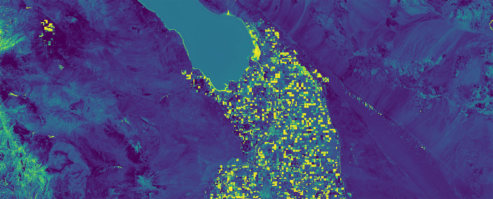
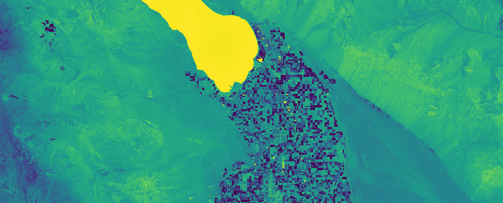

## Introduction

Indexed image analysis uses mathematical combinations of spectral bands—called vegetation indices—to highlight specific features or conditions. The most famous is NDVI (Normalized Difference Vegetation Index), which exploits the fact that healthy vegetation absorbs red light for photosynthesis while reflecting near-infrared. By comparing these two bands, NDVI quantifies vegetation health and density across entire landscapes. Other indices serve different purposes: NDWI (Normalized Difference Water Index) highlights open water; NDSI (Normalized Difference Snow Index) detects snow cover; NDMI (Normalized Difference Moisture Index) indicates surface moisture content.

The power of indices lies in their ability to transform raw spectral data into meaningful measurements. A red pixel in a satellite image could be soil, rooftop, or dead vegetation—NDVI disambiguates these. A bright pixel in thermal data indicates high temperature, but surface temperature varies with material type regardless of ambient conditions. Indices condense multidimensional spectral information into single values that map directly to real-world conditions.

For design applications, vegetation indices provide spatially explicit information about landscape conditions that would be impossible to gather through field observation alone. NDVI maps reveal which urban neighborhoods have tree canopy and which lack it—a foundation for environmental justice analysis and equitable greening strategies. Time-series NDVI shows whether vegetation is recovering after a development project or declining under stress.

## Historical Context

The scientific foundation for vegetation indices was established in the 1970s with the launch of Landsat 1. Researchers noticed that the ratio of near-infrared to red reflectance distinguished vegetation from other surfaces, and various indices were proposed. NDVI, introduced in 1973 by Donald R. Tilley and colleagues, became the most widely used.

The index was refined as understanding of plant spectral properties improved. The core principle—that photosynthetically active vegetation uniquely absorbs red while reflects near-infrared—stays constant, but normalization methods and threshold calibrations evolved. NDVI values range from -1 to +1, with higher values indicating denser, healthier vegetation.

Advanced indices continue to be developed. The Enhanced Vegetation Index (EVI) addresses NDVI saturation in dense canopies. The Normalized Difference Moisture Index (NDMI) emerged as thermal and shortwave infrared bands became available. Each new satellite mission adds spectral bands enabling finer discrimination—Landsat 8's coastal aerosol band improves water quality assessment, for instance.

Today, vegetation indices are standard tools in precision agriculture, forest management, drought monitoring, and urban planning. Google Earth Engine and similar platforms provide access to global NDVI and other indices computed from decades of satellite data, enabling analysis impossible when indices had to be computed from individual scenes.

## Design Relevance

NDVI maps serve as quantitative baselines for landscape assessment. Where a site visit reveals "some trees," NDVI reveals exactly how much vegetation exists, where it's concentrated, and how healthy it is. This matters for both impact assessment (how will this project affect urban tree canopy?) and opportunity identification (which neighborhoods would benefit most from greening investments?).

Time-series NDVI analysis reveals landscape dynamics invisible in static images. Comparing NDVI from different years shows whether urban tree canopy is growing or shrinking, whether post-fire vegetation recovery is progressing, whether agricultural land is being converted to development. For designers working on long-term projects, understanding these trajectories informs recommendations that account for future conditions, not just present ones.

Water indices (NDWI, MNDWI) complement vegetation analysis. Urban streams often have complex surface water signatures—polluted water reflects differently than clean water, drained wetlands look different from flooded ones. Combined with land cover classification, water indices help designers understand the hydrological context: where does stormwater originate, where does it flow, what ecosystems depend on surface water?

Indices derived from Landsat and Sentinel data are free and globally available, making sophisticated environmental analysis accessible without expensive field campaigns. Design studios can integrate NDVI analysis into site assessment using only QGIS and publicly available satellite imagery, producing deliverables that previously required specialized remote sensing expertise.

## Learning Goals

- Explain what an indexed image is and why spectral ratios are useful in GIS analysis.
- Distinguish between common indices such as NDVI, NDWI, and NDMI based on what they measure.
- Interpret index maps as evidence of landscape condition rather than as conventional photographs.
- Use indexed imagery to support site analysis, environmental assessment, and design decision-making.
- Critically evaluate the limits of satellite-derived indicators in urban and regional contexts.

## Key Terms

- **Spectral band**: A specific range of wavelengths recorded by a sensor, such as red, near-infrared, or shortwave infrared.
- **Index**: A mathematical combination of two or more spectral bands used to highlight a surface condition or material.
- **NDVI**: The Normalized Difference Vegetation Index, commonly used to estimate vegetation presence and relative health.
- **NDWI**: The Normalized Difference Water Index, used to emphasize open water and moisture-related surface conditions.
- **NDMI**: The Normalized Difference Moisture Index, used to estimate moisture content in vegetation or soil.
- **Raster calculator**: A GIS tool that performs pixel-by-pixel mathematical operations to generate new raster outputs.

## Environmental Justice Context

Indexed imagery can help reveal uneven environmental conditions across neighborhoods, but the map only becomes meaningful when paired with social context. Higher or lower vegetation and moisture values often align with patterns of redlining, disinvestment, industrial land use, and unequal access to public open space. For design students, these datasets are useful not simply for describing ecological patterns, but for asking who benefits from environmental resources, who bears environmental risk, and how spatial design can address those disparities.

## Resources & Further Reading

- [NASA Earth Observatory: Measuring Vegetation](https://earthobservatory.nasa.gov/features/MeasuringVegetation) - Accessible introduction to NDVI and its applications
- [EOS.com NDVI Guide](https://eos.com/make-an-analysis/ndvi/) - Practical guide to using NDVI for vegetation assessment
- [USGS Remote Sensing FAQ](https://www.usgs.gov/faqs/what-remote-sensing) - Answers common questions about satellite imagery and indices
- [Sentinel Hub EO Browser](https://www.sentinel-hub.com/explore/eobrowser/) - Free tool for exploring multispectral indices from Sentinel satellites
- [Index Database](https://www.indexdatabase.de/) - Comprehensive catalog of vegetation indices and their applications

## Technical Walkthrough

Indexed Imagery is an analysis method that uses different spectrum of light to highlight certain terrestrial features. Normalized Difference Snow Index (NDSI) uses the Red and Shortwave Infrared spectrum to calculate the presence of snow, whereas Normalized Difference Vegetation Index (NDVI) uses the near infrared and red spectrum to estimate plant health. There is a long history of using remote sensing technologies to quantitatively detect terrestrial changes, and researchers are continually developing and improving ways to such technology.

More Readings:

- [https://eos.com/make-an-analysis/index-stack/](https://eos.com/make-an-analysis/index-stack/)

- [https://earthobservatory.nasa.gov/features/MeasuringVegetation](https://earthobservatory.nasa.gov/features/MeasuringVegetation)

### Normalized Difference Moisture Index (NDMI)

### Normalized Difference Water Index (NDWI)

Basic Workflow

- Download Landsat 8 data from [National Map](https://apps.nationalmap.gov/downloader/#/) and unzip it into a project folder. Please refer to the [Multispectral Imagery](./multispectral-imagery.md) tutorial for more background on the source data.

- Build a virtual raster in QGIS with all the spectral bands in the Landsat 8 dataset. This step is also covered in the [Multispectral Imagery](./multispectral-imagery.md) tutorial.

- Build the Indexed Image with Raster Calculation

- Export image

[Build NDVI with QGIS](https://www.youtube.com/watch?v=lG6PxcZaMS0)

- Build a virtual raster from the Landsat bands by adding `B1` through `B7` and checking `Place each input file into a separate band`.
- For Landsat 8 NDVI, use `Raster Calculator` with band 5 and band 4: subtract red from near-infrared, then divide by their sum.
- Save the NDVI output as a GeoTIFF, then switch the layer to `Singleband pseudocolor` for easier interpretation.
- If you want thresholded classes, change the color ramp to discrete breaks such as values below `0`, `0 to 0.33`, `0.33 to 0.66`, and above `0.66`.
- Clip the result to the area you want to present, copy the style to the clipped raster, and export it as a rendered image without upscaling beyond the source resolution.
