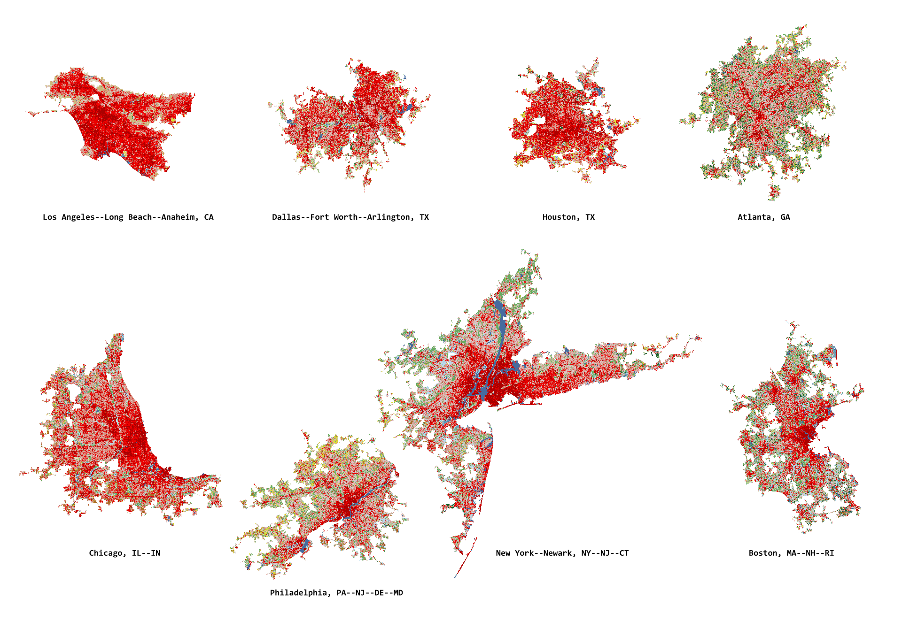
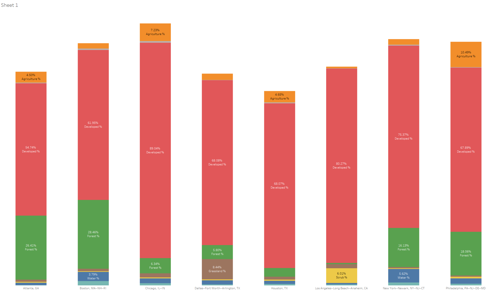

## Introduction

Land cover classification categorizes the Earth's surface into types: forest, grassland, agriculture, developed/urban, water, wetlands, and more. Unlike land use (what humans do with the land—residential, commercial, park), land cover describes the physical surface. A baseball field and a parking lot might both be "developed" land cover, but they have very different implications for stormwater, heat, and ecology. This distinction matters for design: understanding actual surface conditions informs drainage design, microclimate intervention, and habitat connectivity.

Land cover data comes primarily from satellite imagery analysis. The National Land Cover Database (NLCD), produced through the Multi-Resolution Land Characteristics Consortium (MRLC), provides 30-meter resolution classification for the United States. More detailed land-cover products exist for some regions, but the NLCD offers unmatched consistency and historical depth, with versions going back to 1992. This allows designers to understand not just current conditions, but how the landscape has changed—where forest has been lost to development, where agriculture has expanded, where urban areas have densified.

For site-scale analysis, land cover data provides baseline context. A proposed development adjacent to a large forested area needs different stormwater and wildlife mitigation than one surrounded by other urban uses. Regional land cover analysis quantifies impervious surface percentages, vegetation coverage, and connectivity patterns that inform both site design and policy recommendations.

## Historical Context

Systematic land cover mapping began with the USGS in the 1970s, leveraging the same aerial photography and early satellite data used for topographic mapping. The Corine Land Cover program, initiated by the European Community in 1985, established standardized classification systems still referenced today. In the US, the USGS GAP (Gap Analysis Program) created the first comprehensive national land cover dataset in the 1990s.

The 2000s saw major advances with the NLCD, a collaborative effort producing consistent wall-to-wall coverage for the US. The 30-meter resolution (each pixel represents 30x30 meters on the ground) comes from Landsat satellite imagery, chosen as a practical balance between detail and manageable data volume. Earlier datasets had coarser resolution—1-kilometer pixels in global products—limiting their utility for local planning.

Contemporary land cover classification increasingly uses machine learning algorithms that automatically identify patterns in multispectral imagery. These methods achieve accuracy levels difficult to attain through manual interpretation alone, and they scale to continental or global datasets. The European Copernicus program produces global land cover maps annually, while initiatives like Microsoft's Planetary Computer provide access to petabytes of analysis-ready environmental data.

## Design Relevance

Land cover directly affects environmental performance of designed systems. Impervious surfaces—roads, rooftops, parking lots—prevent rainwater infiltration, increasing runoff volumes and velocities, concentrating pollutants, and degrading aquatic habitats. Knowing the percentage of impervious cover in a watershed helps size stormwater management infrastructure and predict downstream flooding risks.

The urban heat island effect correlates strongly with land cover: areas with less vegetation and more dark, absorptive surfaces run significantly hotter. Land cover analysis identifies heat-vulnerable neighborhoods and targets locations for tree planting, green roofs, or cool pavement interventions. This spatial targeting improves the cost-effectiveness of heat mitigation investments.

Ecological connectivity depends on continuous vegetated corridors, which land cover analysis can map and quantify. A site within a fragmented landscape may need wildlife crossings or vegetated buffer zones to maintain ecological function. Understanding the larger landscape context prevents designs that inadvertently isolate habitat patches or sever movement corridors.

For urban design and landscape architecture, land cover classification provides defensible baselines for master planning. Showing clients and regulators how their site contributes to or mitigates regional impervious surface percentages, canopy loss, or habitat fragmentation grounds design recommendations in measurable environmental performance rather than aesthetic preference alone.

## Learning Goals

- Distinguish land cover from land use and explain why that difference matters for design decisions.
- Interpret raster-based land cover datasets at regional and neighborhood scales.
- Evaluate how impervious surface, vegetation, and habitat patterns shape environmental performance.
- Use land cover classification to support evidence-based arguments about stormwater, heat, and ecology.
- Recognize the limits of resolution and classification accuracy when making site-scale claims.

## Key Terms

- **Land cover**: The physical material on the Earth's surface, such as vegetation, pavement, water, or bare soil.
- **Land use**: The human purpose assigned to land, such as housing, agriculture, recreation, or industry.
- **Raster**: A grid-based data format in which each pixel stores a value representing a measured or classified condition.
- **Impervious surface**: Built material, such as asphalt or roofing, that prevents water from infiltrating into the ground.
- **Classification**: The process of assigning each pixel or area to a category based on shared visual or spectral characteristics.
- **Resolution**: The size of each pixel on the ground, which determines how much spatial detail a dataset can represent.

## Land Cover, Policy, and Environmental Justice

Land cover is never only a technical description of surface conditions; it also records histories of investment, extraction, zoning, and exclusion. Neighborhoods shaped by redlining, highway construction, or industrial siting often show higher impervious cover, lower canopy, and reduced ecological access. For design students, land cover analysis can therefore support more just forms of practice: not simply identifying where change is happening, but asking who benefits from green space, who absorbs environmental burdens, and how design can redistribute ecological resources more fairly.

## Resources & Further Reading

- [MRLC Consortium](https://www.mrlc.gov/) - Access to NLCD data and related land cover resources
- [USGS Gap Analysis Project](https://www.usgs.gov/programs/gap-analysis-project) - LANDFIRE vegetation data and species habitat modeling
- [EPA EnviroAtlas](https://www.epa.gov/enviroatlas) - Interactive tool combining land cover with environmental and health indicators
- [UMass DSL: Designing Sustainable Landscapes](https://umassdsl.org/) - Ecological framework linking landscape design to habitat connectivity
- [Census Bureau TIGER/Line Data](https://www.census.gov/cgi-bin/geo/shapefiles/index.php) - Urban area boundaries and demographic data to combine with land cover analysis

## Technical Walkthrough

Land cover data is very useful for various reasons, depending on what data source we use, we can get a very clear picture of how much "wild" / undeveloped land we still have for ecosystems to thrive; how much land has been convert to agriculture / pasture and what's grown on them; and how much of our land have been paved so underground reservoirs can't recharge easily.

In general, all land cover data comes in as raster files, image file with each pixel representing physical dimension (NLCD is 30m x 30m for each pixel), and each pixel has a grey scale value representing land cover types.

This tutorial will walk through the basic techniques of running an analysis with this data set.

*A good reference for how land cover data can be used to assess ecological environments is via UMass's DSL - link below, land cover data is used in conjunction with other data sets like building footprints, road / rail networks, and each "cell" is assigned a weight depending on the ratio of each element.

### Data Sources

Land Cover Data

- [USGS GAP/LANDFIRE](https://www.usgs.gov/programs/gap-analysis-project/science/land-cover-data-download?qt-science_center_objects=0#qt-science_center_objects)

- [Multi-Resolution Land Characteristics Consortium Data (MRLC)](https://www.mrlc.gov/data?f%5B0%5D=year%3A2019)

- [Historical Comparison Tool](https://www.mrlc.gov/eva/)

USDA Cropland Data

- [Cropland CROS](https://cropcros.azurewebsites.net/)

- [NRCS](https://nrcs.app.box.com/v/gateway/folder/22218925171) (Cropland Data Layer by State)

- [Cropland Data Layer (National)](https://www.nass.usda.gov/Research_and_Science/Cropland/Release/)

Census Bureau Vector Files

- [TIGER/Line](https://www.census.gov/cgi-bin/geo/shapefiles/index.php)

UMass Designing Sustainable Landscape

- [DSL Ecological Settings](https://umassdsl.org/data/ecological-settings/)

NOAA Coastal Land Cover Change

- [CCAP Atlas](https://coast.noaa.gov/ccapatlas/)

### Tutorial 1: Urban and Wild Land Ratio Comparison between Major Metropolitans

This tutorial will walk through how to use the land cover data to compare the urban to wild land ratio between the 8 major metropolitan area in the US. The techniques documented can be used on any raster data sets.

Basic Workflow

- Download raster based land cover data from one of the sites above

- Download Urban Areas from the Census Bureau, link above

- Filter all urban areas down to 8 largest regions

- Clip land cover with the 8 urban regions

- Re-classify (simplify) land cover categories into 8 basic types

- Conduct Zonal Analysis to count the number of each land cover types that exist within each region. In simple terms, each pixel is 30m x 30m and it represents a land cover type, count them.

- Move the data to [Tableau Public](https://public.tableau.com/en-us/s/) for visualization and comparison.

[Land Cover Analysis](https://www.youtube.com/watch?v=nBTF-Mu0F0A)

- Download the NLCD 2019 dataset, unzip it, and load the `.img` raster into QGIS; this is the main land-cover layer used in the walkthrough.
- Keep the NLCD raster in its native equal-area projection whenever possible, or reproject all supporting vector layers into the NLCD CRS before analysis. If you must reproject the raster, choose an equal-area projected CRS appropriate to your study area rather than Web Mercator so pixel counts remain meaningful for area comparison.
- Download the Census `Urban Areas` shapefile, load it, export it to the same CRS, and filter the polygons by land area so only the largest metropolitan regions remain.
- Use `Clip raster by mask layer` to cut the NLCD raster down to the selected urban areas.
- Run `Reclassify by table` to collapse detailed NLCD classes into broader groups such as water, developed land, forest, grassland, agriculture, and wetlands.
- Run `Zonal histogram` on the reclassified raster to count pixels by class inside each metro polygon, then convert those counts into percentages for inter-metro comparison.
