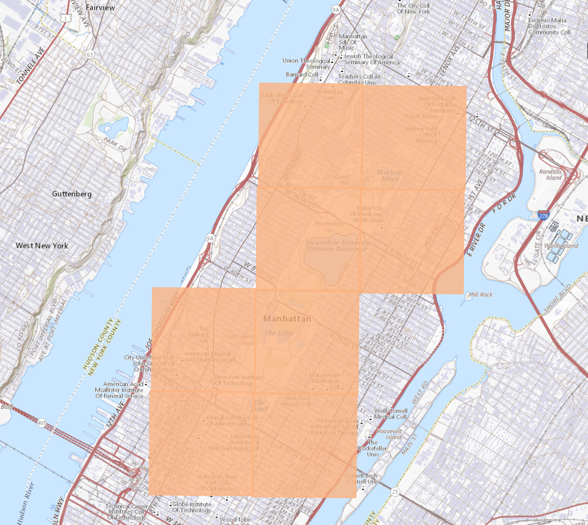
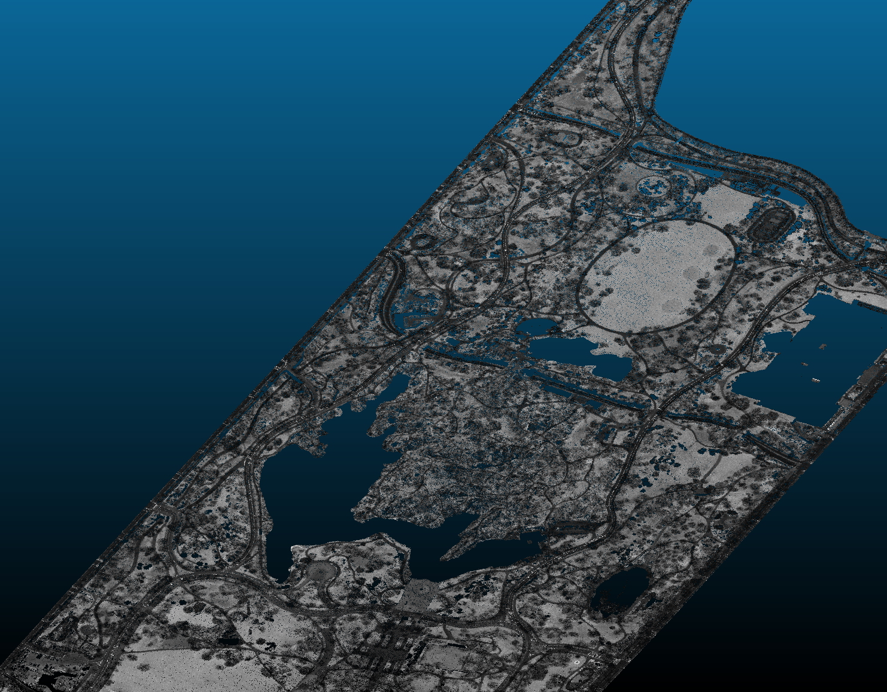
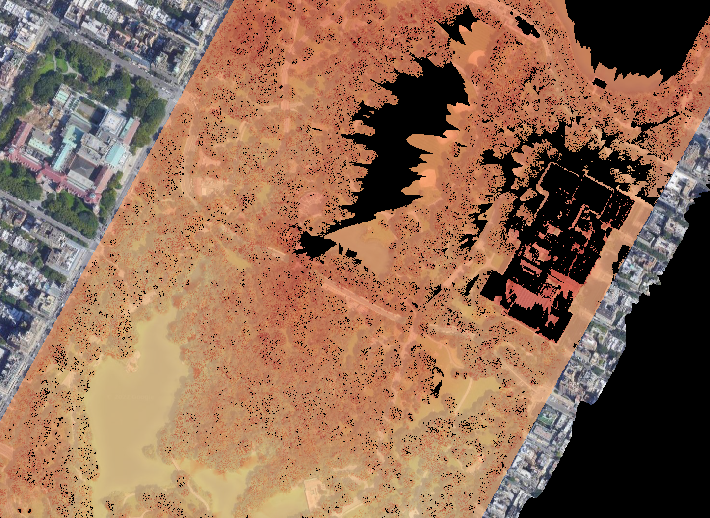

## Introduction

LiDAR—Light Detection and Ranging—is a remote sensing technology that fires rapid pulses of laser light at a surface and measures how long it takes for each pulse to bounce back. By calculating the travel time and angle of thousands or millions of returns, LiDAR builds a precise, 3D point cloud representation of the terrain and everything on it: buildings, trees, power lines, bridges. The result is essentially a digital twin of the physical world at the moment the data was captured.

What makes LiDAR special for design is its combination of precision and coverage. Traditional surveying captures discrete points—elevation at specific locations. LiDAR captures millions of points continuously, creating a dataset dense enough to capture building edges, tree canopy shapes, and subtle terrain variations simultaneously. For site analysis, this means you can extract building footprints, model terrain, analyze viewsheds, and assess vegetation—all from a single dataset.

Modern open-access LiDAR data, largely available through USGS programs and state initiatives, has transformed what's possible in design education and practice. Where once only large infrastructure projects could afford LiDAR surveys, designers can now download pre-captured point clouds and derivative products covering much of the United States. Depending on the source, you may encounter raw point clouds, bare-earth DEMs, surface models, and rasters derived at cell sizes ranging from sub-meter to tens of meters.

## Learning Goals

- Distinguish between point clouds, DSMs, and DEMs and explain when each is useful in design workflows.
- Understand the role of classification, intensity, and meshing in LiDAR processing.
- Build a workflow for downloading, filtering, and converting LiDAR data into usable analysis and modeling outputs.
- Use viewshed analysis to connect terrain data to design questions about visibility, urban form, and landscape experience.
- Situate LiDAR within broader questions of public infrastructure, environmental risk, and uneven data access.

## Key Terms

- **Point cloud**: A dense collection of XYZ coordinates representing the surfaces captured by a LiDAR sensor.
- **Classification**: Labels assigned to LiDAR returns so that ground, vegetation, buildings, and noise can be separated during analysis.
- **Digital Surface Model (DSM)**: An elevation model that includes buildings, trees, and other objects above the ground.
- **Digital Elevation Model (DEM)**: A bare-earth elevation model used for terrain and hydrologic analysis.
- **Intensity**: A measure of the strength of the return signal, often useful for distinguishing surface materials.
- **Viewshed**: A model of what is visible from a given point across terrain and built form.

## Historical Context

LiDAR's origins trace to the 1960s, shortly after the invention of the laser. Early applications were primarily atmospheric research—measuring cloud heights, atmospheric particles, and cloud structure. The technology advanced through the 1970s and 1980s as GPS and inertial measurement units improved, allowing accurate geo-referencing of point clouds from aircraft.

The 1990s saw LiDAR migrate to civilian applications, particularly mapping and elevation modeling. Around the same period, shuttle-based radar missions such as SRTM expanded public access to global elevation data, while LiDAR itself continued to develop through airborne and terrestrial systems. NASA's ICESat mission, launched in 2003, demonstrated the importance of space-based laser altimetry for measuring ice sheets, forests, and elevation change at planetary scale. Around the same time, full-waveform LiDAR emerged, capturing the entire return signal rather than just discrete points and improving the separation of ground returns from vegetation.

The 2010s brought a revolution in data availability. The USGS 3DEP program, initiated in 2015, accelerated public access to high-quality elevation data across the United States. State governments, especially those coastal states concerned about flooding, also invested heavily in LiDAR acquisition. Coverage and quality continue to improve, but they still vary by state, date of capture, point density, and classification standard.

Simultaneously, processing software evolved from specialized, expensive packages to accessible tools. Cloud Compare, developed as an open-source PhD project, now handles millions of points on a standard laptop. This democratization means design students can work with the same caliber of data that previously required specialized GIS departments.

## Social and Environmental Context

LiDAR is often discussed as a technical breakthrough, but it also shapes how governments, researchers, and designers see territory. Publicly funded LiDAR programs are frequently justified through flood mapping, coastal resilience, forestry, and infrastructure maintenance, which means the technology is deeply tied to questions of risk, public investment, and environmental governance. Areas with better data coverage can often plan more effectively, while communities with incomplete coverage may remain less visible in planning systems.

For design students, this matters because LiDAR is not just a faster way to model terrain. It is also part of a broader politics of measurement: who gets mapped, what gets classified, and how those models influence planning decisions about housing, flood protection, and land management. Understanding that context makes the technical workflow more meaningful.

## Design Relevance

For designers, LiDAR is primarily valuable as a source of Digital Surface Models (DSMs) and Digital Elevation Models (DEMs). The distinction matters: a DSM includes everything the laser hit—rooftops, tree canopies, vehicles—while a DEM represents bare earth with structures removed. Your choice depends on the design question: solar analysis needs DSM data (buildings block and cast shadows), while drainage modeling needs DEM (water flows across ground, not rooftops).

The point cloud itself contains rich information beyond simple elevation. LiDAR intensity data indicates surface reflectivity—hard surfaces like asphalt reflect differently than vegetation or buildings. Classified point clouds separate ground points from vegetation, buildings, and noise, enabling specialized analyses like building footprint extraction or tree height estimation.

Viewshed analysis—the ability to see what is visible from a given point—is one of LiDAR's most design-relevant applications. Combined with building height data, designers can assess how proposed massing affects sightlines, solar access, or visual impact on surrounding areas. This type of analysis previously required expensive consultant studies; now it's accessible in QGIS with publicly available data.

LiDAR data also enables accurate 3D modeling workflows. Point clouds can be meshed to create triangulated surfaces, which can then be simplified and optimized for visualization or further design work. This bridges the gap between field-captured reality and design software like Rhino or Revit.

## Resources & Further Reading

- [Cloud Compare Open Source](https://www.danielgm.net/cc/) - Free, powerful point cloud processing software with excellent tutorials
- [USGS LiDAR Documentation](https://www.usgs.gov/3d-elevation-program/lidar) - Comprehensive guide to LiDAR data types, formats, and access
- [NOAA Digital Coast LiDAR](https://coast.noaa.gov/dataviewer/#/) - Coastal-focused LiDAR data portal with high-resolution coverage
- [State LiDAR Resources](https://www.usgs.gov/3d-elevation-program/3dep/state-solicitations) - Index of state-managed LiDAR programs across the US
- [Point Cloud Processing in Python](https://python-pcl-library.github.io/) - Library for working with LiDAR data programmatically

## Technical Walkthrough

This walkthrough moves from data access to terrain analysis and mesh production. The goal is to understand both the software sequence and the reasoning behind each transformation of the raw point cloud.

### Tools

## Cloud Compare

CC is a point cloud processing software created by Daniel Girardeau-Montaut as his PhD on Change detection on 3D geometric data. The tool has since been widely adopted to process all kinds of laser based data.

## QGIS

A very capable GIS software that can handle many data types and will cover most of our tutorials. Pratt's [Launchpad](https://one.pratt.edu/s/launchpad?tabset-e8f43=18357) can provide free access if you don't have a license.

### Overview

Basic Workflow

- Download LiDAR data from National Map

- Process LiDAR data in Cloud Compare (Merge, Filter Classified Data, Export to DSM / DEM)

- Viewshed analysis with QGIS

## Download LiDAR data

LiDAR data are widely available and can be downloaded from [NOAA](https://coast.noaa.gov/dataviewer/#/), [USGS](https://apps.nationalmap.gov/downloader/#/), and [State Governments](https://tnris.org/stratmap/elevation-lidar/). For this exercise we will use data from the National Map.

## LiDAR Processing

LiDAR data is basically a set of point clouds. There are a number of standards we should know in order to properly process the data to a useable form. We will learn about data classifications, difference between DSM / DEM, meshing, and how to integrate these into a larger workflow.

## Viewshed Analysis

LiDAR data can be used for many purposes. One of the more useful studies from a design perspective is the use of Digital Surface Model (DSM). A DSM, unlike a DEM, which only describe the ground surface, includes all the structures like buildings and trees. We will learn a basic view shed study using this information.

### Step 1: Download LiDAR Data

This video walks through the process of downloading LiDAR data from the National Map. LiDAR data capture is standardized and most data sources will include attributes such as intensity, classification, return number, GPS time, and scan angle. Read more about the data capture process [here](https://desktop.arcgis.com/en/arcmap/10.3/manage-data/las-dataset/what-is-lidar-data-.htm).

Many state governments also make LiDAR data available for the public with better classifications. The workflow in general will be the same. Listed below are some links to state level high quality LiDAR data.

- [New York State LiDAR](https://orthos.dhses.ny.gov/?Extent=-9603624.133747088,4774299.7366908705,-7659066.134172721,5795498.434580554&Layers=07_meter_dem_index_usgs,1_meter_dem_index_fema,1_meter_dem_index_usgs,1_meter_dem_index_tidal_water,1_meter_dem_index_hydro_flattened,1_meter_dem_index_usda_utm18n,1_meter_dem_index_usda_utm17n,1_meter_dem_index_nys,2_meter_dem_index_ne_lidar,2_meter_dem_index_nys,2_meter_dem_index_fema,2_meter_dem_index_monroe_county,2_meter_dem_index_tompkins_county,2_meter_dem_index_erie_county&layerGroups=DEMIndexes,Orthoimagery&rightMenu=0)

- [Iowa LiDAR](https://www.geotree.uni.edu/lidar/)

- [Texas LiDAR](https://data.tnris.org/?pg=1&inc=24#5.5/31.33/-99.341)

[National Map LiDAR Download](https://www.youtube.com/watch?v=WIZ-lREt-w8)

- In The National Map or its current download interface, filter for LiDAR source data and select the point-cloud products for your study area.
- Use `Show` and the legend to check data quality; the color ramp indicates approximate point spacing, with smaller spacing meaning denser data.
- Draw a polygon around the site instead of relying on a simple screen extent when you need a more exact search area.
- Run the product search and download every tile that intersects the polygon, since even partial overlaps are needed for stitching later.

### Step 2: LiDAR Processing

This video walks through the process of generating Digital Surface Model and Digital Elevation Model from LiDAR data. More on LiDAR Classification [here](https://desktop.arcgis.com/en/arcmap/10.3/manage-data/las-dataset/lidar-point-classification.htm).

[Cloud Compare LiDAR Processing](https://www.youtube.com/watch?v=Z2s5TRXfuw8)

- Drag all `.las` files into Cloud Compare, accept the default import settings with `Apply All`, and watch memory use while the point clouds load.
- Merge the separate tiles with `Edit > Merge`, generating a scalar field so the dataset can be managed as one point cloud.
- Switch the active scalar field to `Intensity` for easier visual navigation, then crop the merged cloud to the study area with the scissors tool in top orthographic view.
- Create a DSM with `Tools > Projection > Rasterize` using the `Z` dimension, `Average` projection, and interpolated empty cells; the video uses a `0.5 m` grid and exports the raster height as a TIFF.
- For the DEM, switch to the `Classification` scalar field, filter to ground points only, then rasterize and export again with the same grid settings.

### Step 2a: Generate Mesh from LiDAR Data

[LiDAR to Mesh with Cloud Compare](https://www.youtube.com/watch?v=5HTMEihHMZU)

- Start from the ground-only point cloud, then compute normals with `Edit > Normals > Compute` using the default quadratic surface method.
- Convert the normals to HSV colors to verify the surface orientation is smooth and consistent before meshing.
- Build the mesh with Cloud Compare's Delaunay triangulation tools, adjusting `Maximum edge length` to control whether the software bridges voids such as ponds, building footprints, or the cropped boundary.
- Keep the edge-length limit conservative if you want to avoid large bridged gaps or excessive vertical side faces.
- Save the resulting mesh as `.obj` and continue cleanup in Rhino if needed.

### Step 3: Viewshed Analysis

[Viewshed Analysis QGIS](https://www.youtube.com/watch?v=6U8EqbUYuY4)

- In QGIS, add an XYZ satellite layer for context if needed, then use `LAStools > LAS Info` or the source metadata to confirm the LiDAR CRS before loading the DSM.
- After dragging in the DSM TIFF, verify that QGIS recognized the raster CRS correctly. Only assign a CRS manually if the file arrived without one. In the video example, the DSM uses `NAD 1983 UTM Zone 18N (EPSG:26918)`.
- Set `0` as the raster's no-data transparency value so the cropped edges disappear, and optionally switch to `Singleband pseudocolor` for easier elevation reading.
- Run the `Viewshed` tool on the DSM, place the observer point, then use `Identify Features` to read the roof elevation and add viewer height before executing the analysis.
- Set the output viewshed layer to the same CRS and no-data transparency; the visible area appears as the dark region in the result.
