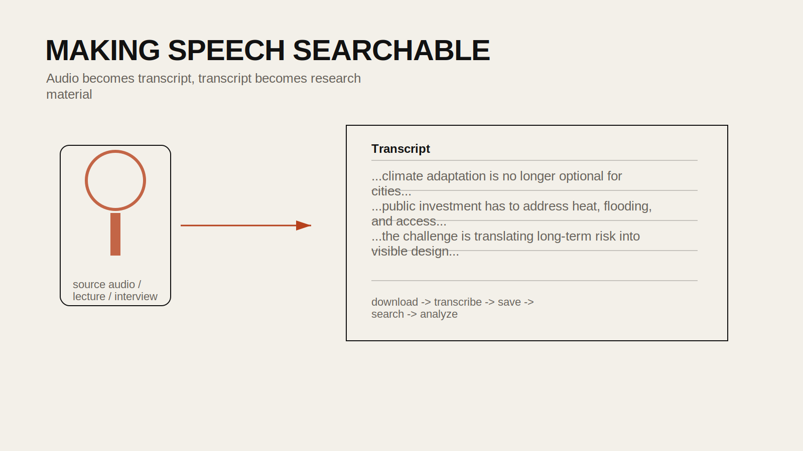

## Introduction

Audio and video are increasingly important sources for design research: lectures, interviews, podcasts, hearings, public testimony, and recorded site observations all contain material that is difficult to search until it becomes text. A transcription workflow turns spoken material into something that can be quoted, annotated, summarized, and analyzed.

This tutorial builds from `24FA-ARCH-581A-40 Week 10 - Transcription`. The original notebook demonstrates a straightforward pattern: download audio from a video source, send the file to a speech model, and export the result as text. The public version below reframes that pattern as a research workflow rather than just a technical demo.

## Historical Context

Transcription has traditionally been labor-intensive, requiring either manual listening or specialized transcription services. Automatic speech recognition systems made transcription faster, but often struggled with multilingual content, accented speech, field recordings, or domain-specific vocabulary. Contemporary speech models have made transcription and translation much more accessible, allowing researchers to process large volumes of audio in ordinary notebook workflows.

For design and planning fields, this matters because so much relevant knowledge lives in spoken form rather than formal reports.

## Design Relevance

Designers work with spoken material all the time: interviews with residents, stakeholder meetings, recorded critiques, public hearings, classroom lectures, documentary footage, or oral histories. Converting these sources into text makes it easier to:

- quote and annotate key passages
- search across multiple recordings
- summarize recurring themes
- compare interviews across participants or locations

## Learning Goals

- Download audio from a video source
- Extract or save an audio file in a usable format
- Generate a transcript with a speech model
- Translate non-English speech into English text when needed
- Export transcripts for later analysis



## Step 1: Install the Required Packages

```bash
pip install openai yt-dlp
```

If you are working locally, make sure your machine also has `ffmpeg` installed, since `yt-dlp` often relies on it for audio extraction.

## Step 2: Choose a Source URL

The notebook uses YouTube as the source, but the same workflow can apply to any legally accessible audio or video source you are allowed to process.

```python
url = "https://www.youtube.com/watch?v=5ANKd4lKcfI"
```

Before downloading, make sure you have the right to use the material for research or teaching.

## Step 3: Download the Audio Track

The source notebook uses `yt-dlp` to extract the best available audio.

```python
import yt_dlp

ydl_aud_opts = {
    "format": "m4a/bestaudio/best",
    "paths": {"home": "./audio_out/"},
    "postprocessors": [{
        "key": "FFmpegExtractAudio",
        "preferredcodec": "m4a",
    }],
}

with yt_dlp.YoutubeDL(ydl_aud_opts) as ydl:
    ydl.download([url])
```

This produces an audio file you can pass to the transcription model.

## Step 4: Transcribe the Audio

Use secure credentials rather than hardcoded keys.

```python
from openai import OpenAI

client = OpenAI()

audio_file = open("./audio_out/example.m4a", "rb")

transcription = client.audio.transcriptions.create(
    model="whisper-1",
    file=audio_file,
)

print(transcription.text)
```

In a notebook, you can display the result directly for quick inspection.

```python
from IPython.display import Markdown
Markdown(transcription.text)
```

## Step 5: Export the Transcript

Once the transcription looks usable, save it as a plain text file.

```python
with open("./transcript.txt", "w") as f:
    f.write(transcription.text)
```

At this point the transcript can be brought into later workflows for summarization, coding, topic extraction, or embeddings.

## Step 6: Translate Spoken Material When Needed

The source notebook also demonstrates translation for non-English audio. This is useful when the research material is multilingual or when students need a working English version for analysis.

```python
audio_file = open("./audio_out/non_english_example.m4a", "rb")

translation = client.audio.translations.create(
    model="whisper-1",
    file=audio_file,
)

print(translation.text)
```

Keep in mind that translation is interpretive. It is helpful for access and analysis, but it should not replace the original language source in contexts where precision matters.

## Step 7: Organize Multiple Files as a Dataset

If you are processing many recordings, put the metadata and transcript paths into a table.

```python
import pandas as pd

df = pd.DataFrame([
    {
        "title": "Noam Chomsky on Greta Thunberg",
        "source_url": url,
        "audio_path": "./audio_out/example.m4a",
        "transcript_path": "./transcript.txt",
    }
])
```

This makes it easier to manage a research corpus across many sources.

## Reading Transcripts Critically

Automatic transcripts are extremely useful, but they are never perfect. Watch out for:

- missing punctuation or paragraph breaks
- speaker ambiguity
- misheard proper nouns or place names
- incorrect segmentation of technical terms
- meaning shifts introduced by translation

For important passages, go back to the source audio and verify them manually.

## Common Pitfalls

1. Hardcoding API keys in notebooks.
Use environment variables or notebook secrets.

2. Ignoring copyright and platform terms.
Only process material you are allowed to use.

3. Forgetting `ffmpeg`.
Audio extraction often depends on it.

4. Treating transcripts as exact records.
They are computational approximations and may need cleanup.

5. Losing source context.
Always keep the URL, file name, and recording metadata with the transcript.

## Extensions

- transcribe interviews and run topic modeling afterward
- compare transcripts across multiple lectures or hearings
- translate and align multilingual recordings for analysis
- combine transcription with embeddings or prompt-based coding workflows

## Resources

- [yt-dlp Documentation](https://github.com/yt-dlp/yt-dlp)
- [OpenAI Speech-to-Text Guide](https://platform.openai.com/docs/guides/speech-to-text)
- [FFmpeg Documentation](https://ffmpeg.org/documentation.html)
