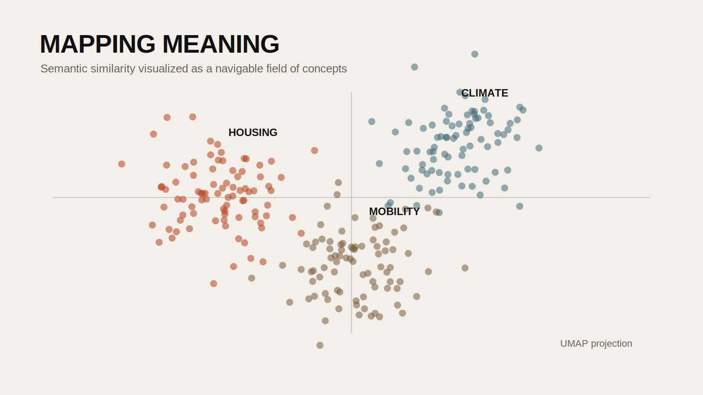

## Introduction

Embeddings are one of the key ideas behind contemporary AI systems. They turn language into vectors: long lists of numbers that preserve semantic relationships between words, sentences, and documents. That may sound abstract, but the result is concrete. Once text is embedded, you can compare similarity, cluster related concepts, search by meaning rather than exact keyword, and visualize whole collections as maps of ideas.

For designers, this matters because research materials are often semantic before they are geometric. Interview transcripts, policy documents, project descriptions, reviews, archives, and captions all contain patterns that are difficult to detect manually at scale. Embeddings provide a way to turn qualitative language into a navigable structure without reducing everything to simple word counts.

This tutorial builds from the `PrattAI-Workshop3.ipynb`, `24_FA-ARCH-581A-40 Week 5`, and `24FA-ARCH-581A-40 Week 7-2` notebooks. The public version below combines the strongest conceptual explanation with a cleaner practical workflow.

## Historical Context

Older language-processing methods often relied on one-hot encoding or sparse bag-of-words models. These approaches were useful for counting terms, but they could not represent relationships between concepts in a meaningful way. In the 2010s, word embedding methods such as Word2Vec and GloVe demonstrated that semantic relationships could be learned from large corpora and represented geometrically. Later transformer models expanded this idea, allowing not just words but sentences and documents to be embedded into high-dimensional vector spaces.

Today, embeddings are foundational to search, recommendation, clustering, retrieval-augmented generation, and multimodal AI systems. For design research, they open up a powerful middle ground between close reading and large-scale computation.

## Design Relevance

Design research frequently involves ambiguous categories, nuanced language, and evolving themes. A keyword search for "housing" may miss texts about rent burden, informal settlements, overcrowding, or shelter insecurity. Embeddings make it possible to find conceptual neighbors rather than literal string matches.

This is useful when you want to:

- cluster a corpus of project descriptions by theme
- compare similarity across interview answers or studio statements
- build semantic maps of films, artworks, publications, or urban case studies
- create research interfaces where people browse ideas spatially rather than linearly

## Learning Goals

- Understand the difference between keyword matching and semantic similarity
- Generate embeddings for short text and full document collections
- Measure closeness between vectors using cosine similarity
- Build a Pandas workflow for storing and working with embeddings
- Reduce high-dimensional vectors into 2D coordinates with UMAP for visualization



## Concept: Why Embeddings Matter

The source workshop frames the problem well: computers work with numbers, but design research is full of ideas, associations, and meanings. A simple one-hot representation treats every word as totally separate from every other word. In that system, `cat` and `dog` are no more related than `cat` and `concrete`.

Embeddings solve this by placing language on a "map of meaning." Terms and documents that are semantically related appear closer together in vector space. Once language is represented this way, you can perform operations such as:

- finding the nearest neighbors to a concept
- comparing the relative similarity of texts
- projecting the corpus into a 2D map for interpretation

## Step 1: Install the Required Packages

You can follow the workflow with either OpenAI embeddings, local Hugging Face embeddings, or both.

```bash
pip install pandas numpy scipy datasets umap-learn matplotlib bokeh openai tiktoken sentence-transformers
```

If you are working in Google Colab, keep credentials in Colab Secrets or another secure environment store. Do not hardcode API keys in the notebook.

## Step 2: Create a Tiny Semantic Test

Start with a few short phrases so you can understand the mechanics before moving to a large corpus.

```python
from openai import OpenAI
from scipy.spatial.distance import cosine

client = OpenAI()
model_name = "text-embedding-3-small"

texts = [
    "public housing policy",
    "affordable housing and rent burden",
    "forest ecology and soil moisture",
]

embeddings = client.embeddings.create(
    model=model_name,
    input=texts,
).data

v1 = embeddings[0].embedding
v2 = embeddings[1].embedding
v3 = embeddings[2].embedding

similarity_12 = 1 - cosine(v1, v2)
similarity_13 = 1 - cosine(v1, v3)

print("housing vs housing:", similarity_12)
print("housing vs ecology:", similarity_13)
```

The exact scores will vary by model, but the first pair should be noticeably closer than the second.

## Step 3: Load a Larger Text Collection

The course notebooks use large datasets such as arXiv abstracts and movie overviews. The same pattern works for any well-structured text source.

```python
import pandas as pd
from datasets import load_dataset

all_docs = load_dataset("CShorten/ML-ArXiv-Papers")["train"]["abstract"][:1000]
df = pd.DataFrame(all_docs, columns=["abstract"])
df.head()
```

At this stage, it helps to clean your text and remove empty rows before embedding.

```python
df = df.dropna()
df = df[df["abstract"].str.len() > 40].reset_index(drop=True)
```

## Step 4: Generate Embeddings for the Corpus

If you want to work with a hosted model:

```python
def get_embedding(text: str) -> list[float]:
    response = client.embeddings.create(
        model=model_name,
        input=[text],
    )
    return response.data[0].embedding

df["embedding"] = df["abstract"].apply(get_embedding)
```

If you prefer a local embedding model, the course material also points toward Hugging Face-based workflows:

```python
from sentence_transformers import SentenceTransformer

hf_model = SentenceTransformer("BAAI/bge-large-en-v1.5")
df["embedding"] = df["abstract"].apply(lambda x: hf_model.encode(x, normalize_embeddings=True))
```

The local option is often better for classroom experimentation because it reduces API cost and avoids sending text to an external service.

## Step 5: Measure Similarity

Once each row has an embedding, you can compare documents directly.

```python
from scipy.spatial.distance import cosine

query = "papers about computer vision for urban observation"
query_embedding = hf_model.encode(query, normalize_embeddings=True)

df["similarity"] = df["embedding"].apply(lambda v: 1 - cosine(v, query_embedding))
df.sort_values("similarity", ascending=False).head(10)
```

This is the basis of semantic search. You are no longer asking for exact keyword overlap. You are asking which documents occupy a nearby conceptual position.

## Step 6: Project the Corpus into 2D with UMAP

Embeddings are high-dimensional. To visualize them, reduce them into two dimensions with UMAP.

```python
import numpy as np
import umap

matrix = np.vstack(df["embedding"].values)

reducer = umap.UMAP(
    n_neighbors=20,
    min_dist=0.1,
    metric="cosine",
    random_state=42,
)

projection = reducer.fit_transform(matrix)

df["x"] = projection[:, 0]
df["y"] = projection[:, 1]
```

Now each abstract has a pair of map coordinates.

## Step 7: Plot the Semantic Map

Start simple with Matplotlib.

```python
import matplotlib.pyplot as plt

plt.figure(figsize=(10, 8))
plt.scatter(df["x"], df["y"], s=10, alpha=0.6)
plt.title("Semantic Map of Abstracts")
plt.xlabel("UMAP-1")
plt.ylabel("UMAP-2")
plt.show()
```

If you want students to explore individual points, use an interactive plotting library such as Bokeh or Plotly and include hover text.

```python
import plotly.express as px

fig = px.scatter(
    df,
    x="x",
    y="y",
    hover_data=["abstract"],
    opacity=0.65,
)
fig.show()
```

## Reading the Map Carefully

A semantic map is not a literal landscape. It is a reduced projection of a much more complex space. Clusters may indicate thematic neighborhoods, but they do not automatically reveal clean categories. Two texts may appear close because they share topic, tone, vocabulary, or model bias. This means interpretation still matters.

When students read a UMAP projection, they should ask:

- which clusters seem conceptually coherent?
- what kinds of texts fall at the edge of the map?
- which outliers are interesting rather than erroneous?
- how do preprocessing choices affect the structure?

## Common Pitfalls

1. Hardcoding API keys in notebooks.
Use environment variables or Colab Secrets instead.

2. Embedding uncleaned text.
Null values, repeated boilerplate, and very short strings can distort results.

3. Treating UMAP clusters as absolute truth.
UMAP is interpretive and parameter-sensitive.

4. Comparing vectors produced by different embedding models.
Keep each project consistent within one embedding space.

## Extensions

- Build a semantic search tool for studio precedents
- Map interview responses from community workshops
- Compare neighborhoods of research papers, films, or building descriptions
- Label clusters manually and turn the projection into a research atlas

## Resources

- [OpenAI Embeddings Guide](https://platform.openai.com/docs/guides/embeddings)
- [Sentence Transformers](https://www.sbert.net/)
- [UMAP Documentation](https://umap-learn.readthedocs.io/en/latest/)
- [Hugging Face Datasets](https://huggingface.co/docs/datasets)
