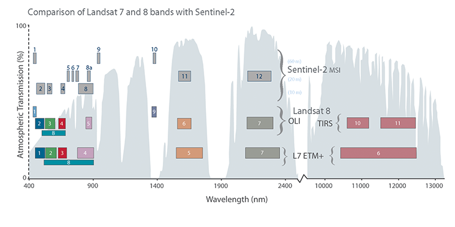

## Introduction

Multispectral imagery captures data at specific wavelengths across the electromagnetic spectrum—beyond what the human eye can see. While a regular photograph records red, green, and blue light (the visible spectrum), multispectral sensors record additional bands: near-infrared, shortwave infrared, and thermal energy. Each band reveals different information about the Earth's surface. Healthy vegetation, for instance, reflects strongly in near-infrared but absorbs red light (how plants photosynthesize), making the difference between these bands a powerful indicator of plant health.

The satellites carrying these sensors—Landsat, Sentinel, MODIS—have been observing Earth systematically since the 1970s. This creates an extraordinary archive: you can compare how a site looked in 1990 versus today, track deforestation patterns, measure urban growth, or assess flood extents. For designers, this historical perspective reveals site dynamics that a single site visit cannot—seasonal flooding patterns, long-term erosion, or gradual changes in land cover.

The power of multispectral analysis lies in band combinations. By combining different spectral bands, you can create images tailored to specific questions. Color infrared imagery (displaying near-infrared as red) makes vegetation "glow" red, instantly revealing plant health and density. False-color urban imagery highlights built structures and bare soil. Bathymetric combinations can peer through shallow water to map underwater features. The same raw data becomes many different analytical tools depending on how you combine and display the bands.

## Learning Goals

- Distinguish visible, near-infrared, shortwave infrared, and thermal bands and explain what each can reveal about land surfaces.
- Compare multispectral datasets by spatial, spectral, and temporal resolution in order to choose an appropriate source for a design or planning question.
- Interpret common Landsat band combinations for vegetation, water, urban surfaces, and geological features.
- Connect remote sensing workflows to design research questions such as land cover change, flood risk, habitat fragmentation, and urban heat.
- Evaluate satellite imagery as evidence that should be read alongside fieldwork, community knowledge, and policy context.

## Key Terms

- **Multispectral imagery**: Raster imagery captured in several discrete wavelength bands so that surfaces can be compared beyond normal RGB photography.
- **Spectral band**: A specific range of wavelengths recorded by a sensor, such as red, near-infrared, or shortwave infrared.
- **False-color composite**: An image that assigns non-visible bands to visible display channels so that patterns like vegetation stress or moisture become easier to interpret.
- **Spatial resolution**: The ground area represented by one pixel, which affects how much visual detail can be detected in an image.
- **Temporal resolution**: How often a sensor revisits the same location, which determines how well change over time can be tracked.
- **Land cover classification**: The process of sorting pixels into categories such as water, forest, agriculture, or built surface based on their spectral signatures.

## Historical Context

The first civilian Earth observation satellite, Landsat 1, launched in 1972 with a four-band multispectral scanner. This revolutionary mission proved that satellites could consistently monitor Earth's surface and made remote sensing data publicly available. The program has continued uninterrupted through Landsat 8 (launched 2013) and Landsat 9 (2021), creating a nearly 50-year unbroken record of Earth's land surface.

Meanwhile, European Space Agency's Sentinel program, part of the Copernicus initiative, began launching in 2014, providing free, high-quality data with frequent revisit times (Sentinel-2 passes the same location every 5 days). This temporal resolution transformed what's possible for monitoring rapid changes—floods, fires, agricultural cycles.

The US government made a pivotal decision in 2008 to make Landsat data free, sparking an explosion in applications and analysis. Combined with increasingly powerful and accessible processing tools like QGIS, Google Earth Engine, and Python's rasterio library, multispectral analysis moved from government agencies and research institutions to anyone with a computer and curiosity.

## Design Relevance

Multispectral imagery provides site designers with analytical capabilities that complement and extend traditional site analysis methods. Understanding vegetation health across a site, for instance, reveals microclimates—areas of stress may indicate poor soil conditions, drainage problems, or areas lacking irrigation. This helps prioritize intervention zones or understand why certain areas developed naturally as habitat corridors.

Land cover classification using multispectral data quantifies what site visit observations can only estimate qualitatively. How much of the site is impervious surface versus vegetated? What type of vegetation exists—forest, grassland, wetland? These questions have direct implications for stormwater management, ecological connectivity, and heat island mitigation strategies.

The historical archive of satellite imagery enables longitudinal analysis impossible through site visits alone. You can identify seasonal water patterns that might indicate flood zones, track how neighboring developments changed the landscape over time, or discover that what appears to be undisturbed forest was actually farmland two decades ago. This temporal dimension supports design decisions grounded in site history rather than snapshot observations.

Thermal bands reveal heat patterns across the landscape—where buildings and pavement store and radiate heat, how tree canopy coverage affects local temperatures, which slopes receive sun exposure at different times of day. Combined with building footprint data, this enables urban heat island mitigation strategies that target the most impactful interventions.

## Social and Cultural Relevance

Multispectral imagery is not only a technical tool for environmental analysis; it is also a way of seeing how power is distributed across landscapes. Satellite-derived evidence is used to monitor drought, crop stress, deforestation, mining expansion, flood exposure, and urban heat, all of which shape public policy and unevenly affect different communities. For design students, this means remote sensing can support climate adaptation and land-use planning, but it should not be treated as neutral or complete on its own.

The most responsible use of multispectral data pairs spectral analysis with local histories, on-the-ground observation, and community knowledge. Questions of food systems, environmental risk, extraction, and ecological repair are always social as well as spatial. In an academic setting, the goal is not just to produce compelling imagery, but to build interpretations that remain accountable to place, politics, and lived experience.

## Resources & Further Reading

- [USGS Landsat Mission](https://www.usgs.gov/landsat-missions/landsat-satellites) - Comprehensive information on Landsat satellites, data access, and band specifications
- [EOS.com Landsat 8 Band Combinations](https://eos.com/make-an-analysis/landsat-8-bands-combinations/) - Practical guide to common band combinations and their applications
- [QGIS Documentation: Raster Analysis](https://docs.qgis.org/latest/en/docs/user_manual/working_with_raster/raster_analysis.html) - Official guide to processing multispectral data in QGIS
- [Copernicus SciHub](https://scihub.copernicus.eu/) - Access to Sentinel satellite data from the European Space Agency
- [NASA Earth Observatory: Measuring Vegetation](https://earthobservatory.nasa.gov/features/MeasuringVegetation) - Accessible introduction to NDVI and vegetation indices


## Technical Walkthrough

Several GIS applications use raster images that are derived from remote sensing.

A general definition of Remote Sensing is “the science and technology by which the characteristics of objects of interest can be identified, measured or analyzed the characteristics without direct contact” (JARS, 1993).

Usually, remote sensing is the measurement of the energy that is emanated from the Earth’s surface. If the source of the measured energy is the sun, then it is called passive remote sensing, and the result of this measurement can be a digital image (Richards and Jia, 2006). If the measured energy is not emitted by the Sun but from the sensor platform then it is defined as active remote sensing, such as radar sensors which work in the microwave range (Richards and Jia, 2006).

There are several satellites with different characteristics that acquire multispectral images of earth surface.

## Multispectral Satellites



## How to choose dataset

Choosing the right multispectral dataset depends on the question you are asking. If you need a long historical record, Landsat is often the best starting point because it has continuous coverage reaching back to the 1970s. If you need finer spatial detail for contemporary land cover, vegetation, or urban surface studies, Sentinel-2 is often more useful because it offers higher spatial resolution and more frequent revisit times. ASTER can also be valuable when thermal bands or terrain-related products are relevant to the analysis.

In practice, designers usually balance three variables: spatial resolution, spectral resolution, and temporal coverage. A coarser dataset may still be the right choice if it lets you compare long-term change; a newer dataset may be better if you need sharper detail for a specific site. For this tutorial, Landsat 8/9 is a strong teaching dataset because it is openly available, well documented, and flexible enough for both visual composites and environmental analysis.

[Landsat 8: Band by Band](https://www.youtube.com/watch?v=A6WzAc1FTeA)

- Start by treating Landsat as a stack of separate wavelength images rather than a single photograph.
- Use bands 4, 3, and 2 for a natural-color view, then swap in non-visible bands to build false-color composites for analysis.
- In color-infrared views, healthy vegetation appears red because plants reflect strongly in the near-infrared band.

## Landsat 8/9

- OLI: the Operational Land Imager which collects data in the visible, near infrared, and shortwave infrared wavelength regions as well as a panchromatic band. With respect to Landsat 7 two new spectral bands have been added: a deep-blue band for coastal water and aerosol studies (band 1), and a band for cirrus cloud detection (band 9). Furthermore, a Quality Assurance band (BQA) is also included to indicate the presence of terrain shadowing, data artifacts, and clouds.

- TIRS: The Thermal Infrared Sensor continues thermal imaging and is also intended to support emerging applications such as modeling evapotranspiration for monitoring water use consumption over irrigated lands.

This tutorial is inspired by an article published on [GIS Geography](https://gisgeography.com/landsat-8-bands-combinations/) Information on some of the more common composite imagery is relayed here. More detailed information on common composites and applications can be found - [here](https://eos.com/make-an-analysis/natural-color/).

### Color Infrared (5, 4, 3)

This band combination is also called the NRG composite. It uses near-infrared (5), red (4), and green (3). Because chlorophyll reflects near-infrared light, this band composition is useful for analyzing vegetation. In particular, areas in red have better vegetation health. Dark areas are water and urban areas are white.


### Short-Wave Infrared (7, 6 4)

The short-wave infrared band combination uses SWIR-2 (7), SWIR-1 (6), and red (4). This composite displays vegetation in shades of green. While darker shades of green indicate denser vegetation, sparse vegetation has lighter shades. Urban areas are blue and soils have various shades of brown.


### Agriculture (6, 5, 2)

This band combination uses SWIR-1 (6), near-infrared (5), and blue (2). It’s commonly used for crop monitoring because of the use of short-wave and near-infrared. Healthy vegetation appears dark green. But bare earth has a magenta hue.


### Geology (7, 6, 2)

The geology band combination uses SWIR-2 (7), SWIR-1 (6), and blue (2). This band combination is particularly useful for identifying geological formations, lithology features, and faults.


### Bathymetric (4, 3, 1)

The bathymetric band combination (4,3,1) uses the red (4), green (3), and coastal band to peak into water. The coastal band is useful in coastal, bathymetric, and aerosol studies because it reflects blues and violets. This band combination is good for estimating suspended sediment in the water.


### STEP 1: Download Landsat 8 data

- The data from Landsat 8 are available for download at no charge and with no user restrictions.

- For our analysis example, we’ll obtain a Landsat 8 scene from [USGS Earth Explorer](http://earthexplorer.usgs.gov/)

- At the beginner level, we'll also use QGIS to process the image - [Download](https://www.qgis.org/en/site/forusers/download.html) the standalone installer

- [More Info Here](https://www.usgs.gov/faqs/what-are-best-landsat-spectral-bands-use-my-research) on LandSat 8/9's spectral band usage for research.

- First register an account with Earth Explorer [here](https://ers.cr.usgs.gov/register)

- Then follow the video below to start acquiring the Landsat data set.

[Downloading data from Earth Explorer](https://www.youtube.com/watch?v=dxDisROqGzs)

- Sign in to EarthExplorer, search by place name or click directly on the map, and use that marker or polygon as the initial area of interest.
- Under `Data Sets`, start with `Landsat Collection 2 Level-2`; the walkthrough recommends Level-2 because it is suitable for visualization and basic analysis without additional preprocessing.
- In the results, note the `path/row` of a tile that fully covers your site, then switch the search criteria to that exact path/row to avoid browsing overlapping scenes.
- Filter for low cloud cover, preview several dates, and download clear scenes that match the season or comparison period you want to study.

### STEP 2: Process and Visualize Data with QGIS

This step is relatively straightforward. If your goal is to create legible visual composites for mapping and presentation, the video tutorial below will take you through the process in QGIS. If your goal is research or long-term comparison across many scenes, continue to Step 3 for a more automated workflow.

[Processing Landsat Data](https://www.youtube.com/watch?v=CX62cGqjcY8)

- Unzip the downloaded `.tar` file, then in QGIS use `Raster > Miscellaneous > Build Virtual Raster` and add bands `B1` through `B7` in numeric order.
- Check `Place each input file into a separate band` and run the tool to build the raster stack.
- Use the layer `Symbology` panel to remap the composite, such as `4/3/2` for natural color or `5/4/3` for color infrared.
- To export a presentation image, use `Rearrange bands` and select exactly three bands in the order you want to display, for example `5/4/3`.
- Save the export as a `.png`; if the image looks flatter than it did in QGIS, adjust the RGB curves in Photoshop to mimic QGIS's display stretch.

### Step 3: Advanced Automation (Optional)

One of the main advantages of multispectral archives is the ability to compare many scenes over time. Doing that manually in QGIS quickly becomes repetitive, so the example below shows how the workflow can be automated in Python. Treat this section as an optional advanced exercise: you do not need to master every line to understand the logic of batch image processing.

```python

import os

import numpy as np

import math

import rasterio as rio

from rasterio.plot import show

import rasterio.mask as mask

from rasterio.warp import calculate_default_transform, reproject, Resampling

import fiona

from xml.dom import minidom

import matplotlib.pyplot as plt

from glob import glob

def getMulVal(child, x):

num1 = float(child.getElementsByTagName("REFLECTANCE_MULT_BAND_{}".format(x))[0].firstChild.data)

return(num1)

def getAddVal(child,x):

num2 = float(child.getElementsByTagName("REFLECTANCE_ADD_BAND_{}".format(x))[0].firstChild.data)

return(num2)

def atmosCor(band, rco, rad):

return (band * rco - rad)

def normalize(array):

array_min, array_max = array.min(), array.max()

return((array - array_min) / (array_max - array_min))

def culCountCut (array):

min_per = 2

max_per = 98

lo, hi = np.nanpercentile(array, (min_per, max_per))

# Apply linear stretch so all values are between 0 and 1

stretchedIMG = (array.astype(float) - lo) / (hi - lo)

stretchedIMG = np.maximum(np.minimum(stretchedIMG*65535, 65535), 0).astype(np.uint16)

return (stretchedIMG)

def croppedGPNGUintExp(band1:int, band2:int, band3:int, dst, ref, trans, crs):

wid = ref.shape[1]

ht = ref.shape[0]

img = rio.open(dst, 'w', driver='PNG',

nodata=0, width=wid,

height=ht, count=3,

crs=crs, transform=trans,

dtype='uint16')

img.write(band1, indexes = 1)

img.write(band2, indexes = 2)

img.write(band3, indexes = 3)

img.close()

def makeColorImage(band1:int, band2:int, band3:int, fpath:str, landsat:str, fname:str):

if not (

band1 > 0

and band2 > 0

and band3 > 0

and band1 < 8

and band2 < 8

and band3 < 8):

raise ValueError(f"One or more invalid Landsat band {band1}, {band2}, {band3} supplied)")

b1_path = landsat + "_SR_B{}.TIF".format(band1)

b2_path = landsat + "_SR_B{}.TIF".format(band2)

b3_path = landsat + "_SR_B{}.TIF".format(band3)

site_b_path = site_bound + site_b

xml_path = landsat + "_" + xml_loc

# read shp file for site boundary

with fiona.open(site_b_path, "r") as shpf:

boundary = [feature["geometry"] for feature in shpf]

b1_img = rio.open(b1_path)

b2_img = rio.open(b2_path)

b3_img = rio.open(b3_path)

fileCrs = b1_img.crs

b1_band, b1_affine = mask.mask(b1_img, boundary, crop=True, nodata=0)

b2_band, b2_affine = mask.mask(b2_img, boundary, crop=True, nodata=0)

b3_band, b3_affine = mask.mask(b3_img, boundary, crop=True, nodata=0)

b1_band = b1_band.astype('float')

b2_band = b2_band.astype('float')

b3_band = b3_band.astype('float')

b1_band = np.squeeze(b1_band)

b2_band = np.squeeze(b2_band)

b3_band = np.squeeze(b3_band)

band_rco = []

band_rad = []

bands = [band1, band2, band3]

# read metadata and create variables

xml_doc = minidom.parse(xml_path)

l2_sur = xml_doc.getElementsByTagName("LEVEL2_SURFACE_REFLECTANCE_PARAMETERS")

l2_sur_child = l2_sur.item(0)

# get multipliers for each band

for band in bands:

band_rco.append(getMulVal(l2_sur_child, band))

band_rad.append(getAddVal(l2_sur_child, band))

# Atmospheric Corrections, refer to Landsat 8 Documentation

b1_cor = atmosCor(b1_band, band_rco[0], band_rad[0])

b2_cor = atmosCor(b2_band, band_rco[1], band_rad[1])

b3_cor = atmosCor(b3_band, band_rco[2], band_rad[2])

# Normalize arrays to between 0-1

b1_norm = normalize(b1_cor)

b2_norm = normalize(b2_cor)

b3_norm = normalize(b3_cor)

b1_uint = culCountCut(b1_norm)

b2_uint = culCountCut(b2_norm)

b3_uint = culCountCut(b3_norm)

croppedGPNGUintExp(b1_uint, b2_uint, b3_uint, "./{}.png".format(fname), b1_uint, b1_affine, fileCrs)

# Set all global variables

site_bound = "./VectorBoundary/"

site_b = "AustinBoundary.shp"

xml_loc = "MTL.xml"

folders = glob(".\\Austin\\Landsat 4-5 TM C2 L2\\*\\")

fns = [folder.split("\\")[-2] for folder in folders]

for x, folder in enumerate(folders):

file = fns[x]

landsat_name = folder + file

makeColorImage(5,4,3,folder,landsat_name, ".\\NRG\\{}_NRG".format(file))

makeColorImage(6,5,2,folder,landsat_name, ".\\Agri\\{}_AGRI".format(file))

makeColorImage(4,3,1,folder,landsat_name, ".\\Bath\\{}_BATH".format(file))

makeColorImage(7,6,4,folder,landsat_name, ".\\SWIR\\{}_SWIR".format(file))

makeColorImage(7,6,2,folder,landsat_name, ".\\Geo\\{}_GEO".format(file))

print(str(x) + ": " + file + " ---- done")

```
