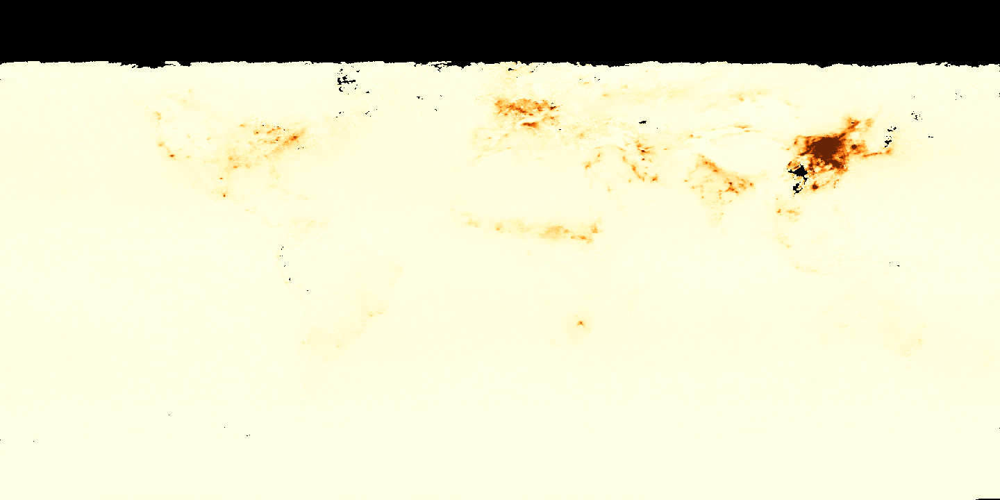
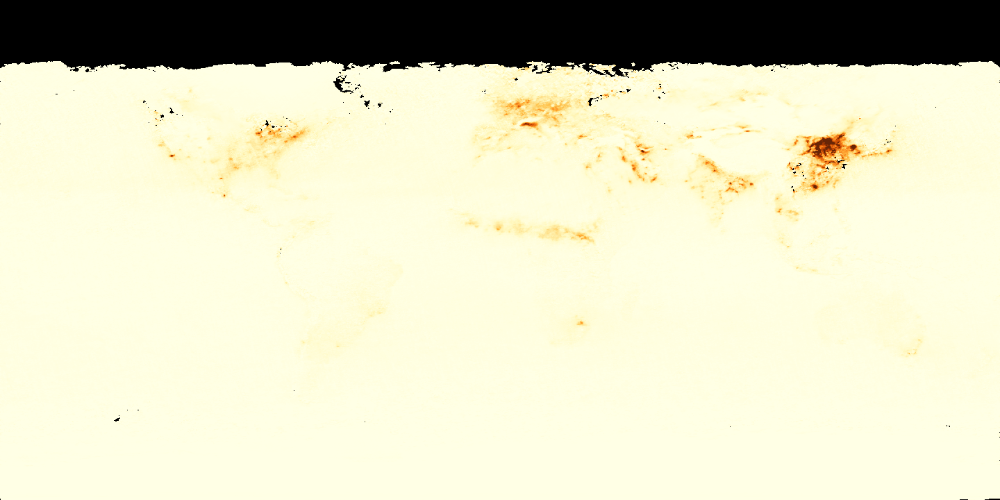
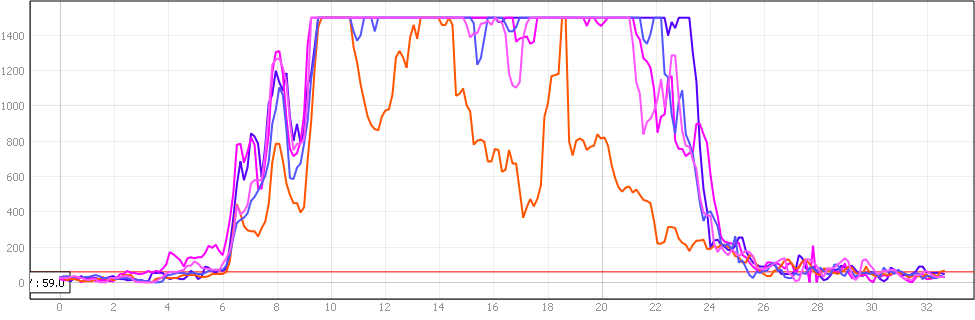

## Introduction

NASA Earth Observations (NEO) is a powerful, browser-based portal that gives you free access to over 20 years of satellite data covering the entire planet. Think of it as a time machine for Earth's surface—you can watch forests shrink, ice melt, cities grow, and air quality shift across seasons and decades. The platform hosts datasets on everything from aerosol concentrations and chlorophyll levels to land surface temperature, vegetation health, and fire activity. Best of all? You don't need to download gigabytes of data or run complex processing to get started. NEO lets you explore, animate, and export satellite imagery directly from your browser, making it an ideal entry point for design research that needs planetary context.

## Historical Context

NASA's Earth Observing System (EOS) began launching satellites in the 1990s, creating the first comprehensive, long-term record of Earth's surface. The Terra and Aqua satellites carrying instruments like MODIS (Moderate Resolution Imaging Spectroradiometer) have been circling the planet since 1999, building an unprecedented dataset that scientists worldwide rely on for climate research. NEO was created specifically to make this treasure trove accessible to educators, policymakers, and the public. What started as a tool for scientists became a resource for anyone asking questions about how our planet is changing. Today, with over two decades of data available, NEO offers a unique historical perspective that lets you compare any location across 20+ years of satellite observations.

## Design Relevance

For designers working on climate resilience, urban planning, or environmental justice, NEO provides the macro-scale context that individual site visits can't offer. Want to show clients how their neighborhood's heat burden compares to other parts of the city? NEO's land surface temperature data makes that visible. Investigating how industrial activity affects air quality in different communities? NO2 emission data tells that story. The ability to animate time series means you can show decision-makers not just what is happening, but how it's changed—and what the trend lines suggest for the future. This kind of evidence transforms design proposals from aesthetic preferences into data-driven arguments for change.

## Learning Goals

- Identify what NASA Earth Observations provides and how it differs from raw satellite data portals.
- Compare WMS access with direct download in relation to visualization, animation, and quantitative analysis.
- Interpret time-series satellite imagery as evidence of environmental change at multiple scales.
- Use NEO datasets to frame design questions about climate, infrastructure, and public health.
- Recognize the strengths and limitations of global datasets when applied to local design decisions.

## Key Terms

- **Earth Observation**: The collection of information about the planet using satellite and airborne sensors.
- **WMS (Web Mapping Service)**: A web standard that streams map layers into GIS software without requiring full dataset downloads.
- **Temporal dimension**: The time-based component of a dataset that allows users to compare conditions across dates or periods.
- **MODIS**: A satellite instrument that captures global environmental data used for monitoring land, ocean, and atmosphere.
- **Land surface temperature**: An estimate of how hot the Earth's surface is, distinct from standard air temperature measurements.
- **NO2**: Nitrogen dioxide, an air pollutant associated with combustion, transportation, and industrial activity.

## Data Justice and Public Interpretation

Open satellite data can make environmental inequality visible, but visibility alone does not guarantee equitable interpretation or action. Pollution, heat, fire, and ecological stress are not distributed randomly; they often reflect long histories of zoning, extraction, racial segregation, and uneven public investment. In an academic design context, NASA Earth Observations should be used not only to map change over time, but also to connect planetary-scale evidence with questions of accountability, lived experience, and environmental justice on the ground.

## Resources & Further Reading
- [NASA Earth Observations Portal](https://neo.gsfc.nasa.gov/) - Browse and download satellite datasets, create animations
- [NEO Web Mapping Service Guide](https://neo.gsfc.nasa.gov/blog/2021/02/08/how-to-add-neo-layers-to-your-map-using-the-neo-web-mapping-service/) - Technical guide for adding NEO layers to GIS software
- [USGS EarthExplorer](https://earthexplorer.usgs.gov/) - Download raw Landsat and other satellite data
- [NASA EOSDIS Worldview](https://worldview.earthdata.nasa.gov/) - Interactive interface for exploring global satellite imagery

## Technical Walkthrough

NASA's Earth Observations website is a data portal to NASA's Earth Observing System Project, where you can access over 20 years of data.

Access the platform here: [NEO](https://neo.gsfc.nasa.gov/)

This tutorial documents two main ways of accessing the dataset.

- Via the Web Mapping Service. The benefit of this method is the layer contains temporal dimension and you can scroll through time to see changes. You can also export this time layer out as an animated sequence.

- Direct download. The benefit of this approach is that you can get the full dataset and conduct quantitative analysis, which is not possible with the WMS method alone.

### Active Fires 2002 - 2022 (Terra / MODIS)

[NASA EOS ActiveFires](https://www.youtube.com/watch?v=lISxOX19fGo)

### Active Fires in association with Surface Temperature 2002-2022

[NASA EOS Surface Temperature + Active Fire](https://www.youtube.com/watch?v=H-lql_jk8PI)

### Method 1: Web Mapping Service

This first method is great for creating animations and quickly searching through large amounts of historical data.

The URL for NEO's WMS server is - [https://neo.gsfc.nasa.gov/blog/2021/02/08/how-to-add-neo-layers-to-your-map-using-the-neo-web-mapping-service/](https://neo.gsfc.nasa.gov/blog/2021/02/08/how-to-add-neo-layers-to-your-map-using-the-neo-web-mapping-service/)

Code for formatting date - format_date(@map_start_time, 'MM-yyyy')

[NASA Earth Observation Animated Sequences](https://www.youtube.com/watch?v=ZoM3Rb83Nqo)

- Add NASA NEO as a new `WMS` connection in QGIS, then use the Browser panel to load a static base layer such as `Blue Marble` together with a time-enabled layer such as monthly active fires.
- Turn off temporal behavior on the basemap so only the data layer responds to the timeline.
- Open the `Temporal Controller`, refresh the full date range from the active-fire layer, and set the step unit to `Months` so the monthly imagery displays correctly.
- Export the animation as a PNG sequence, setting the horizontal size manually and using `Calculate from` to derive the matching extent and height.
- Add a timestamp with `View > Decorations > Title Label` using `format_date(@map_start_time, 'MM-yyyy')` before rendering the final frame sequence.

### Method 2: Direct Download

This method is useful for analysis when you already know which datasets you want to investigate more closely.

This tutorial outlines the process of using NEO data for historical comparison. One visible case is the change in NO2 concentrations around early 2020, when transportation and industrial activity shifted dramatically in many cities during the pandemic. The point is not to make a causal claim from imagery alone, but to show how satellite evidence can support broader environmental interpretation when paired with other forms of analysis.

The video will walk through all the steps to conduct such analysis using data from 2018 - 2022. Other planetary scale analysis such as ocean acidification, toxic algal bloom, or assessment of coastal ecosystem, can be done using this method.

NASA Earth Observations - [Link](https://neo.gsfc.nasa.gov/)

### NO2 Emission Jan 2019

### NO2 Emission Jan 2020

### NO2 Emission Comparison Jan 2018-2022 (billion molecules / mm2)

[NO2 Emission 2020 Comparison](https://www.youtube.com/watch?v=jRTlh762-Pg)

- Use the WMS view to identify the layer and dates you want, then download the rasters from NEO as highest-resolution `GeoTIFF floating point` files for each comparison month.
- The walkthrough uses monthly NO2 averages and compares January datasets from 2018 through 2022 to keep the sequence consistent year to year.
- In QGIS, set the `-9999` no-data value to transparent, then style each raster as `Singleband pseudocolor` with equal intervals so the NO2 concentrations display properly.
- Add the date for each raster manually in the layer's temporal settings, then animate them with yearly steps in the `Temporal Controller`.
- For a more quantitative comparison, install the `Profile Tool` plugin, add each yearly raster to the profile view, and draw a section line to compare NO2 values along one transect.
