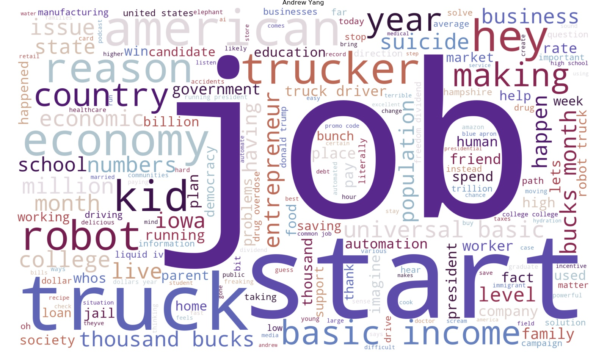
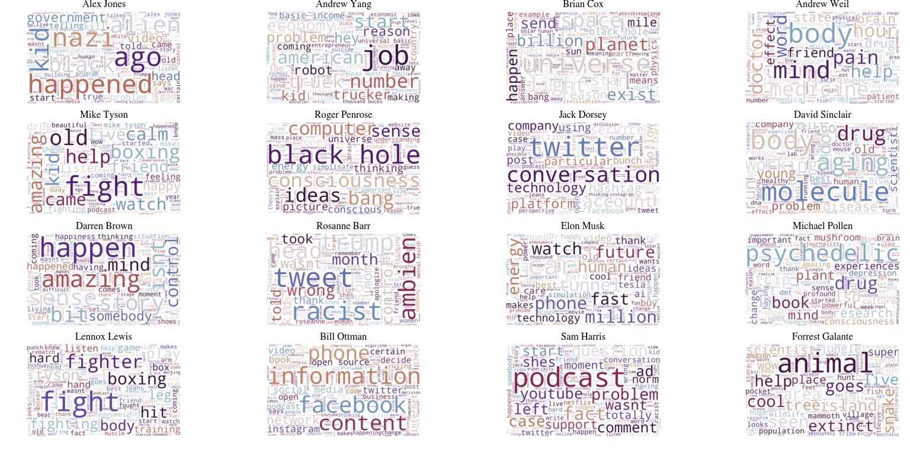
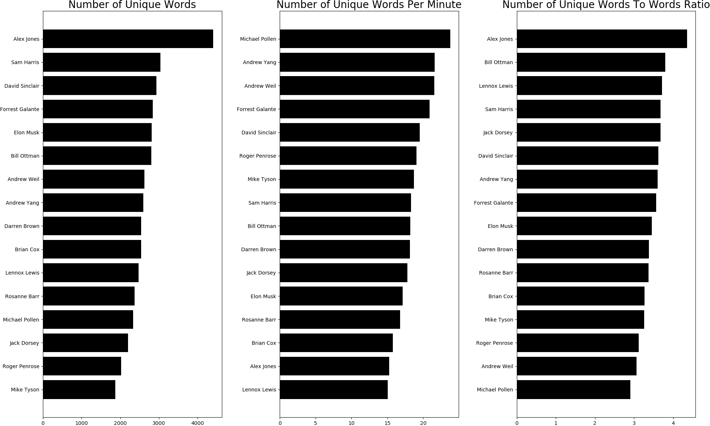

## Project Description

This is part 1 of the Natural Language Processing module. The process described here largely follows the structure of Alice Zhao's (A Dash of Data) [Presentation on NLP at PyOhio 2018](https://www.youtube.com/watch?v=xvqsFTUsOmc). This first part will mainly focus on webscraping and cleaning up data for Natural Language Processing. We will also deviate from Alice's presentation and scrape our own dataset from [Joe Rogan's podcast transcript](https://jrescribe.com/). The transcript from Rogan's Podcast is preferred because of the length and the varieties of his interviews, we get some very interesting results.

The main goal for this module is to introduce the idea of vectorization of data, an essential step in regression and classification, which is the precursor to machine learning. When faced with data types such as words or sounds, we need to find ways to represent the data with numbers, and the numerical representation would be called **Vectors** for 1-dimensional values, **Matrices** for 2-dimensional values, and **Tensors** for higher dimensions. NLP relies on a package in [Scikit-Learn](https://scikit-learn.org/stable/), a very popular machine learning library in Python, to convert words to vectors, which then enable us to do higher level analysis.

Before you begin, you must have completed the installation and visualization modules so you have working knowledge of Anaconda and regular expression.

---

# Step 1
## Download Data and Clean Data

For this exercise we will be using **BeautifulSoup** to scrape data off [Joe Rogan's podcast transcript](https://jrescribe.com/) site, and I have chosen 16 interviews based on the range of ideas being discussed. To get that started, import the following packages.

```python
import requests, pickle
from bs4 import BeautifulSoup
```

Next we will define a function to launch BeautifulSoup and scrape the data, a list of URLs to the interview transcripts, a list of speakers, and a list of the full names of the speakers.

```python
def url_to_transcript(url):
    text=[]
    page = requests.get(url).text
    soup = BeautifulSoup(page, 'lxml')
    text = [p.text for p in soup.find(class_="content").find_all('p')]
    print(url)
    return text

urls = ['https://jrescribe.com/transcripts/p1255.html',
        'https://jrescribe.com/transcripts/p1245.html',
        'https://jrescribe.com/transcripts/p1233.html',
        'https://jrescribe.com/transcripts/p1213.html',
        'https://jrescribe.com/transcripts/p1227.html',
        'https://jrescribe.com/transcripts/p1216.html',
        'https://jrescribe.com/transcripts/p1236.html',
        'https://jrescribe.com/transcripts/p1234.html',
        'https://jrescribe.com/transcripts/p1198.html',
        'https://jrescribe.com/transcripts/p1184.html',
        'https://jrescribe.com/transcripts/p1169.html',
        'https://jrescribe.com/transcripts/p1121.html',
        'https://jrescribe.com/transcripts/p1260.html',
        'https://jrescribe.com/transcripts/p1248.html',
        'https://jrescribe.com/transcripts/p1241.html',
        'https://jrescribe.com/transcripts/p1240.html',
          ]

speakers = ['jones', 'yang','cox','weil','tyson','penrose','dorsey','sinclair',
            'brown','barr','musk','pollen','lewis','ottman','harris','galante',
           ]

full_names = ['Alex Jones', 'Andrew Yang', 'Brian Cox', 'Andrew Weil', 'Mike Tyson', 'Roger Penrose',
              'Jack Dorsey', 'David Sinclair','Darren Brown','Rosanne Barr','Elon Musk','Michael Pollen',
              'Lennox Lewis', 'Bill Ottman','Sam Harris','Forrest Galante']
```

`text = [p.text for p in soup.find(class_="content").find_all('p')]` This line in the function is the key that pulls out the text of the whole interview. It finds the div tag **class="content"** which contains the transcript, and strips out all the HTML code. Next we call the function to store all the text into the variable **transcript**. This is a very Pythonic syntax which is a short form for writing a loop. In the long form, it is equivalent to:

```python
text=[]
for p in soup.find(class_="content").find_all('p'):
  text.append(p.text)
```

Now let's get back on track, call the function to process all the URLs and get all the text into the transcript variable.

```python
transcript = [url_to_transcript(u) for u in urls]
```

Once it's done scraping, now we **"pickle"** all the transcripts into our local storage. **Pickling** here means saving whatever is in the variable into a file, which can then be called later.

```python
for i, s in enumerate(speakers):
    with open('transcripts/' + s + ".txt", 'wb') as file:
        pickle.dump(transcript[i], file)
        
data = {}
for i, s in enumerate(speakers):
    with open('transcripts/' + s + '.txt', 'rb') as file:
        data[s] = pickle.load(file)
```

Typing the following and see that you now have a dictionary with **key:speakers** and **value:transcript** structure.

```python
data.keys()
```

However, you can see that the **transcripts** is a **list** of texts due to the function call **find_all('p')**, all HTML paragraphs with a **<p>** tag were imported as a separate list item.

```python
data['weil'][:2]
```

We need to change the dictionary from **value:list** to **value:string**. We can do that with a function.

```python
def combine_text(list_of_text):
    combined_text = ' '.join(list_of_text)
    return combined_text
  
data_combined = {key: [combine_text(value)] for (key, value) in data.items()}
```

Next we can put everything into a Pandas DataFrame.

```python
import pandas as pd

pd.set_option('max_colwidth', 150)
data_df = pd.DataFrame.from_dict(data_combined).transpose()
data_df.columns = ['transcript']
data_df
```

Now you get a small glimpse of what the transcript looks like, we now need to clean up all the text. By that, it means we need to get rid of all the things that are irrelevant to our analysis such as punctuations, capitalization, numerical values, symbols...etc. The most effective method to do this is by using **regular expressions**. Type in `data_df.transcript.loc['weil']` to display the transcript for Dr. Andrew Weil and see what kind of cleanup you should expect.

The **regex** routine is written as a function called **clean_text_round1**. What kind of cleanup you will need really depends on where you scraped your text from. The first line removes capitalization. The second line removes anything in square brackets. The third line removes punctuations. The fourth line removes any words containing numbers.

```python
import re, string

def clean_text_round1(text):
    text = text.lower()
    text = re.sub('\[.*?\]', '', text)
    text = re.sub('[%s]' % re.escape(string.punctuation), '', text)
    text = re.sub('\w*\d\w*', '', text)
    text = re.sub('[^A-Za-z0-9 ]+', '', text)
    return text

round1 = lambda x: clean_text_round1(x)

data_clean = pd.DataFrame(data_df.transcript.apply(round1))
```

Once the first round of cleaning is done, type `data_clean.transcript.loc['weil']` to see the "clean" text and see what else needs to be done.

Before we do that, let's pickle the corpus.

```python
data_df.to_pickle('corpus.pkl')
```

Now the important step is to **vectorize** the text.

```python
from sklearn.feature_extraction.text import CountVectorizer

cv = CountVectorizer(stop_words = 'english')
data_cv = cv.fit_transform(data_clean.transcript)
data_dtm = pd.DataFrame(data_cv.toarray(), columns=cv.get_feature_names())
data_dtm.index = data_clean.index
data_dtm
```

Last but not least, pickle all the data generated thus far.

```python
data_dtm.to_pickle('dtm.pkl')
data_clean.to_pickle('data_clean.pkl')
pickle.dump(cv, open('cv.pkl', 'wb'))
```

---

# Step 2
## Exploratory Data Analysis - Word Cloud

EDA is an important step in data science. This is when you are trying different ways to see how to get some useful information out of the dataset. But before we begin, we need to install a word cloud library to help us visualize the most common words these speakers used, so in your **Terminal or Anaconda Prompt**, type in `pip install wordcloud`. Once that's done, we're ready to start by importing Pandas and loading the pickled data back.

```python
import pandas as pd

data = pd.read_pickle('dtm.pkl')
data = data.transpose()
data.head()
```

First thing to try is to see how many times each speaker says a certain word. Since the whole transcript is vectorized, this is quite easy to do with a **sort** function.

```python
top_dict={}
for c in data.columns:
    top = data[c].sort_values(ascending=False).head(90)
    top_dict[c] = list(zip(top.index, top.values))
    
top_dict
```

On the top of the most used words list, there are a lot of repetitions that have nothing to do with their ideas such as: like, know, don't, just, i'm, that's…etc. So the next thing we can do is collate the most used words list by every speaker.

```python
from collections import Counter

words = []
for speaker in data.columns:
    top = [word for (word, count) in top_dict[speaker]]
    for t in top:
        words.append(t)
        
Counter(words).most_common()
```

The words listed here are all words that are commonly spoken and do not represent or indicate any of the speaker's ideas, values, beliefs, or unique personality. However, upon further inspection, if we get rid of all the words that are used repeatedly by more than 3 speakers, we can see the words list becomes quite distinct.

```python
add_stop_words = [word for word, count in Counter(words).most_common() if count > 3]
```

Now we use the **sklearn's feature_extraction** to **"union"** to the default list of English **stop_words**. And finally, we use word cloud to produce a visualization of words used by each speaker with the word scaled based on its use frequency.

```python
from sklearn.feature_extraction import text
from sklearn.feature_extraction.text import CountVectorizer

data_clean = pd.read_pickle('data_clean.pkl')
stop_words = text.ENGLISH_STOP_WORDS.union(add_stop_words)

wc = WordCloud(stopwords=stop_words, background_color='white', colormap='twilight_shifted',
              width=2000, height=1200,max_font_size =350, random_state=23)

plt.rcParams['figure.figsize'] = [18,12]
full_names = ['Alex Jones', 'Andrew Yang', 'Brian Cox', 'Andrew Weil', 'Mike Tyson', 'Roger Penrose',
              'Jack Dorsey', 'David Sinclair','Darren Brown','Rosanne Barr','Elon Musk','Michael Pollen',
              'Lennox Lewis', 'Bill Ottman','Sam Harris','Forrest Galante']

plt.figure(figsize = (20,12), dpi=100, frameon=False)
for index, speaker in enumerate(data.columns):
    wc.generate(data_clean.transcript[speaker])
    plt.subplot(5,4, index+1)
    plt.imshow(wc, interpolation='bilinear')
    plt.axis('off')
    plt.title(full_names[index], fontname='STIXGeneral')

plt.savefig( 'roganWordCloud.jpg',bbox_inches='tight', pad_inches=0)
```

This is the result. As you can see, the word cloud is actually able to pick out all the unique topics discussed by each individual. As a whole, you can get a sense of what they care about most.



---

# Step 3
## Exploratory Data Analysis - Unique Words

Another analysis we can try is to see how many unique words the speaker had used over the course of the interview, and calculate **Unique Words Per Minute**. This is a good indicator for evaluating the quality of a talk - is it lengthy and repetitive, or is it short and concise?

We first build a **unique word list**. We go back to the **data** variable which contains the **document-term-matrix** that lists out all the words used by all the speakers and the number of times the words have been used. We then find all the words that have **nonzero** values meaning the words have been used at least once by the speaker, and then find the **size** of that list.

```python
unique_list = []
for speaker in data.columns:
    uniques = data[speaker].to_numpy().nonzero()[0].size
    unique_list.append(uniques)

data_words = pd.DataFrame(list(zip(full_names, unique_list)), columns=['speaker','unique_words'])
data_unique_sort = data_words.sort_values(by='unique_words')
data_unique_sort
```

| Speaker | Unique Words |
|:---:|:---:|
| Mike Tyson | 1869 |
| Roger Penrose | 2022 |
| Jack Dorsey | 2204 |
| Michael Pollen | 2329 |
| Rosanne Barr | 2368 |
| Lennox Lewis | 2470 |
| Brian Cox | 2540 |
| Darren Brown | 2541 |
| Andrew Yang | 2594 |
| Andrew Weil | 2629 |
| Bill Ottman | 2805 |
| Elon Musk | 2811 |
| Forrest Galante | 2843 |
| David Sinclair | 2931 |
| Sam Harris | 3037 |
| Alex Jones | 4404 |

Next we calculate other metrics. First is the total number of words spoken, then we add in the length of the interview to calculate the number of **unique words per minute**, **words per minute** and the **unique words to words ratio**.

```python
total_list = []
for speaker in data.columns:
    totals = sum(data[speaker])
    total_list.append(totals)
    
runtimes = [289,120,161,122,100,106,124,150,140,141,164,98,164,154,166,136]

data_words['total_words'] = total_list
data_words['runtimes'] = runtimes
data_words['unique_wpm'] = data_words['unique_words'] / data_words['runtimes']
data_words['wpm'] = data_words['total_words'] / data_words['runtimes']
data_words['UWPM2WPM'] = data_words['wpm'] / data_words['unique_wpm']

data_uniwpm_sort = data_words.sort_values(by='unique_wpm')
data_uwpm2wpm_sort = data_words.sort_values(by='UWPM2WPM')
data_uniwpm_sort
```

```python
import numpy as np
y_pos = np.arange(len(data_words))

plt.figure(figsize = (20,12), dpi=100, frameon=False)
plt.subplot(1,3,1)
plt.barh(y_pos, data_unique_sort.unique_words, align='center', color='black')
plt.yticks(y_pos, data_unique_sort.speaker)
plt.title('Number of Unique Words', fontsize = 20)

plt.subplot(1,3,2)
plt.barh(y_pos, data_uniwpm_sort.unique_wpm, align='center', color='black')
plt.yticks(y_pos, data_uniwpm_sort.speaker)
plt.title('Number of Unique Words Per Minute', fontsize = 20)

plt.subplot(1,3,3)
plt.barh(y_pos, data_uwpm2wpm_sort.UWPM2WPM, align='center', color='black')
plt.yticks(y_pos, data_uwpm2wpm_sort.speaker)
plt.title('Number of Unique Words To Words Ratio', fontsize = 20)

plt.tight_layout()
plt.savefig( 'roganUniqueWPM_test.jpg',bbox_inches='tight', pad_inches=0)
plt.show()
```



---

# Summary

### What You Have Learned

- How to scrape data from websites using BeautifulSoup
- How to clean text data using regular expressions
- How to vectorize text using Scikit-Learn's CountVectorizer
- How to create word clouds to visualize word frequency
- How to calculate and compare unique word metrics across speakers
- How to use pickling to save and load Python objects
