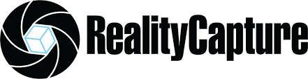
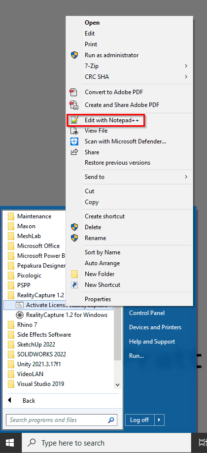
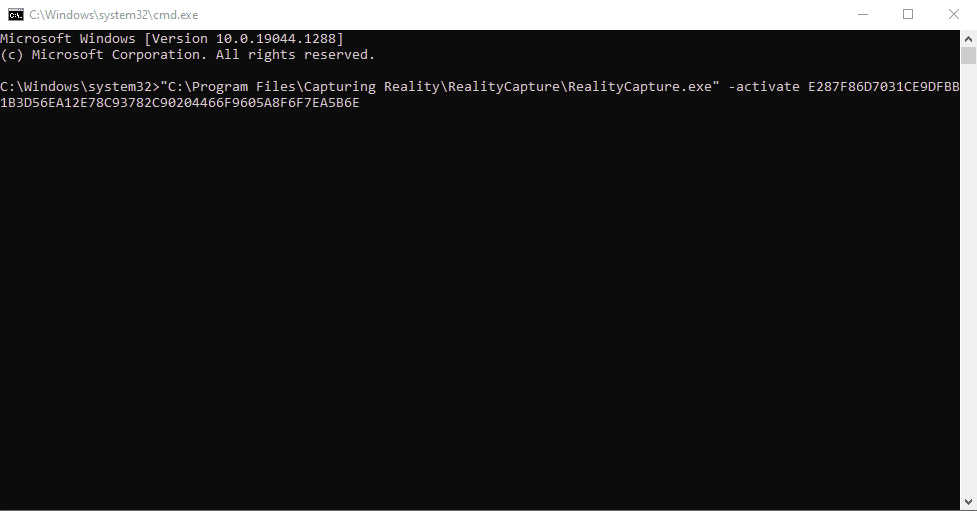
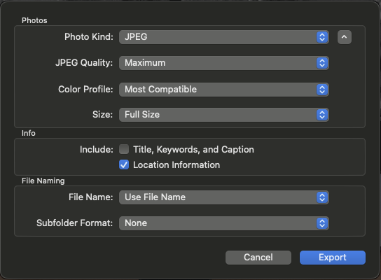

## Introduction

Photogrammetry is the science of making measurements from photographs—specifically, deriving 3D positions of points from overlapping 2D images. When you take many overlapping photos of an object or scene from different angles, software can identify matching points across images and triangulate their positions in 3D space. The result is a point cloud or mesh that precisely represents the photographed subject's shape. For designers, this means you can digitize almost anything with a camera: a building facade, a sculpture, an urban streetscape, an archaeological artifact.

The key insight behind photogrammetry is parallax—the apparent shift of an object's position when viewed from different angles. If you see a building from the left side, the windows appear at one position relative to the building's corner. From the right side, they appear shifted. By calculating these shifts across many overlapping images, software reconstructs the 3D geometry. Modern photogrammetric algorithms, particularly Structure from Motion (SfM), automate this process, handling thousands of images and millions of points with minimal human intervention.

Reality Capture, the software used in this tutorial, represents the current state of the art in accessible photogrammetry. It can process images from smartphones, DSLRs, or specialized survey cameras, producing point clouds, meshes, and textured models suitable for visualization, analysis, or fabrication. The software leverages GPU acceleration to achieve processing speeds that were unthinkable a decade ago.

## Learning Goals

- Understand how overlapping photographs are transformed into point clouds, meshes, and textured models.
- Distinguish between image capture, alignment, reconstruction, cleanup, and export as separate stages in the workflow.
- Evaluate when photogrammetry is an appropriate alternative to LiDAR or manual surveying.
- Recognize how lighting, overlap, camera movement, and control points affect model quality.
- Reflect on the ethical and cultural implications of digitally capturing people, places, and artifacts.

## Key Terms

- **Photogrammetry**: The process of deriving spatial measurements and 3D form from overlapping photographs.
- **Parallax**: The apparent shift of an object between images taken from different viewpoints, used to infer depth.
- **Structure from Motion (SfM)**: A computational method that estimates camera positions and reconstructs 3D geometry from many images.
- **Point cloud**: A set of spatial points that records the surface geometry of an object or site.
- **Mesh**: A connected polygon surface generated from point cloud data to create a continuous 3D model.
- **Control point**: A known reference point used to improve alignment accuracy or connect multiple datasets.

## Historical Context

Photogrammetry began with aerial photography in the late 19th century. Surveyors discovered that overlapping photographs taken from aircraft could be viewed in stereo to extract elevation information—pioneering the mapping method that produced topographic maps for decades. The stereoscope, still used today, exploits the brain's natural ability to fuse two offset images into a single 3D perception.

The digital revolution transformed photogrammetry from an analog to computational discipline. Early digital photogrammetry required expensive specialized hardware and expertise. The critical breakthrough came with "Structure from Motion" algorithms in the 2000s, which automated feature matching across images without requiring pre-calibrated camera positions. This made photogrammetry accessible to anyone with a camera.

The 2010s saw photogrammetry migrate from specialized applications to mainstream design and entertainment. Game studios, VFX houses, and architects adopted the technology for asset creation and existing conditions documentation. Epic Games' acquisition of Reality Capture signals the technology's value for real-time visualization and metaverse applications.

Simultaneously, hardware evolved: higher resolution sensors, better lens quality, and the ubiquity of GPS-tagged images all improved data quality. Today's smartphones capture images detailed enough for professional-grade photogrammetry, removing the barrier of specialized equipment.

## Social and Cultural Context

Photogrammetry is not just a neutral imaging technique; it is a way of selecting, framing, and owning representations of the built environment. In heritage work, it can help document fragile monuments, damaged sites, or community spaces before they are altered or lost. At the same time, it raises questions about who has permission to capture cultural artifacts, who controls the resulting models, and whose labor is involved in producing accurate digital records.

For design students, this means treating capture as an ethical act as well as a technical one. Scanning a site can support preservation and public memory, but it can also extract value from places and objects without consent or context. In academic practice, methodology matters: who is represented, who benefits, and how digital models circulate are part of the design question.

## Design Relevance

Photogrammetry offers designers a direct bridge between physical site conditions and digital design tools. A site visit supplemented with hundreds of overlapping photographs yields a 3D model accurate enough for measuring distances, extracting elevations, or testing design interventions against existing geometry. This is especially valuable for historic preservation projects where existing conditions may be poorly documented.

The technology democratizes 3D scanning. Traditional terrestrial LiDAR scanners cost tens to hundreds of thousands of dollars; photogrammetry requires only a camera (often a smartphone) and processing software. Reality Capture's educational licensing makes this capability accessible to students, enabling workflows previously limited to well-funded research labs or large firms.

For urban design and landscape architecture, photogrammetry enables detailed existing conditions documentation at scales from street furniture to neighborhood character. Combined with drone imagery, it can capture sites inaccessible by foot or too large for ground-based photography alone. The resulting point clouds or meshes become base maps for further analysis or visualization.

The entertainment industry applications—game assets, VFX, virtual production—represent a growing design domain where photogrammetry skills transfer directly. Understanding the workflow, including proper photography techniques, control point usage, and mesh optimization, prepares students for careers spanning architecture, gaming, film, and immersive media.

## Resources & Further Reading

- [Reality Capture Education](https://www.capturingreality.com/Education) - Official tutorials and educational licensing information
- [Photogrammetry Wikipedia](https://en.wikipedia.org/wiki/Photogrammetry) - Comprehensive overview of principles and applications
- [Sketchfab Blog: Photogrammetry Best Practices](https://sketchfab.com/blogs-category/tutorial) - Practical tips for photographing objects and scenes
- [Agisoft Metashape Documentation](https://agisoft.com/support/documentation/) - Alternative photogrammetry software with extensive tutorials
- [Epic Games Reality Capture](https://www.epicgames.com/store/en-US/product/reality-capture) - Information on Reality Capture by its current owner

## Technical Walkthrough

This walkthrough focuses on the practical sequence from image capture to model cleanup. Read it as a method: each step affects not just software output, but the quality and credibility of the spatial evidence you produce.

### Tools

## RealityCapture

This is the main tool we will use to generate 3D point cloud data from photographs. This tool also allows you to combine LiDAR data from handheld devices or geospatial sources.

### Overview

Basic Workflow

- Photograph object / buildings / scenes, a topic not covered here. Rule of thumb for photographing outdoor, avoid harsh sunlight, best to shoot during overcast; overlap at least 60% between photos; try to capture "elevation" and walk along the building.

- Import geo-referenced photos to Reality Capture, we have 16 education licenses but opening the software with the appropriate license is somewhat tricky. Procedure is covered here.

- Generate point cloud data.

### Capture Checklist

- Aim for at least 60 percent overlap between adjacent photos.

- Keep lighting as even as possible; overcast conditions are usually easier to process than harsh directional sunlight.

- Walk a site or object in loops rather than jumping randomly between viewpoints.

- Include oblique views as well as frontal views so the model captures depth and edges.

- If the model must be measurable, plan for control points or other reliable reference geometry.

### Starting Reality Capture

Reality Capture is a software that's available on Pratt Anywhere - Pratt's cloud based desktop. As of 23/SP, Pratt Anywhere is still in pilot mode, therefore some access restrictions will be in place. Currently, to access Pratt Anywhere, you must be on campus and logged into our secured wifi network. Then follow the instruction here - [https://docs.google.com/document/d/1akyjomfpAjTKm34DT8x3XmSySwRZb0uEbF1FxAkdmDw/edit?usp=sharing](https://docs.google.com/document/d/1akyjomfpAjTKm34DT8x3XmSySwRZb0uEbF1FxAkdmDw/edit?usp=sharing)

Pratt Anywhere's backend is a series of high performance computing hardware with Xeon Platinum CPU and NVIDIA A40 GPU.

### Copy code for software license

Once you have successfully logged in, find Reality Capture in the Start Menu, you should see "Activate License Reality Capture", right-click on it and choose Edit with Notepad++

Copy the whole line of text, which should read something like this,

"C:\Program Files\Capturing Reality\RealityCapture\RealityCapture.exe" -activate XXXXXX

### Launch software with code

Open a Command Prompt window by clicking on the start menu, type CMD and hit Enter

Paste the code into the Command Prompt window with Ctrl-V, and hit Enter.

Software should launch and says License has been activated.

### Point Cloud Generation in Reality Capture

Reality Capture is a very capable software that can generate 3D point clouds for many specific applications such as land and archaeological survey. It is also a very popular software for generating game assets, it was thus acquired by Epic Games. There are quite a few tutorials and documentation online, so feel free to look more into this.

Overall workflow

- Import the photographs

- align those photographs

- merge the components together

- generate preview

- filter unwanted polygons

- generate mask

- re-import

- re-align

### Quick note on exporting phone images

When exporting your phone images, make sure to include Location Information, this help Reality Capture to align images.

## Video References

- [Reality Capture Workflow](https://www.youtube.com/watch?v=DfTDYRi2tno)

  - In RealityCapture, switch to the `1+1+1` workflow layout, import all source photos, and confirm the images still contain geolocation metadata so the model has usable scale information.
  - Run `Align Images` first and inspect the resulting components; if the model splits into several components, the photo set likely did not have enough overlap between adjacent views.
  - Use `Alignment > Add Control Points` to stitch components together by marking the same visible feature across images. Aim for at least three shared points and keep the point variance under 1 pixel when possible.
  - Re-run alignment after adding control points, then use `Set Ground Plane` and `Set Reconstruction Region` to orient the model to the grid and crop away unwanted geometry before meshing.
  - Once the preview or high-quality mesh looks acceptable, run `Colorize`, then export the result as a `LAS Point Cloud` with vertex normals enabled for further cleanup and reuse.

- [RealityCapture tutorial: Complete model in PPI](https://www.youtube.com/watch?v=tw6wNNEbH_M)

- [RealityCapture tutorial: Control Points](https://www.youtube.com/watch?v=S00_mLfbx6o)

- [Photogrammetry workflow with Tim Hanson, RealityCapture & CG Society](https://www.youtube.com/watch?v=-1gume35gEk)

### Control Points

Control points are used to align multiple point clouds together or to anchor a model to known spatial references. They become especially important when you are combining several capture sessions, integrating survey data, or trying to improve metric accuracy.

## Applied Examples

- [Inside the VFX of Army of the Dead's Zombie Las Vegas | Netflix](https://www.youtube.com/watch?v=O3D33K-qkm8)

- [Producing a music video across countries, on a laptop](https://www.youtube.com/watch?v=9PwZm6feTmc)

- [3DoF to 6DoF, Photogrammetry in the Metaverse | Masterclass by Eric Hanson](https://www.youtube.com/watch?v=sfv5kwngq-Y)
