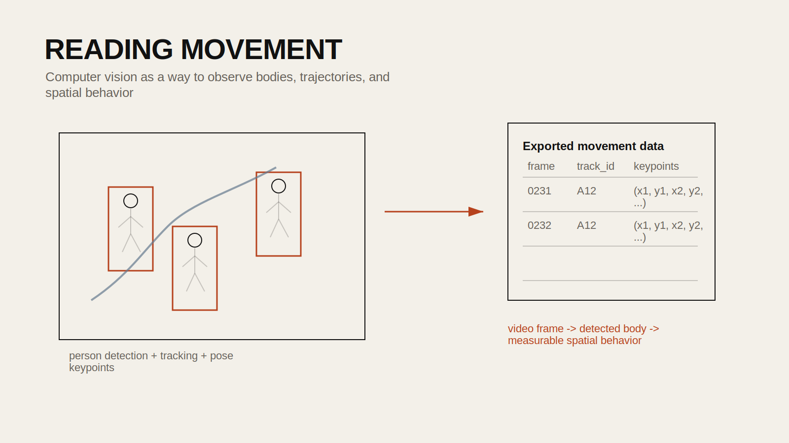

## Introduction

Computer vision can turn images and video into measurable observations. Instead of manually counting pedestrians or qualitatively describing body movement, students can use object detection and pose estimation models to identify people, track their location, and extract keypoint data from motion.

This tutorial draws from a course workflow focused on YOLO-based detection and pose estimation. The public version below centers on a clear sequence: detect people, track movement through time, and export pose information for later analysis.

## Historical Context

Object detection and human pose estimation have long been central problems in computer vision. Earlier systems relied on handcrafted features and classical image-processing pipelines. More recent deep-learning models such as YOLO made real-time detection much more practical, while pose-estimation models added the ability to infer body joints and skeletal structure from images and video.

For architecture and urban research, these methods are useful because they move visual observation toward measurable spatial behavior.

## Design Relevance

Designers often study how bodies move through space: where people gather, how circulation patterns form, whether a public space invites lingering, or how a street edge affects pedestrian behavior. Computer vision can support that work by generating consistent observational data from video and image sources.

Possible uses include:

- counting pedestrians in a street or plaza
- identifying occupancy patterns across time
- extracting approximate body poses for movement analysis
- comparing how different spaces support sitting, waiting, or passing through

## Learning Goals

- run object detection on images with YOLO
- filter detection to a specific class such as `person`
- apply tracking across a video file
- run pose estimation on video
- export keypoint coordinates for later analysis



## Step 1: Install the Required Packages

```bash
pip install ultralytics opencv-python
```

This tutorial assumes you have access to a GPU-friendly environment for faster inference, although small examples can run on CPU.

## Step 2: Load the YOLO Model

The notebook uses Ultralytics YOLO models directly.

```python
from ultralytics import YOLO

model = YOLO("yolo11n.pt")
```

For pose estimation, use a pose-enabled checkpoint.

```python
pose_model = YOLO("yolo11n-pose.pt")
```

## Step 3: Run Object Detection on a Single Image

Start with one image before moving to video.

```python
results = model("./pedestrian_scene.png", classes=[0])
```

In the COCO class system, `0` corresponds to `person`, so this filters the output to people only.

You can inspect the detections visually:

```python
results[0].show()
```

And inspect the detection boxes numerically:

```python
for result in results:
    boxes = result.boxes
    print(boxes)
```

## Step 4: Track People Through Video

The workflow then applies tracking to a video file using ByteTrack.

```python
video_file = "./pedestrian_video.mp4"

results = model.track(
    video_file,
    show=False,
    tracker="bytetrack.yaml",
    conf=0.3,
    iou=0.5,
    save=True,
)
```

This lets you go beyond isolated detections and begin analyzing trajectories through time.

## Step 5: Run Pose Estimation

Pose estimation adds another layer by identifying body keypoints.

```python
pose_results = pose_model(
    video_file,
    show=False,
    save=True,
)
```

The result contains keypoint information for each detected person.

```python
pose_results[0].keypoints
```

This is useful if you are interested in posture, gesture, or rough movement states rather than just position.

## Step 6: Export Keypoints to CSV

The source workflow flattens keypoint coordinates and writes them to a CSV. A cleaned version looks like this:

```python
import csv

keypoints_data = []

for r in pose_results:
    if r.keypoints is None:
        continue

    for person_keypoints in r.keypoints.data.tolist():
        flattened_keypoints = [coord for point in person_keypoints for coord in point]
        keypoints_data.append(flattened_keypoints)

csv_file_path = "keypoints_output.csv"

with open(csv_file_path, "w", newline="") as csvfile:
    csv_writer = csv.writer(csvfile)
    if keypoints_data:
        header = [f"kp_{i}" for i in range(len(keypoints_data[0]))]
        csv_writer.writerow(header)
        csv_writer.writerows(keypoints_data)
```

This turns pose output into a portable table that can be analyzed later in Python, R, or visualization tools.

## Step 7: Interpret the Results Carefully

Computer vision outputs are not neutral facts. They are model inferences shaped by training data, occlusion, camera angle, lighting, crowd density, and image quality.

Questions to ask when reviewing results:

- Are people being missed in dense or low-light scenes?
- Are detections stable across frames?
- Are body keypoints consistent enough for the kind of analysis you want?
- Does the camera angle bias what the model can see?

The workflow is best for approximate pattern analysis, not for precise behavioral claims without verification.

## Common Pitfalls

1. Using low-quality or low-resolution video.
Poor input leads to weak detections.

2. Treating tracking IDs as perfectly reliable across occlusion.
Tracking is approximate and can break.

3. Ignoring the ethics of surveillance.
Any use of pedestrian imagery should account for privacy, consent, and context.

4. Exporting keypoints without documenting the camera setup.
Coordinates are difficult to interpret without frame and viewpoint metadata.

## Extensions

- count pedestrians per minute in different sites
- compare movement patterns across design interventions
- cluster body poses into simple activity types
- combine trajectories with spatial maps of the site

## Resources

- [Ultralytics YOLO Docs](https://docs.ultralytics.com/)
- [OpenCV Documentation](https://docs.opencv.org/)
- [ByteTrack Paper](https://arxiv.org/abs/2110.06864)
