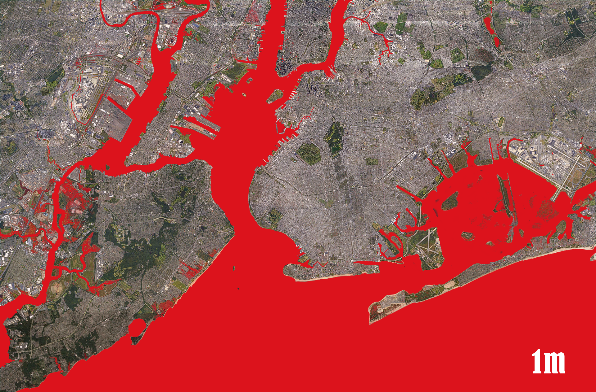
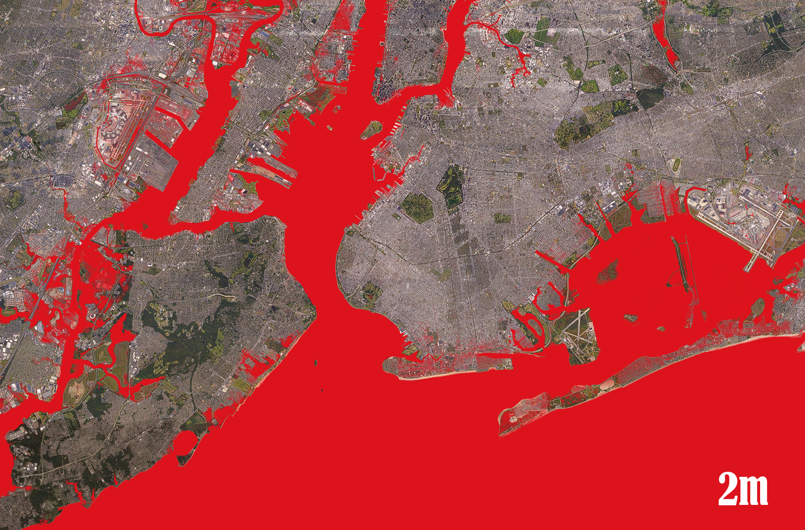

## Introduction

Sea level rise is one of the most consequential consequences of climate change, threatening coastal infrastructure, freshwater resources, and ecosystems worldwide. As greenhouse gases warm the atmosphere, two things happen: water expands (thermal expansion, accounting for roughly half of observed rise), and ice sheets in Greenland and Antarctica melt faster than they accumulate snowfall. The result is seas that have risen approximately 8-9 inches globally since 1900, with the rate accelerating—from about 0.06 inches per year in the early 20th century to nearly 0.14 inches per year today.

For coastal designers—architects, landscape architects, urban planners—the implications are profound. Buildings sited in flood zones face increasing insurance costs and regulatory requirements. Infrastructure designed for historical flood elevations may become inadequate. Waterfront parks and public spaces may require adaptive redesign or managed retreat. Understanding sea level rise projections and their spatial implications transforms how coastal sites are conceived and programmed.

This tutorial focuses on visualizing sea level rise using Digital Elevation Models—essentially asking "if the water were this high, what would be flooded?" This "bathtub" approach provides a first-order assessment useful for strategic planning and communication. More sophisticated models account for storm surge, wave action, and hydrodynamic processes, but DEM-based visualization effectively conveys the stakes and scope of the challenge.

## Historical Context

Tide gauge records extending back to the 1700s in some locations document long-term sea level trends, revealing that sea level has risen approximately 120 meters since the last glacial maximum 20,000 years ago. These geological timescales provide context but also indicate the pace of change: the rate currently observed is extremely rapid by geological standards.

Modern sea level research accelerated with satellite altimetry missions beginning in the early 1990s. The TOPEX/Poseidon satellite, launched in 1992, provided the first precise, continuous measurements of global sea surface height, revealing variations and trends invisible to tide gauges. Subsequent missions (Jason series, Sentinel-6) continue this record, providing the data underlying current projections.

The IPCC (Intergovernmental Panel on Climate Change) produces periodic assessment reports synthesizing sea level research. The Sixth Assessment Report (2021) projects global mean sea level rise of 0.3 to 1.0 meters by 2100 under various emissions scenarios, with higher end estimates incorporating potential ice sheet instabilities. These projections inform building codes, infrastructure planning, and coastal zoning in many jurisdictions.

NOAA's Sea Level Rise Viewer and similar tools make projection data accessible for local planning, allowing communities to visualize which areas become inundated under different scenarios. Many coastal cities have incorporated these visualizations into comprehensive plans and hazard mitigation strategies.

## Design Relevance

Coastal flooding from sea level rise compounds existing storm surge risks. A 100-year flood event—one with a 1% chance of occurring in any year—becomes more frequent as base sea level rises: what was a 100-year flood might become a 10-year flood by mid-century. For designers, this means building envelope, foundation, and mechanical system decisions that once assumed historical flood elevations may require reassessment.

Beyond flooding, sea level rise threatens coastal groundwater tables. As seas rise, the freshwater-saltwater interface moves inland and upward. Buildings with basements or below-grade structures may encounter brackish or saltwater intrusion, affecting foundation integrity and indoor air quality. Landscape designs relying on freshwater irrigation may face increasing constraints.

Adaptation strategies fall into three categories: protection (hard infrastructure like seawalls, soft infrastructure like dunes and marshes), accommodation (building designs that tolerate periodic flooding), and retreat (relocating development away from vulnerable areas). Each approach involves tradeoffs between cost, effectiveness, ecological impact, and social equity. Designers must understand these tradeoffs to advise clients and communities realistically.

Visualization is a critical design tool for sea level rise communication. Converting DEM data into inundation maps transforms abstract projections into tangible site conditions. These visualizations support community engagement, grant applications, regulatory discussions, and the design process itself—helping stakeholders understand what is at stake before committing to adaptation strategies.

## Learning Goals

- Explain the main physical drivers of sea level rise and their relevance to coastal design.
- Interpret DEM-based inundation mapping as a preliminary planning method rather than a parcel-level prediction tool.
- Compare adaptation strategies such as protection, accommodation, and retreat in spatial terms.
- Use flood visualization to communicate risk to clients, communities, and public agencies.
- Identify the uncertainty, scale, and data limitations built into sea level rise mapping workflows.

## Key Terms

- **Sea level rise**: The long-term increase in average ocean height caused primarily by warming water and melting land ice.
- **DEM (Digital Elevation Model)**: A raster dataset representing ground elevation used to model slope, flooding, and terrain.
- **Inundation mapping**: A method for showing which areas may be covered by water under a given flood or sea level scenario.
- **Thermal expansion**: The increase in water volume that occurs as ocean water warms.
- **Storm surge**: The abnormal rise of water generated by a storm, often producing severe coastal flooding.
- **Vertical datum**: The reference surface from which elevations are measured, such as NAVD88 or mean sea level.

## Coastal Adaptation and Climate Justice

Sea level rise does not affect all coastal communities equally. Low-income residents, renters, public housing occupants, and communities with fewer political resources are often concentrated in the most flood-prone areas while also having the least capacity to absorb insurance costs, displacement, or rebuilding expenses. In an academic design context, mapping inundation should therefore be paired with questions of housing security, public infrastructure, and managed retreat: not only where water will go, but whose homes, institutions, and cultural landscapes are placed at greatest risk.

## Resources & Further Reading

- [NOAA Sea Level Rise Viewer](https://coast.noaa.gov/slr/) - Interactive tool for visualizing sea level rise and flood scenarios along US coasts
- [NOAA Digital Coast Data](https://coast.noaa.gov/digitalcoast/) - Download sea level rise data, coastal elevation models, and wetland impact projections
- [IPCC AR6 Sea Level Projections](https://www.ipcc.ch/report/ar6/wg1/) - Authoritative scientific projections of sea level rise under different emissions scenarios
- [Climate Central Surging Seas](https://riskfinder.climatecentral.org/) - Locally-specific sea level rise and flood risk analysis
- [USACE Sea Level Rise Calculator](https://www.usace.army.mil/corpscope/) - Engineering guidance for incorporating sea level rise into coastal project design


## Technical Walkthrough

This walkthrough uses publicly available elevation data to build a first-pass inundation study. Treat it as a strategic planning method for understanding regional exposure, not as a substitute for parcel-scale engineering or flood insurance modeling.

### Data Sources

Sea Level Rise Viewer

- [NOAA Site](https://coast.noaa.gov/slr/#)

Sea Level Rise Data Download

- [NOAA SLR Data](https://coast.noaa.gov/slrdata/) (by state)

- [NOAA Coast Elevation Models](https://www.ngdc.noaa.gov/mgg/coastal/coastal.html) (by coastline)

- [Sea Level Rise Wetland Impact](https://coast.noaa.gov/digitalcoast/data/slr-wetland.html)

This tutorial walks through the process of visualizing sea level rise over time using digital elevation data. The main caveat is not that DEMs are "from satellites" by definition, but that elevation sources vary in resolution, date, vertical accuracy, and vertical datum. Many coastal DEMs are derived from LiDAR, photogrammetry, bathymetry, or merged terrain products. For flood insurance, permitting, or parcel-scale decisions, you should use the most local and authoritative surveyed data available and verify the vertical datum before comparing water levels to terrain. This method is best used for strategic planning and scenario visualization at the urban or landscape scale rather than as a precise prediction for a single property.

### NYC Sea Level Rise






Basic Workflow

- Download DEM Data (This tutorial uses the [Hurricane Sandy DEM Data](https://www.ngdc.noaa.gov/mgg/inundation/sandy/sandy_geoc.html))

- DEM Process (Merge / Clip)

- Download Satellite Imagery

- Sea Level Visualization

- Export satellite imagery and dem data for compositing

Note: This method is a good way to estimate Sea Level Rise in coastal regions, it is also sometimes used to model storm surge events. This is referred to as the ["Bath Tub" modeling](https://www.researchgate.net/publication/264886335_Comparing_the_Bathtub_Method_with_MIKE21_HD_flow_model_for_modelling_storm_surge_inundation_-_Case_study_Kiel_Fjord). It is not very accurate because it doesn't account for many factors such as speed of the storm and the physical features of the sea floor. A more accurate simulation method can be done with the [SLOSH model](https://www.nhc.noaa.gov/surge/slosh.php), this methodology will be covered in a separate tutorial.

[Sea Level Rise Viz with Digital Elevation Model](https://www.youtube.com/watch?v=r4sEg0t5XLc)

- In QGIS, merge the NOAA DEM tiles with `Raster > Miscellaneous > Merge` so you are working from a single elevation raster before styling or export.
- Keep the DEM in its native projected CRS for analysis, and only reproject a copy with `Raster > Projections > Warp` to `Web Mercator (EPSG:3857)` if you need it to line up with an XYZ or Google-style satellite basemap for visualization/export.
- Add the satellite basemap through an `XYZ` connection, then export it as a rendered image using the DEM extent and matching pixel dimensions.
- Style the DEM as `Singleband pseudocolor` with a grayscale ramp so low elevations turn white and higher land turns black; adjust the break values to test different flood thresholds.
- Export each flood threshold as a rendered GeoTIFF with the same extent and resolution as the basemap so the images can be composited cleanly in Photoshop.

Quick addendum to the previous video. This shows how you can do a quick viz inside QGIS without having to involve Photoshop.

[SLR QGIS](https://www.youtube.com/watch?v=lGod9qJQwdk)

- For a faster in-app preview, open the DEM symbology and use QGIS layer blending modes to simulate the same masking workflow directly in the map canvas.
- Set the flood layer to white and place it over a contrasting lower layer so inundated areas read clearly without leaving QGIS.
- Change the elevation thresholds to test alternate scenarios, including larger storm-surge events, without rebuilding the full Photoshop composite.
- This method is faster for iteration, but final export still requires a separate map workflow because saving one layer will not preserve the blended view.

This workflow can be automated to create an animation sequence via Python scripting. The code below demonstrates how to generate an image sequence from the DEM data that goes from -1m to 2m at every 0.3m.

```python

import rasterio as rio

import matplotlib.pyplot as plt

import numpy as np

from skimage.transform import resize

b1_img = rio.open("./NYC_google.tif")

b1_band = b1_img.read(1, masked=False).astype('float')

b1_band_exp = resize(b1_band,(3672, 5570))

a = 0

for x in np.arange (-1, 2, 0.3):

plt.imsave("./nyc_flood_{}.png".format(a), b1_band_exp, cmap='gist_yarg', vmin=x, vmax=x+2)

a += 1

```
