## Introduction

Solar potential analysis assesses how much sunlight a site, building, or surface can receive and convert into usable energy or daylight. This assessment involves understanding both the solar resource itself (how much energy arrives from the sun) and site-specific factors that modify it (shading from topography, trees, or buildings; surface orientation and tilt; atmospheric conditions). For designers, solar analysis informs passive solar design, photovoltaic system sizing, daylighting strategies, and outdoor thermal comfort.

The sun delivers approximately 1,000 watts per square meter to Earth's surface under ideal clear-sky conditions at sea level. This "solar constant" doesn't vary—the Earth's orbit is nearly circular and stable on human timescales. What varies is how much of this resource reaches a given location and surface: latitude affects the angle of incoming radiation; atmosphere (clouds, pollution, humidity) absorbs and scatters light; terrain and structures create shadows; surface orientation determines exposure.

Designers work with two key metrics. Global Horizontal Irradiance (GHI) measures total solar radiation on a horizontal surface, including direct sunlight and diffuse sky radiation. Direct Normal Irradiance (DNI) measures only the direct beam from the sun, relevant for concentrator systems like those on solar trackers. Understanding both helps size and orient systems appropriately.

## Learning Goals

- Explain how solar radiation, atmosphere, shading, and surface orientation shape the solar resource available at a site.
- Distinguish between GHI, DNI, and tilted-plane estimates and describe when each metric matters in design practice.
- Use solar potential concepts to inform passive design, photovoltaic siting, daylighting, and urban-scale planning decisions.
- Interpret solar resource maps critically rather than treating them as automatic proof of feasibility.
- Connect solar analysis to questions of energy burden, public policy, and equitable access to decarbonization.

## Key Terms

- **Solar irradiance**: The rate at which solar energy reaches a surface, usually expressed per unit area.
- **Global Horizontal Irradiance (GHI)**: The total solar radiation received by a horizontal surface, including both direct sunlight and diffuse sky radiation.
- **Direct Normal Irradiance (DNI)**: The amount of direct solar radiation received by a surface kept perpendicular to the sun's rays.
- **Tilted plane**: A sloped collecting surface, such as a roof or panel array, whose solar gain differs from horizontal or sun-tracking conditions.
- **Capacity factor**: The ratio between actual energy production and the maximum possible production if a system operated at full rated output all the time.
- **Nameplate capacity**: The maximum output a solar system is rated to produce under standardized ideal conditions.

## Historical Context

Humans have harnessed solar energy for millennia—orienting buildings to capture winter sun, drying crops, heating water in passive systems. The modern scientific study of solar radiation began in the 19th century, with researchers measuring solar output and atmospheric effects systematically.

The photovoltaic effect, discovered in 1839 by Edmond Becquerel, was theoretical until the 1950s when Bell Labs produced the first practical silicon solar cell. Early photovoltaics were extremely expensive, used primarily for space satellites. The 1970s oil crisis sparked research into terrestrial applications, but costs remained prohibitive.

A remarkable cost decline changed everything: solar module prices fell from over $70 per watt in 1975 to under $0.30 per watt today. This 99% reduction, driven by manufacturing scale, technology improvements, and policy incentives, made solar competitive with fossil fuels in many markets. Today, solar is the fastest-growing electricity source globally.

The National Renewable Energy Laboratory (NREL) has been measuring and modeling solar resources since the 1970s, establishing the scientific basis for solar deployment. Their National Solar Radiation Database, with over 1,400 monitoring stations across the US, provides the data underlying solar potential assessments.

## Design Relevance

Building orientation and window placement, informed by solar analysis, can dramatically reduce energy consumption. A building that captures winter sun (when the sun is low and heating is welcome) while shading windows in summer (when the sun is high and cooling loads are highest) reduces both heating and cooling demands. This passive solar design has been practiced for millennia—the Pantheon in Rome, the solar houses of Eleanor and Raymond Fick—but systematic solar analysis tools now make it accessible to any designer.

Photovoltaic system design requires accurate solar potential assessment. Oversizing systems wastes money; undersizing leaves rooftop potential unrealized. Solar analysis tools model shading from nearby buildings and trees across all seasons, producing annual generation estimates accurate enough for financial projections. Tools like NREL's PVWatts calculator make this accessible without specialized expertise.

Urban design implications extend beyond individual buildings. Street orientation affects solar access for pedestrians; park placement affects neighborhood cooling; building height limits affect shadowing on adjacent properties. Some jurisdictions have enacted solar rights legislation or daylighting codes protecting solar access, making basic solar analysis relevant to planning and zoning decisions.

Daylighting—using sunlight to illuminate building interiors—reduces electricity consumption while providing connection to outdoor conditions. Understanding solar paths, window placement, and light shelf design enables daylighting strategies that balance visual comfort, thermal gains, and glare control. The same solar analysis that informs photovoltaics enables better daylighting design.

## Energy Justice and Public Policy

Solar potential maps often appear objective, but access to solar infrastructure is shaped by housing tenure, roof condition, financing, utility regulation, and public investment. Neighborhoods with high energy burdens or long histories of environmental injustice may have strong solar resources while still facing the greatest barriers to adoption. For designers, solar analysis therefore belongs within a broader discussion of energy justice: who benefits from rooftop solar, who is excluded, and how policy affects whether technical potential becomes a shared public good.

This is especially relevant in cities where rental housing, aging building stock, and uneven capital investment shape who can participate in decarbonization. Community solar, public-housing retrofits, and solar access protections all depend on the same resource knowledge that designers use for site planning. The educational value of solar analysis lies partly in learning the metrics, and partly in understanding how those metrics enter housing policy, infrastructure planning, and climate adaptation debates.

## Resources & Further Reading

- [NREL National Solar Radiation Database](https://www.ncei.noaa.gov/products/land-based-station/national-solar-radiation-database) - Free historical solar radiation data for over 1,400 US stations
- [NREL PVWatts Calculator](https://pvwatts.nrel.gov/) - Online tool for estimating photovoltaic system energy production
- [NREL Solar Resource Data](https://www.nrel.gov/gis/solar-resource.html) - Overview of solar data sources and tools from NREL
- [FEMP Solar Analysis Tools](https://www.energy.gov/femp/solar-analysis-tools) - Federal energy management program guidance on solar assessment
- [SUNY ESF Solar Resource Guide](https://www.esf.edu/solar/) - Educational resources explaining solar radiation concepts and measurement

## Technical Walkthrough

[NREL Solar Supply Curves Map](https://www.nrel.gov/gis/solar-supply-curves.html)

[NREL Technical Report](https://www.nrel.gov/docs/fy09osti/44073.pdf)

### Understanding Solar Potential

Understanding solar potential and what it takes to realize that potential requires a number of topics to be addressed. In general, solar energy has been used in our built ecologies in 3 main ways, photovoltaics, solar thermal, and daylighting. Since our solar system is a stable and steady state system within the short span of human existence, we have a very good understanding of how much light is available for conversation, and it comes down to a finite set of factors. This tutorial will introduce a number of solar related terminologies and we will begin with the moment when sun light hits earth's atmosphere.

### How much light reaches the earth?

On average, about 1360 watts per square meter reaches the top of the atmosphere directly facing the sun, this is the so called Solar Constant, although this term is rarely used anymore. The amount of light that reaches earth depends on 2 main factors. Absorption is another main factor but for design engineering purpose, it can be omitted. As shown in the chart on the left, absorption causes "dips" in the infrared spectrum due to absorption by water, however, the infrared range still accounts for roughly 50% of total solar irradiance.

- [Scattering](https://ltb.itc.utwente.nl/509/concept/89052#:~:text=Atmospheric%20scattering%20occurs%20when%20particles,redirected%20from%20its%20original%20path.): the way particles in the atmosphere redirect solar radiation before it reaches the ground.

- Rayleigh Scattering (particles smaller than wavelength of light, blue sky effect)

- Mie Scattering (particles similar size to wavelength of light, lower atmosphere)

- Non-Selective Scattering (particle larger than wavelength of light, large water droplets / cloud cover)

- Geometry: the angle between the receiving plane and the sun. This can be influenced by topography, latitude, altitude, time of day, or roof pitch.

### How do we optimize our chance of collection?

Under most circumstances, we do not have much control over how much sun light reaches the earth's surface, unless we are talking about geo-engineering like artificially creating clear skies, or extra-terrestrial engineering like using satellite mirrors to bring more photons to earth. Typically, under the best sky conditions, the most amount of sun light we can get, or the instantaneous flux of solar radiation that can be received on earth surface, at a location closest to the sun, is about 1000 watts per square meter. This number decreases depending on weather, pollution, latitude, and topography. NOAA's National Centers for Environmental Information (NCEI)'s [National Solar Radiation Database (NSRDB)](https://www.ncei.noaa.gov/products/land-based-station/national-solar-radiation-database) distributes data of over 1400 stations across the United States from 1991-2010. This database is extremely useful because it shows the maximum and minimum amount of sun light the US receives on a daily basis over 20 years. To understand this data set, we will need to understand 2 basic concepts - Global Horizontal Irradiation and Direct Normal Irradiation.

Global Horizontal Irradiation (GHI) (Global Yearly Average)

This measurement is taken with a flat plate laid on "flat" ground, so collection accounts for direct solar radiation plus diffused / reflected light. Flat ground in this situation means topographic orientation and elevation is also accounted for. The max on the left shows the "theoretical" daily and yearly maximum that you can receive on earth surface. Of course that is impossible unless we can develop a technology that is 100% efficient.

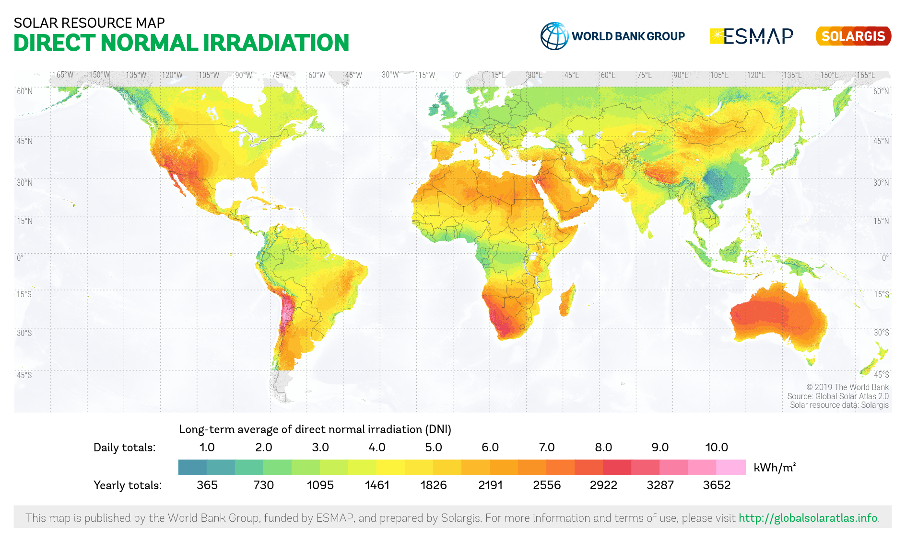

Direct Normal Irradiation (DNI) (Global Yearly Average)

This measurement is taken with any instrument that is constantly tracking the sun's location in 2-axis. This type of system typically collect much higher amount of direct solar radiation, but it also minimizes diffused / reflected light.

### [Global Horizontal Irradiance Monthly Averages](https://www.nrel.gov/gis/solar-resource-maps.html)

From NREL's NSRDB viewer, we can see that there is not much difference between the Northeast and the Southwest in terms of the amount of sun light available at the global horizontal plane for 8 out of the 12 months. Nonetheless, with a horizontal configuration, the maximum irradiance is around 5.75 kWh/m2/day and minimum is around 4.0 kWh/m2/day.

The month-by-month maps below work best as a reference atlas. Instead of reading them one by one in isolation, compare seasonal shifts and ask how stable or variable the solar resource appears across regions. That comparative reading is more useful for design than any single monthly image on its own.

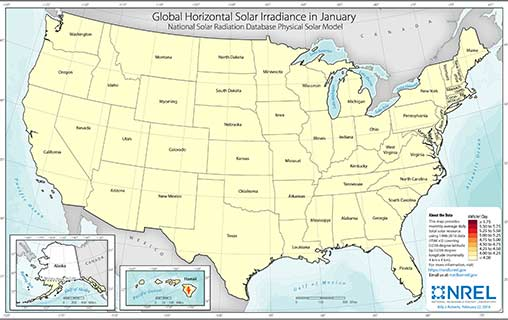

Jan

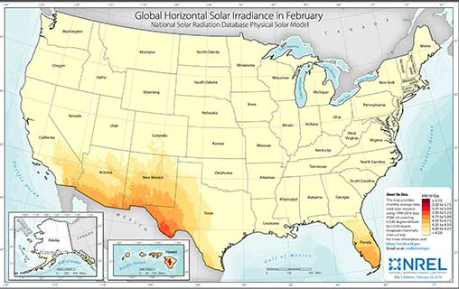

Feb

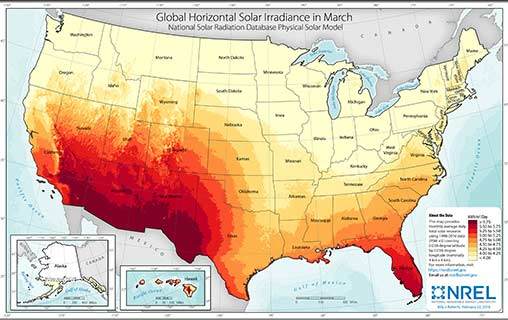

Mar

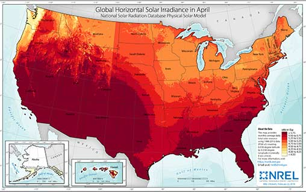

Apr

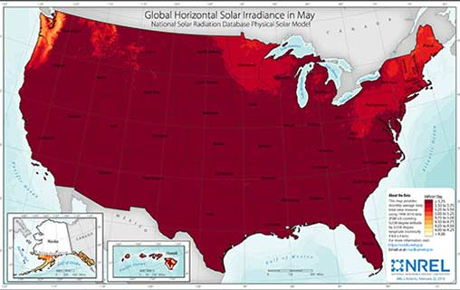

May

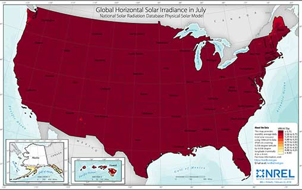

Jun

Jul

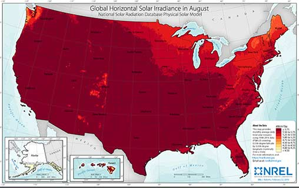

Aug

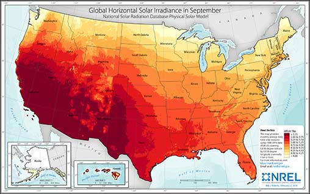

Sep

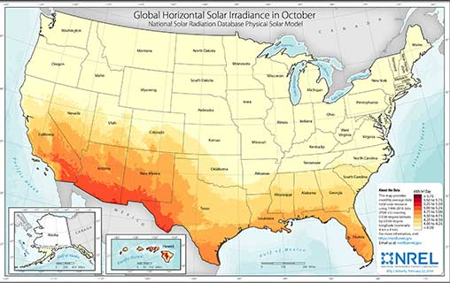

Oct

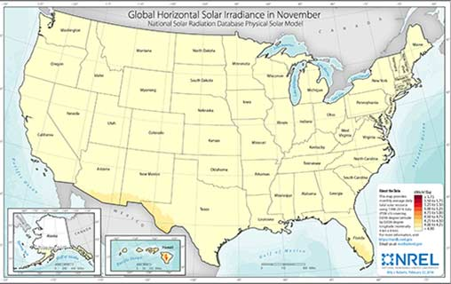

Nov

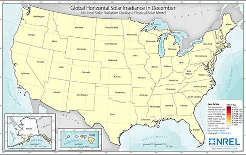

Dec

### [Direct Normal Irradiance Month Averages](https://www.nrel.gov/gis/solar-resource-maps.html)

A 2-axis solar tracking system can maximize capture by constantly re-orienting the collection surface perpendicular to the sun. With this configuration, the Southwest can capture significantly more than the Northeast, with average maximum at around 7.5 kWh/m2/day and minimum at around 4.0 kWh/m2/day. Again, this number represents the absolute maximum of sun light available for conversion. If you have a PV system that is 20% efficient, the theoretical maximum this system capture in the southwest region would be 7.5kWh/m2/day x 20% = 1.5kWh/m2/day

Jan

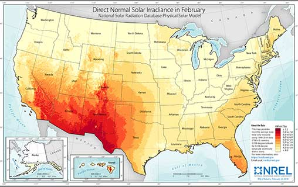

Feb

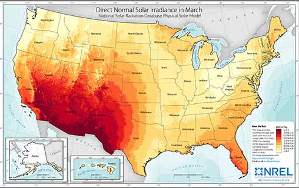

Mar

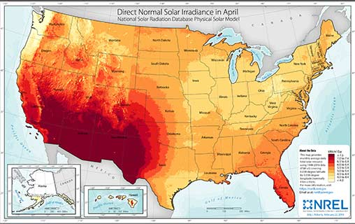

Apr

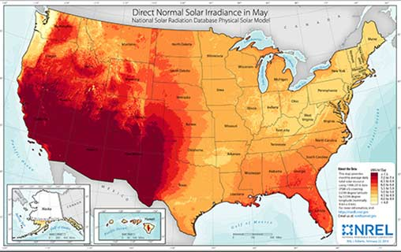

May

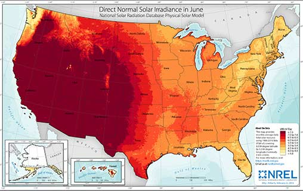

Jun

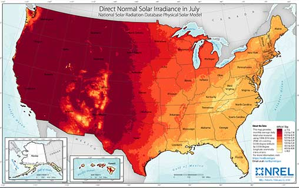

Jul

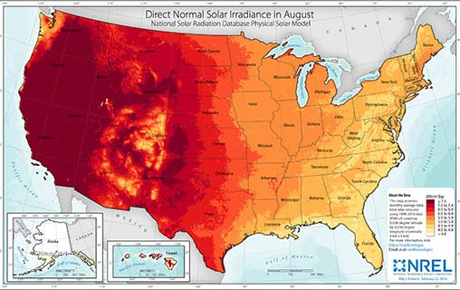

Aug

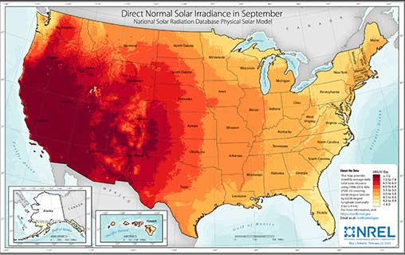

Sep

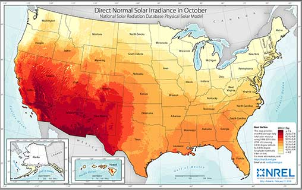

Oct

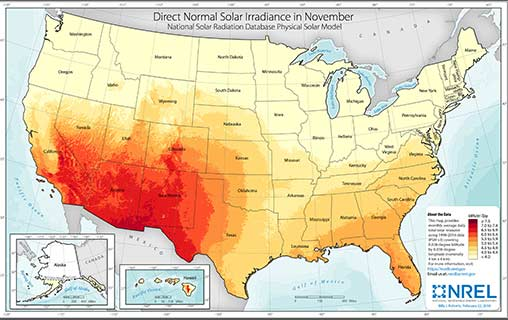

Nov

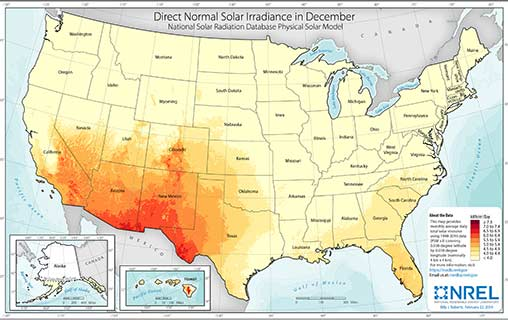

Dec

### Tilted Plane

In practice, 2-axis solar tracking system is extremely expensive and error prone. It is more common to use it on satellites than on terrestrial surfaces. Global horizontal plane, on the other hand, is also not optimal because laying the system flat tends to collect a lot more debris which in turn reduces transmission. A more practical application is to tilt the collection surface at an certain angle. Since weather stations typically only include DNI and GHI values, therefore, determining how much a tilted plane collects requires the use of an algorithm. Regardless, the maximum cannot be more than the DNI value, and the minimum should not be lower than the GHI value.

There are many tools out there that will provide an estimate for how much photons a tilted plane can collect. However, each tool is designed for specific applications -

### Conversion Efficiencies

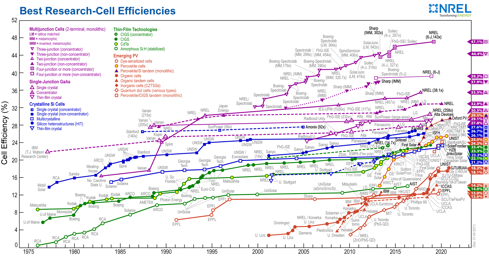

### How are we collecting those photons?

Converting solar radiation to a useful form is a tricky business. Since different technology utilizes different solar radiation spectrum, it is difficult to say one technology is better than another without any caveats. For example, photosynthesis in plants only utilize the red and blue spectrum, so plants can't be considered as particularly efficient in utilizing the whole solar spectrum. However, plants cover a huge amount of territory to compensate. All things considered, the [maximum energy efficiency of plants is about 26%](https://www.britannica.com/science/photosynthesis/Energy-efficiency-of-photosynthesis), which is not at all a high number, but for plants, the efficacy is high. For human beings, we currently have 2 dominant ways to utilize solar radiation - photovoltaics and solar thermal. Currently, [most photovoltaic cells use only the visible spectrum of solar radiation](https://jrenewables.springeropen.com/articles/10.1186/s40807-015-0016-y#:~:text=Standard%20photovoltaic%20solar%20cells%20%28PV,the%20efficiency%20of%20the%20cell.), which only accounts of less than 50% of the solar spectrum, and the current state of the art [PV cells is about 47.1% efficient](https://www.nrel.gov/pv/cell-efficiency.html) under the ideal conditions. Solar thermal, on the other hand, has a theoretical maximum efficiency of about 70%. This is due to the fact that solar thermal systems can utilize the infrared spectrum, which accounts of 50% of solar radiation (see diagram above).

To be clear, efficiency means, given that the maximum amount of solar radiation that reaches earth is around 1000W/m2 at sea level, if a solar thermal system is 70% efficient, that system will have a theoretical maximum output of 700W/m2. This theoretical maximum number is typically what vendors use to rate the capacity of their systems. In reality, systems will never be able to reach their rated capacity due to losses. Potential losses a solar collection system may encounter are fairly typical, they have been heavily studied and we can simulate those loses with a high level of confidence at this point.

To assess the solar potential of any given site, it is very helpful for us to understand the basic terminologies that describe the contributing loss factors solar industry uses.

- Capacity generally refers to the maximum output (generation) of a power plant under ideal conditions. For example, you can buy a solar panel array that's rated at 1000w, however, the system will never be able to generate 1000wh because of soiling, cloud cover, loss due to orientation...etc. But this 1000w number is the rated capacity. Capacity is typically measured in a kilowatt (kW), megawatt (MW), or gigawatt (GW) rating. Rated capacity may also be referred to as “nameplate capacity” or “peak capacity.” This may be further distinguished as the “net capacity” of the plant after plant parasitic loads have been considered, which are subtracted from “gross capacity.”

- [Capacity factor](https://en.wikipedia.org/wiki/Capacity_factor) is a measure of how much energy is produced by a plant compared with its maximum output. It is measured as a percentage, generally by dividing the total energy produced during some period of time by the amount of energy the plant would have produced if it ran at full output during that time.

- Generation refers to the amount of energy that is produced over a specific period of time, usually measured in watt-hours, kilowatt-hours, megawatt-hours. Consider a faucet that's dripping at various rate for an hour, it's hard to measure the instantaneous flow rate, that number wouldn't be meaningful. If we put a bucket to collect that drip, we can then easily put a metric to this.

- Demand refers to the maximum power consumption over a period of time. Power consumptions varies depending on geography, time of day, month of year, and cultural habit. Understanding the demand curve is critical in assessing the energy potential because you want to be able to generate just enough to meet demand and not over produce.

Now that we have our basics laid out, let's get to the geospatial data part.

### Supply Curves Development

**quoted from NREL

Solar resource potential is often assessed in terms of geographic (or resource), technical, and economic potential—each of which represents a succession of additional complexity and input assumptions that leverage similar data and a common analysis flow. This is done by first assessing the solar resource, incorporating an assessment of land availability, assuming system design details, and incorporating costs for site and transmission development.

Ultimately, this results in a spatially resolved characterization of the developable quantity, quality, and cost of solar resources, which can be sorted to represent a "supply curve."
