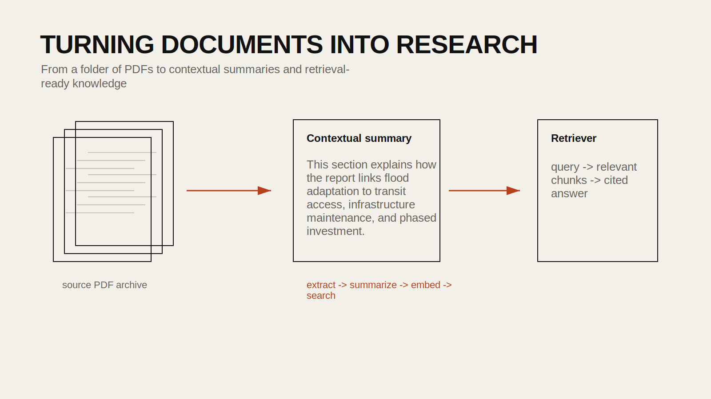

## Introduction

Design research often depends on large collections of PDF documents: reports, policy memos, technical manuals, grant calls, meeting notes, and academic papers. Reading them one by one may be necessary, but it is rarely sufficient when the collection grows. A batch workflow can help extract text, generate contextual summaries, and turn the collection into a searchable research system.

This tutorial builds from `24FA-ARCH-581A-40 - Batch Process`. The original notebook mixes document loading, summarization, and retrieval in one sequence. The public version below separates the workflow into three clear stages:

- extract and organize the text
- generate contextual summaries for chunks
- build a retrieval interface from the resulting corpus

## Historical Context

PDFs became the default container for institutional and scholarly documents because they preserve layout and appearance, but they are often awkward as data sources. Researchers have long used OCR, parsing tools, and indexing systems to make document collections searchable. Large language models add a new layer: they can summarize, reframe, and contextualize document chunks in ways that support retrieval and interpretation.

This makes it possible to treat a folder of PDFs less like an archive of static files and more like a navigable knowledge base.

## Design Relevance

Designers and planners often work with extensive written material before drawing anything. Environmental impact statements, zoning text, consultant reports, community plans, and precedent studies shape the design field long before the site model appears.

This workflow is useful when you want to:

- search across many PDFs by concept rather than filename
- summarize large document sets for faster orientation
- build a retrieval-based research assistant for a project archive
- compare language across multiple reports or institutions

## Learning Goals

- Load a folder of PDFs into a structured table
- Split documents into manageable text chunks
- Generate contextual summaries for each chunk
- Save the processed dataset for reuse
- Build a vector store and retriever for question answering



## Step 1: Install the Required Packages

```bash
pip install pandas pymupdf langchain langchain-community langchain-openai langchain-chroma openai
```

Do not hardcode API keys in the notebook. Use environment variables or Colab Secrets.

## Step 2: Gather the PDF File Paths

The source notebook uses `glob` to locate every PDF in a shared folder.

```python
import glob

file_paths = glob.glob("./Example PDF Folder/*.pdf")
file_paths[:5]
```

At this point it helps to check whether the folder contains clean text-based PDFs, scanned images, or a mixture of both.

## Step 3: Load the PDFs into a Text Collection

The notebook uses `PyMuPDFLoader`, which is a good choice for text extraction from many born-digital PDFs.

```python
import pandas as pd
from langchain_community.document_loaders import PyMuPDFLoader

documents_list = []

for fp in file_paths:
    loader = PyMuPDFLoader(fp)
    documents = loader.load()
    for doc in documents:
        documents_list.append({
            "source": fp,
            "page_content": doc.page_content,
            "metadata": doc.metadata,
        })

df = pd.DataFrame(documents_list)
df.head()
```

Each row now corresponds to a page or chunk extracted from the PDF set.

## Step 4: Build a Full-Document Reference String

The source notebook contextualizes each chunk by comparing it to the larger document it came from. That is a useful idea because a single page often lacks enough context on its own.

One way to prepare for this is to concatenate the chunks belonging to each source PDF.

```python
full_text_lookup = (
    df.groupby("source")["page_content"]
    .apply("\n\n".join)
    .to_dict()
)

df["full_text"] = df["source"].map(full_text_lookup)
```

## Step 5: Generate Contextualized Summaries

The notebook defines a reusable function that creates a chunk summary in the context of the larger document. This is one of the strongest parts of the workflow.

```python
from openai import OpenAI

client = OpenAI()

def generate_contextualized_summary(document: str, chunk: str) -> str:
    prompt = f"""
You are helping summarize a document chunk for later retrieval.

Full document context:
{document[:12000]}

Target chunk:
{chunk}

Write a concise contextual summary of the target chunk. Explain what role it plays in the larger document and preserve important terms, names, and topics.
"""

    response = client.responses.create(
        model="gpt-4.1-mini",
        input=prompt,
    )
    return response.output_text
```

Apply it row by row:

```python
df["contextualized_summary"] = df.apply(
    lambda row: generate_contextualized_summary(row["full_text"], row["page_content"]),
    axis=1,
)
```

If the documents are long, you may need to truncate the full-document context or summarize the document first.

## Step 6: Save the Processed Dataset

The source notebook saves intermediate results as a pickle file, which is a good practice for long-running workflows.

```python
df.to_pickle("pdf_contextualized_summary.pkl")
df.to_csv("pdf_contextualized_summary.csv", index=False)
```

This means you do not need to rerun the expensive summarization step every time.

## Step 7: Build a Retrieval Layer

Once the DataFrame contains contextual summaries, you can load it into a retrieval workflow.

```python
from langchain_community.document_loaders import DataFrameLoader

loader = DataFrameLoader(
    data_frame=df,
    page_content_column="page_content",
    engine="pandas",
)
docs = loader.load()
```

Then embed the documents and store them in a vector database.

```python
from langchain_openai import OpenAIEmbeddings
from langchain_chroma import Chroma

embedding_model = OpenAIEmbeddings(model="text-embedding-3-small")

vectorstore = Chroma.from_documents(
    documents=docs,
    embedding=embedding_model,
)
```

## Step 8: Query the Collection

The notebook builds a retriever for question answering. A minimal version looks like this:

```python
retriever = vectorstore.as_retriever(search_kwargs={"k": 5})

query = "Which documents discuss flood adaptation strategies and public infrastructure?"
results = retriever.invoke(query)

for doc in results:
    print(doc.metadata)
    print(doc.page_content[:500])
    print("-" * 60)
```

If you want to add a response-generation layer on top of retrieval, you can pass those documents into a model and ask for a synthesized answer with citations.

## Why Contextual Summaries Help

Raw page text is often noisy. A page might contain a table, a subsection, or a continuation of an argument that only makes sense inside the larger document. The contextual-summary layer helps the retriever understand what the page is doing rather than just what words it contains.

For design research, this can make the difference between retrieving a random chunk with matching vocabulary and retrieving the part of a report that actually addresses your question.

## Common Pitfalls

1. Assuming all PDFs contain clean text.
Scanned documents may require OCR first.

2. Ignoring chunk size.
Very small chunks lose context, while very large chunks can become vague and expensive.

3. Re-running the entire pipeline every time.
Save intermediate outputs.

4. Trusting generated summaries without spot-checking the source text.
Summaries can omit or distort important details.

## Extensions

- build a project-specific document search assistant
- compare language across policy documents from different cities
- tag chunks by topic before building the retriever
- connect document retrieval to a design precedent library

## Resources

- [PyMuPDF Documentation](https://pymupdf.readthedocs.io/)
- [LangChain Document Loaders](https://python.langchain.com/docs/integrations/document_loaders/)
- [Chroma Documentation](https://docs.trychroma.com/)
- [OpenAI Embeddings Guide](https://platform.openai.com/docs/guides/embeddings)
