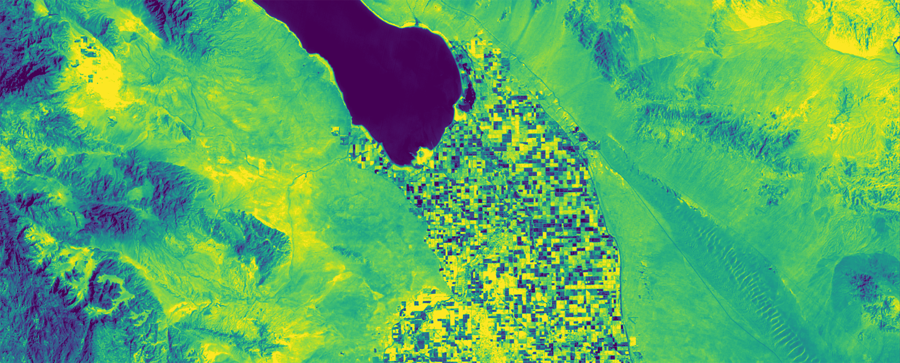
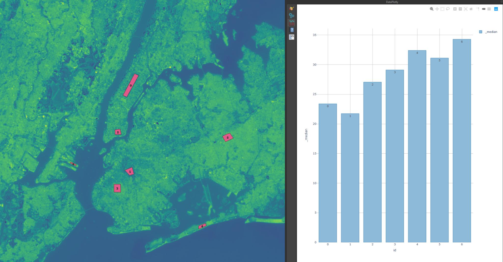

## Introduction

The Urban Heat Island (UHI) effect describes how cities and urban areas are significantly warmer than surrounding rural areas—sometimes by 5-10°F or more during summer heat events. This happens because urban materials—dark asphalt, concrete, roofing membranes—absorb solar radiation during the day and release it slowly at night, creating heat reservoirs. Vegetation and trees, which cool the environment through evapotranspiration, are typically sparse in cities. The result is not just higher average temperatures, but extreme heat events that pose public health risks, increase energy demand for cooling, and accelerate air pollution formation.

For designers, UHI is both a challenge and an opportunity. Dense urban areas with abundant dark surfaces and little shade can become dangerously hot—contributing to heat-related illness and mortality, especially in neighborhoods lacking air conditioning or with populations vulnerable to heat stress. But the built environment also shapes heat patterns: building orientation, street width, tree canopy coverage, surface materials, and vegetation all affect how heat accumulates and dissipates. Thoughtful design can mitigate heat island effects and create more comfortable outdoor spaces.

This tutorial uses Landsat 8 thermal imagery to estimate Land Surface Temperature (LST)—not air temperature, but how hot surfaces actually become. LST reveals which materials and locations store the most heat, information designers can use to target interventions: where to add shade trees, which surfaces to change, how building orientation affects pedestrian comfort.

## Historical Context

Scientists first documented urban-rural temperature differences in the early 1800s, noticing that cities were warmer than countryside. Luke Howard's 1818 study of London's climate identified the "heat island" phenomenon, noting that nighttime temperatures in the city center remained elevated even as surrounding areas cooled.

Systematic study accelerated in the mid-20th century as cities grew and thermal imaging technology emerged. Researchers in the 1950s and 1960s mapped Chicago, Tokyo, and other major cities, documenting temperature variations across urban transects. The Environmental Protection Agency formally studied UHI in the 1970s and 1980s, establishing the scientific basis for mitigation policies.

Satellite-based UHI research began with early Landsat missions in the 1970s, but thermal sensors with sufficient resolution for urban analysis came online with Landsat 4 (1982) and improved significantly with Landsat 7 (1999) and Landsat 8 (2013). The Landsat archive now spans over 40 years, enabling long-term studies of how urban heat patterns have intensified with development.

Contemporary research links UHI to environmental justice: historically marginalized neighborhoods often have less tree canopy, more industrial land uses, and older buildings with less insulation—all contributing to higher temperatures. Studies in cities like Phoenix, Baltimore, and Houston have documented that heat vulnerability maps onto existing patterns of social and racial inequality, motivating equity-focused design interventions.

## Design Relevance

Designers increasingly must consider thermal comfort as a performance criterion, not just an aesthetic one. Heat exposure affects how people use outdoor spaces—whether a plaza is habitable at noon in August, whether children can safely walk to school, whether elderly residents can garden without risk. Tools like Universal Thermal Climate Index (UTCI) and others attempt to quantify thermal comfort, but Landsat-derived LST provides accessible, locally-specific baseline data.

Cool surfaces—light-colored roofing, reflective pavement coatings, shade structures—reduce heat absorption and lower surface temperatures. Green infrastructure—trees, green roofs, parks—provides shade and evaporative cooling. Both strategies can significantly reduce local temperatures, but their effectiveness varies by context: a green roof cools the building it sits on more than the surrounding air, while a large park can cool adjacent neighborhoods through airflow and evapotranspiration.

Vegetation mapping using NDVI (Normalized Difference Vegetation Index) from multispectral imagery reveals which areas have tree canopy and which lack it. Overlaying vegetation maps with LST maps identifies mismatches: neighborhoods with both high temperatures and low canopy coverage are prime candidates for tree planting programs. This spatial targeting improves the return on greening investments.

Material selection matters at multiple scales. At the building scale, cool roofing and walls reduce cooling loads and lower surface temperatures. At the neighborhood scale, permeable pavement, tree trenches, and pocket parks cumulatively affect thermal comfort. Designers who understand these relationships can advocate for material palettes and site designs that mitigate rather than exacerbate heat islands.

## Learning Goals

- Define urban heat island effects and distinguish land surface temperature from air temperature.
- Use Landsat thermal imagery to identify spatial heat patterns across an urban area.
- Relate heat intensity to canopy cover, material choice, urban form, and land use.
- Compare neighborhoods critically by accounting for timing, weather, and data quality.
- Frame heat mapping as a tool for public health, environmental justice, and design intervention.

## Key Terms

- **Urban Heat Island (UHI)**: The pattern in which urbanized areas are warmer than surrounding rural or less developed areas.
- **Land Surface Temperature (LST)**: An estimate of how hot the ground or built surface is, derived from thermal remote sensing.
- **Thermal infrared**: The portion of the electromagnetic spectrum used to detect heat emitted by the Earth's surface.
- **NDVI**: A vegetation index derived from red and near-infrared bands that helps estimate plant presence and vigor.
- **Emissivity**: A measure of how efficiently a surface emits thermal energy, which affects temperature estimation.
- **Zonal statistics**: A GIS method for summarizing raster values, such as temperature, within defined areas.

## Heat Inequality and Environmental Justice

Urban heat is a design problem, but it is also a social one. The hottest neighborhoods are often places with less tree canopy, more asphalt, older housing stock, and fewer public cooling resources, conditions that closely follow histories of disinvestment and racialized planning. For design students, heat analysis should support more than surface cooling diagrams; it should help identify where shade, open space, cooling infrastructure, and public investment are most urgently needed, and how design can reduce unequal exposure to heat-related harm.

## Resources & Further Reading

- [EPA Heat Island Effect](https://www.epa.gov/heatislands) - Comprehensive overview of UHI causes, impacts, and mitigation strategies
- [USGS Landsat 8 Surface Temperature](https://www.usgs.gov/landsat-missions/landsat-8) - Technical details on thermal band calibration and temperature derivation
- [Tree Equity](https://treeequity.org/) - Interactive mapping tool connecting tree canopy coverage to socioeconomic data
- [NOAA Heat Health Tools](https://www.noaa.gov/heat-health) - Weather service resources for heat event planning and response
- [Landscape Architecture Foundation Heat Briefs](https://www.lafoundation.org/research/heat-briefs) - Design-focused resources on heat mitigation strategies with case studies

## Technical Walkthrough

On a hot summer afternoon, two neighborhoods a mile apart can feel like different worlds—one cooled by trees and parks, the other baking under dark roofs and wide asphalt streets. This pattern is the Urban Heat Island (UHI) effect: built materials absorb and re‑radiate heat, making cities hotter than nearby rural areas and creating hot spots within cities themselves. These patterns matter for public health, energy bills, building design, and environmental justice—because the hottest places often align with historically disinvested communities.

The remarkable part is that we can “see” these hot spots from space. Satellites like Landsat sense thermal energy emitted by the Earth’s surface, allowing us to estimate Land Surface Temperature (LST)—how hot roofs, roads, and soil actually are. LST is not the same as air temperature; it tells us how hot surfaces become, which helps explain why some blocks store heat during the day and release it at night.

In this tutorial, you’ll use Landsat 8 Collection 2 Level‑2 data to approximate LST and visualize UHI patterns across your city. The workflow converts the satellite’s thermal measurements into temperature maps you can analyze and overlay with neighborhood boundaries, tree canopy, or zoning to inform design and policy ideas. You’ll also learn what LST can and can’t tell you, and how to make fair comparisons across time and place.

A note on comparisons: surface temperature changes with season, time of day, recent weather, and moisture. Landsat passes your location mid‑morning (around 10:30 a.m. local time), which captures heating in progress—but not peak afternoon heat or nighttime heat retention. To compare two LST images meaningfully, try to match season, cloud conditions, and recent rainfall, and treat results as relative (hotter/colder) rather than exact thermometers of human heat exposure.

## Multispectral Satellites

[Landsat 8: Band by Band](https://www.youtube.com/watch?v=A6WzAc1FTeA)

- Use the visible and near-infrared bands to understand vegetation and land cover before interpreting the thermal map.
- False-color composites help separate trees, marsh, and built surfaces that may look similar in a natural-color image.
- Healthy vegetation reflects strongly in near-infrared, which makes canopy cover easier to compare against hotter paved surfaces.

## Landsat 8/9

This tutorial uses Landsat 8—NASA and USGS’s workhorse mission for observing how places change over time. Launched in 2013, Landsat 8 collects consistent, free imagery that lets us track land cover, vegetation, water, and heat at neighborhood scales. As you watch “Landsat 8: Band by Band,” keep in mind that we’ll use two instruments together to study Urban Heat Island patterns:

- OLI (Operational Land Imager): captures reflected sunlight in the visible, near‑infrared (NIR), and shortwave infrared (SWIR), plus a high‑resolution panchromatic band. Compared to Landsat 7, OLI adds Band 1 (deep blue) for coastal water and aerosols and Band 9 (cirrus) for high, thin cloud detection.

OLI helps map context—vegetation (e.g., NDVI from Bands 4 and 5), water, bare soil, and built surfaces—so you can relate hot spots to tree canopy, materials, and land use.

- TIRS (Thermal Infrared Sensor): measures heat emitted by the surface in two thermal bands (10 and 11). For Land Surface Temperature (LST) in this tutorial, we’ll primarily use Band 10, following USGS guidance for single‑band temperature estimates. TIRS lets us turn emitted radiation into temperature maps that highlight hot roofs and pavement versus cooler parks and shade.

Practical notes for your analysis

- Spatial detail: OLI bands are 30 m; the panchromatic band is 15 m; TIRS is 100 m but resampled to 30 m. Expect block‑level patterns, not individual buildings.

- Timing: Landsat 8 passes around 10:30 a.m. local time with a 16‑day revisit. Match season, cloudiness, and recent rain when comparing dates.

- Quality masking: Use the QA_PIXEL (and QA_RADSAT) quality bands to remove clouds, shadows, and cirrus before calculating LST.

- Products: Prefer Collection 2, Level‑2 surface reflectance and surface temperature products when available—they’re calibrated and ready for analysis. For longer histories, you can incorporate earlier missions (Landsat 4–7), but align band choices and avoid direct cross‑satellite comparisons without careful normalization.

For more details, see the Landsat 8 (OLI/TIRS) Collection 2 documentation from USGS/NASA.: [here](https://d9-wret.s3.us-west-2.amazonaws.com/assets/palladium/production/s3fs-public/atoms/files/LSDS-1619_Landsat8-C2-L2-ScienceProductGuide-v2.pdf)

The following documentation is only for [Landsat 8 Collection 2 Level 2](https://d9-wret.s3.us-west-2.amazonaws.com/assets/palladium/production/s3fs-public/atoms/files/LSDS-1328_Landsat8-9-OLI-TIRS-C2-L2-DFCB-v6.pdf) data, which uses Band 10 for thermal infrared. If you are using Landsat 7 or prior, Band 6 is the thermal infrared and have different resolution, and correction values. Make sure to reference the Landsat [documentation](https://www.usgs.gov/landsat-missions/landsat-project-documents) for proper usage.

### Land Surface Temperature - New York

This image below shows quite significant heating in the urban areas of Long Island compared to the eastern regions.

### Land Surface Temperature - Salton Sea

This image shows no temperature difference between farmlands and their surrounding regions.

### STEP 1: Download Landsat 8 data

Think of this as your zero-cost satellite studio. Landsat 8 imagery is free, open, and classroom-friendly—no license fees, no usage restrictions. In this tutorial you’ll grab a scene from USGS EarthExplorer and open it in QGIS (a free, no‑coding GIS app) to turn the thermal band into a surface heat map you can compare with streets, parks, and building materials.

Before you start

Create a free account on USGS EarthExplorer (you’ll need it to download).

- Install QGIS using the standalone installer—fast, cross‑platform, and perfect for beginners.

- If you want a quick “what each band sees” refresher, watch NASA’s Landsat 8: Band by Band and skim a Landsat 8/9 band guide.

Get your first scene (quick path)

- Go to EarthExplorer, sign in, and draw your area of interest (your campus or city).

- Under Data Sets, choose Landsat > Landsat Collection 2 > Landsat 8–9 OLI/TIRS C2 Level‑2.

- Set a date range and limit Cloud Cover (start with under 20%). Preview candidates and pick the clearest scene.

- Download the Level‑2 products. If a Surface Temperature layer is available, grab it; otherwise download Surface Reflectance and we’ll compute LST from the thermal band (Band 10) in QGIS.

- Unzip the file and open it in QGIS. You’ll visualize the thermal layer and style it into a readable heat map.

Why this works for design

- Free and repeatable: revisit the same place across seasons to study shade, materials, and tree canopy.

- Practical resolution: about a city block—great for neighborhood patterns, even if not down to single buildings.

- Easy on-ramp: QGIS gives you sliders, color ramps, and overlays without any coding.

Tip: Expect 1–2 GB per scene and plan for a few minutes of download time. If your area is cloudy, widen the date range or try a drier season.

[Downloading data from Earth Explorer](https://www.youtube.com/watch?v=dxDisROqGzs)

- Sign in to EarthExplorer, mark your study area on the map, and choose `Landsat Collection 2 Level-2` as the starting dataset.
- Use the first search to find a tile that covers the full city, then note its `path/row` and rerun the search with that exact tile for cleaner results.
- Limit cloud cover to a low range before browsing results, and preview each candidate scene instead of relying only on the metadata.
- For heat-island work, prefer clear summer scenes and download dates that are comparable in season and weather.

### STEP 2: Process and Visualize Data with QGIS

Reference this [USGS site](https://www.usgs.gov/landsat-missions/landsat-collection-2-level-2-science-products) for the correct scaling factor.

[Landsat 8 Surface Temperature Processing in QGIS](https://www.youtube.com/watch?v=fvDtGlhBJFg)

- In the unzipped Landsat folder, locate the raster ending in `B10` and load that thermal band into QGIS.
- Open `Raster Calculator` and apply the Collection 2 scaling factor to convert the raw band into temperature, then subtract `273.15` to switch from Kelvin to Celsius.
- Save the result as a new raster layer so the temperature output remains separate from the original band.
- Change the symbology to `Singleband pseudocolor`, choose a readable color ramp, and classify the values with equal intervals for a quick first map.

### STEP 3: Statistical Analysis

In this video, you’ll map “study zones” and use QGIS to summarize how hot those areas run, turning a heat map into evidence you can compare. Start by drawing or importing regions that make design sense—neighborhoods, school blocks, housing complexes, or street corridors—then use Zonal Statistics to calculate mean, median, and high‑end temperatures (like the 90th percentile) inside each zone. To make comparisons fair, create a few “controlled” zones where the building height and materials are similar; use those as a baseline and compare them with zones that are tree‑rich (aim for >80% canopy). You can estimate canopy with NDVI or an existing tree dataset, and you can use the emissivity layer from the Landsat Surface Temperature product (or NDVI‑based emissivity estimates) to group areas by material type. The result is a more rigorous, design‑relevant story: not just which places are hotter, but how features like shade, surface materials, and building form shift the temperature distribution within otherwise similar urban fabric.

Practical tips

- Use the QA mask to remove clouds/shadows before stats.

- Prefer median and 90th percentile for heat‑stress comparisons; means can be skewed.

- Keep zones similar in size to avoid bias, or add area‑weighted stats.

- Add tree fraction, building height/material class, and albedo proxies (bright vs dark roofs) as fields so you can sort and chart results.

- Visualize the results with simple bar charts or box plots, such as those available through DataPlotly in QGIS, to make the comparisons legible to nontechnical audiences.

[Urban Heat Island Analysis QGIS](https://www.youtube.com/watch?v=O0A2C5Tm6O0)

- Create a new polygon shapefile with the same CRS as the temperature raster, toggle editing on, and draw comparison zones over parks, hot paved areas, or other study sites.
- Save the edits, open the `Processing Toolbox`, and run `Zonal statistics` with the polygon layer as the input zone layer and the LST raster as the raster input.
- Calculate at least mean, minimum, and maximum temperature so each polygon gets comparable summary values in its attribute table.
- Use cooler vegetated polygons as a baseline, then compare hotter built-up polygons before relating the differences back to land cover, paving, or building form.

Turn your numbers into pictures. Install the DataPlotly plugin in QGIS and chart your zonal results so patterns jump out. Start with box plots to compare the full temperature distribution across neighborhoods (not just the average), bar charts for median values, and a scatter plot to test ideas like “hotter in low‑rise vs. high‑rise areas.”

Scale matters. UHI differences are most obvious at larger neighborhood or borough scales, but your NYC‑metro analysis also hints at form effects—high‑rise versus low‑rise blocks can behave differently because of shade, wind channels, and sky‑view factor. That said, charts alone don’t prove density drives heat. To support that claim you’ll need a basic density analysis and a few controls.

Quick next steps to strengthen the evidence

- Add density metrics to each zone (e.g., median building height, floor‑area ratio, built volume, or residents per hectare) and plot temperature vs. these measures.

- Control for major confounders: tree canopy fraction, distance to water, roof/surface brightness (albedo proxy), imperviousness, and cloud/shadow masks.

- Look for consistent trends across multiple dates rather than relying on a single scene.

The goal here isn’t to finish the argument—it’s to use clear visuals to sharpen your research questions and point you toward the next round of data you’ll need.

